# MyDFIR Active Directory Project 2.0 — On-Prem Build

**A fully self-hosted SOC detection-and-response lab. Splunk detects, Shuffle SOAR orchestrates, an analyst approves by email, and Active Directory containment executes and self-verifies — entirely on RFC1918 addressing with zero inbound ports exposed to the internet.**


-orange)


---

## Table of Contents

- [Overview](#overview)
- [Architecture & Design](#architecture--design)
- [Key Features & Visual Walkthrough](#key-features--visual-walkthrough)
- [Technical Implementation](#technical-implementation)
- [Retrospective & Lessons Learned](#retrospective--lessons-learned)
- [Setup & Installation](#setup--installation)
- [Security Notes](#security-notes)
- [Credits](#credits)

---

## Overview

This project adapts MyDFIR's **Active Directory Project 2.0** — originally built on cloud infrastructure with a publicly reachable SOAR platform — into a **fully on-premises deployment** running on a single workstation across two isolated virtual networks.

The thesis: **SOAR automation, including human-in-the-loop analyst approval and Active Directory account containment, can run entirely on private addressing with no cloud dependency and no inbound exposure.** The cloud tutorial's architecture requires a public endpoint because SaaS Shuffle cannot reach a private domain controller. Moving the SOAR platform *inside* the perimeter removes that requirement rather than working around it.

**Stack:** Splunk Enterprise + Universal Forwarders · Shuffle SOAR (self-hosted, Docker Swarm) · Active Directory (LDAP 389) · Slack (bot token via HTTP app) · Gmail SMTP

**End-to-end latency, measured:** ~100 seconds from RDP authentication to verified containment, including the human decision.

---

## Architecture & Design

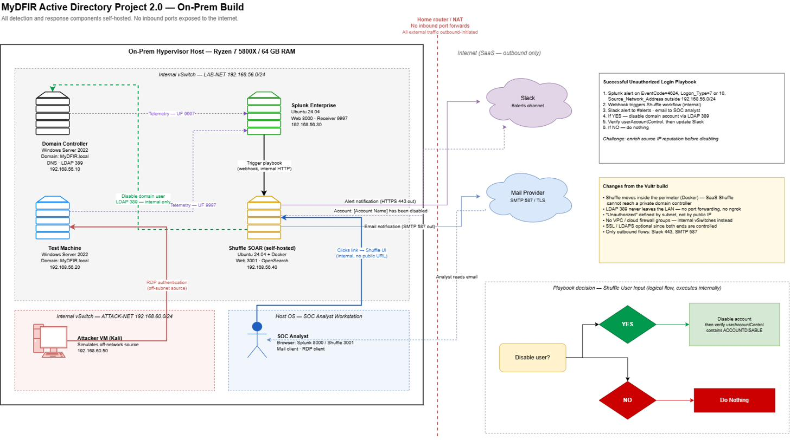

### Network topology

Two isolated internal vSwitches on a single hypervisor host. Neither network has an inbound path from the internet; all external traffic is outbound-initiated.

| Host | Role | Address | Network |
|---|---|---|---|
| `MYDFIR-AD-DC01` | Domain Controller (Windows Server 2022) | `192.168.56.10` | LAB-NET |
| `MYDFIR-TEST01` | Domain-joined endpoint (dual-homed target) | `192.168.56.20` / `192.168.60.20` | LAB-NET / ATTACK-NET |
| `MYDFIR-SPLUNK` | Splunk Enterprise (Ubuntu 24.04) | `192.168.56.30` | LAB-NET |
| `MYDFIR-SHUFFLE` | Shuffle SOAR (Ubuntu 24.04 + Docker Swarm) | `192.168.56.40` | LAB-NET |
| `KALI-ATTACKER` | Simulated off-network source | `192.168.60.50` | ATTACK-NET |

- **LAB-NET** — `192.168.56.0/24` (VMnet2): the trusted corporate segment.
- **ATTACK-NET** — `192.168.60.0/24` (VMnet3): the untrusted source. `MYDFIR-TEST01` is deliberately dual-homed so an RDP session originating on ATTACK-NET is indistinguishable, from the DC's perspective, from an external intrusion.

The detection defines "unauthorized" by **subnet**, not by public IP — the single semantic change from the cloud build. Everything else follows from it.

### Detection-to-response flow

```
                    ┌──────────────────────────────────────────┐
   Kali (attack) ──►│ MYDFIR-TEST01  ──UF 9997──►  Splunk       │
                    │                              (mydfir-ad)  │
                    └────────────────┬─────────────────────────-┘
                                     │ webhook (internal HTTP)
                                     ▼
    ┌────────────────────── WORKFLOW A — Detect & Notify ───────────────────────┐
    │  Splunk-Alert (webhook)  ─►  Slack-Alert  ─►  Approval-Email              │
    │                                                        │ FINISHES (~5s)   │
    └────────────────────────────────────────────────────────┼─────────────────-┘
                                                             │
                                         analyst clicks one of two links
                              ┌──────────────────────────────┴──────────────┐
                              ▼                                             ▼
    ┌──── WORKFLOW B — Contain & Verify ─────┐        ┌──── WORKFLOW C — Decline ────┐
    │ Approval-Webhook                       │        │ Decline-Webhook              │
    │   ─► AD-Disable-User   (LDAP modify)   │        │   ─► Slack-Decline           │
    │   ─► AD-Verify         (LDAP read)     │        │      (audit record)          │
    │   ─► [condition: ACCOUNTDISABLED]      │        └──────────────────────────────┘
    │   ─► Slack-Confirm                     │
    └────────────────────────────────────────┘
```

### Why three workflows instead of one

The obvious design is a single workflow with a User Input node holding a `WAITING` state until the analyst responds. **That design does not work reliably on self-hosted Shuffle**, and diagnosing why drove the final architecture. See [Challenges](#challenges--what-didnt-work) for the full analysis.

The three-workflow pattern replaces held state with an **authenticated callback**:

- **Workflow A** fires, notifies, mails the analyst, and **terminates**. Nothing is held open.
- The approval link *is* Workflow B's webhook URL, carrying the target account as a query parameter.
- **Workflow B** is idempotent — clicking twice returns `Account already disable` rather than erroring.
- **Workflow C** records the decline decision, so both analyst choices produce an audit trail in the channel.

This is closer to how production containment is actually built. Long-lived `WAITING` executions are fragile: they die on restarts, accumulate, and leak live authorization tokens into mailboxes. An idempotent containment workflow triggered by a callback has none of those properties.

### Verify-after-act

`AD-Verify` performs an **independent LDAP read** after the disable, and `Slack-Confirm` fires only if that read returns `ACCOUNTDISABLED`. The confirmation reports *observed state*, not *issued intent*.

> Reporting an action as complete because you issued it is not the same as reporting it complete because you confirmed it.

This is the single most important design decision in the project, and the one most tutorials skip.

---

## Key Features & Visual Walkthrough

> All screenshots are live captures from the running lab and live in `docs/images/`.

### 1 — Network isolation

The on-prem equivalent of a cloud console. Two host-only vSwitches with DHCP disabled — this is where the "no inbound exposure" claim is either true or isn't.

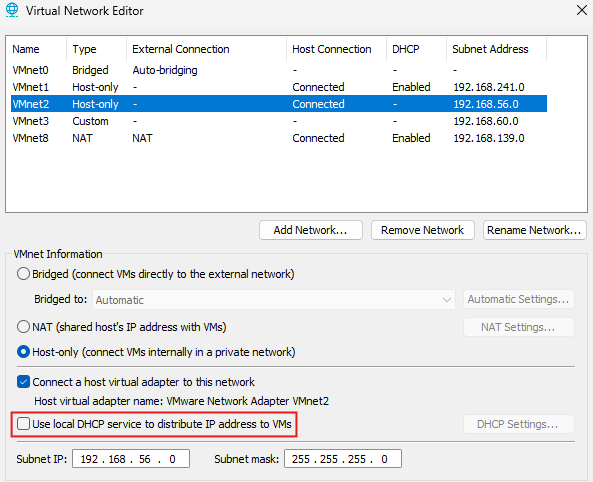

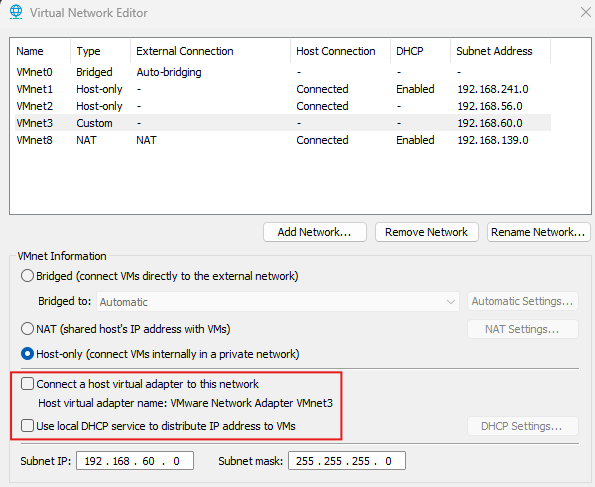

VMnet3 has **no host virtual adapter** at all — the attack network is invisible even to the hypervisor host.

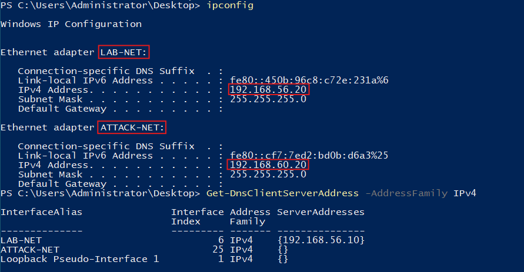

The endpoint is deliberately dual-homed and neither adapter has a default gateway. DNS resolves only through LAB-NET.

**The connectivity matrix.** Kali reaches the target on ATTACK-NET:

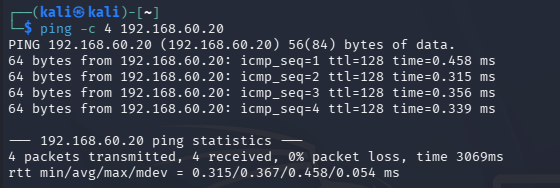

And cannot reach the domain controller on LAB-NET:

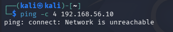

A deliberate failure is stronger evidence than a success. The attacker VM has **no route** to the DC — the only path in is the authentication itself, which is exactly the scenario the detection is built for.

### 2 — Active Directory & least privilege

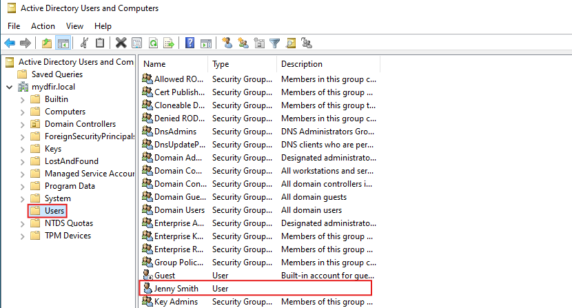

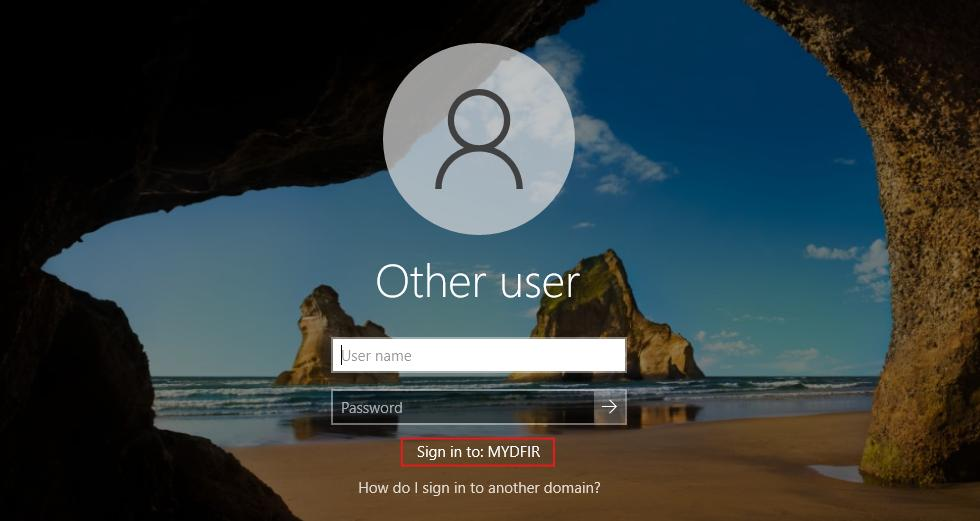

The delegation is the screenshot that punches above its weight:

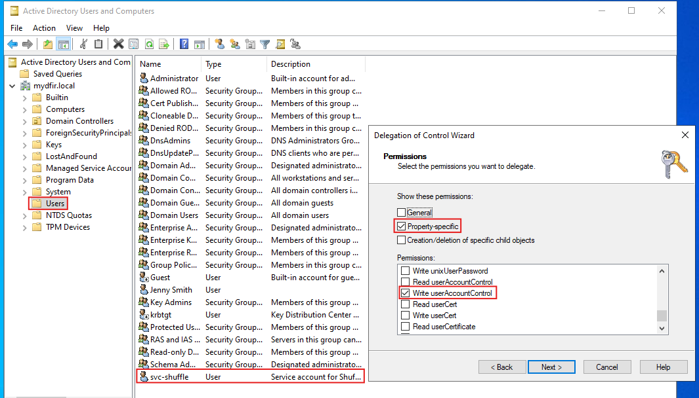

`svc-shuffle` holds **property-specific write on `userAccountControl`** and nothing else. Not Domain Admin. That is precisely enough to disable an account and no more — five extra minutes of scoping, and the difference between *used domain admin* and *understood least privilege*.

### 3 — Detection engineering

The detection surveys the environment *before* filtering. Logon Types 7 and 10 are a tiny minority of 4624 events here (1.7% and 0.2% of 406 events) — copying a filter without checking produces an alert that silently never fires.

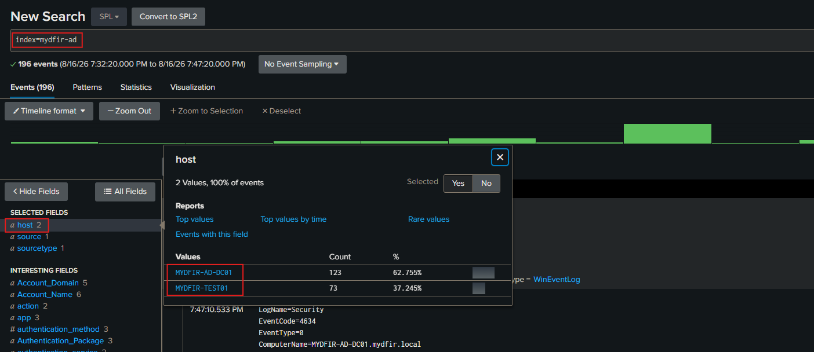

Both endpoints forwarding. **The detection firing on the real attack:**

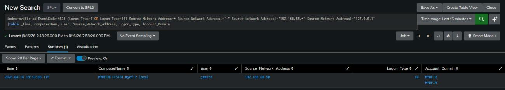

One row. `jsmith` authenticating from `192.168.60.50` with Logon Type 10 — the off-subnet RDP session, isolated out of hundreds of benign 4624 events. Everything downstream is orchestration; this is the telemetry the project hinges on.

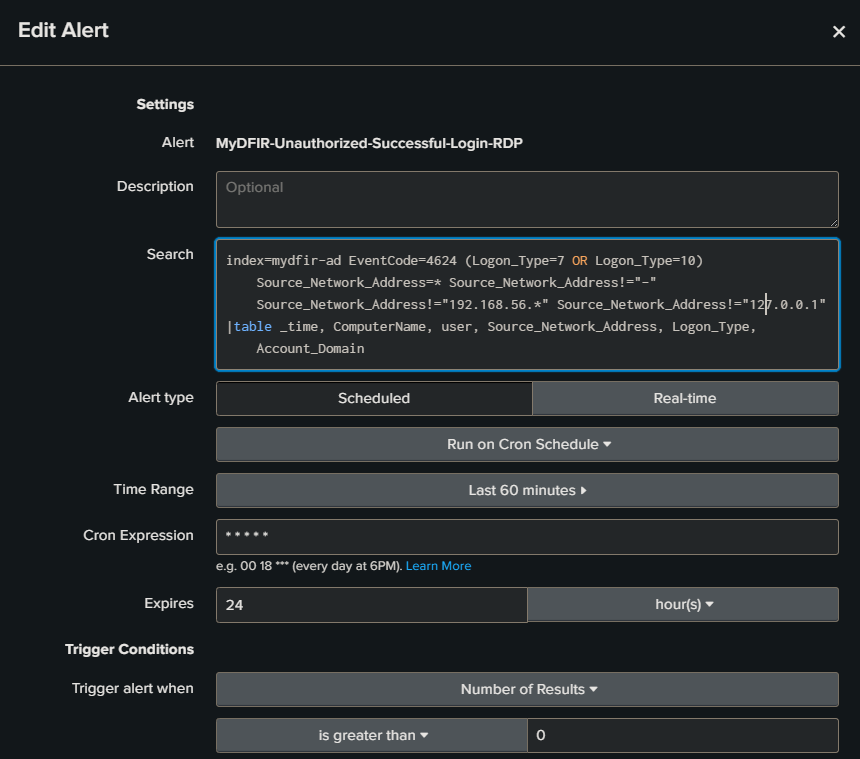

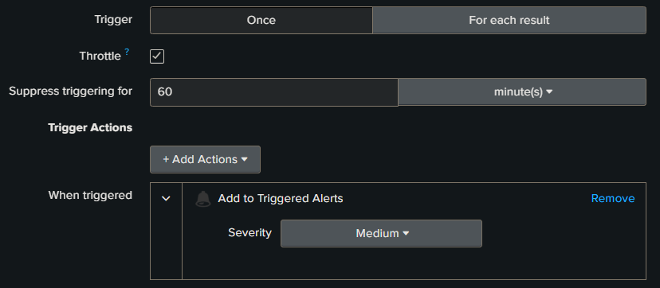

Cron interval and lookback must be aligned. `* * * * *` against a 60-minute lookback re-fires the same event repeatedly — this produced 53 duplicate triggers from a single logon before it was caught. Per-user suppression only appears when Trigger is set to **For each result**; it is hidden under **Once**.

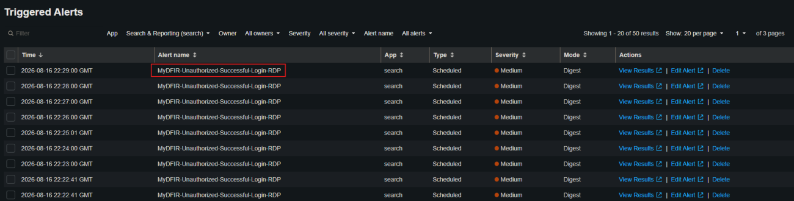

Note the once-per-minute cadence in the timestamps — this is the alert-fatigue bug rendered visible, and the reason throttling is not optional.

### 4 — The SOAR platform, inside the perimeter

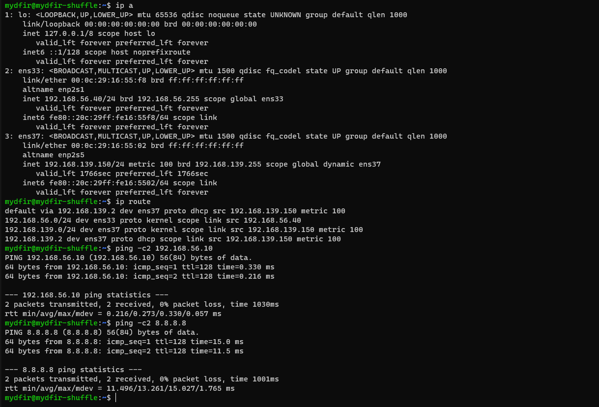

The Shuffle host is dual-homed: LAB-NET for the domain controller, NAT for outbound Slack and SMTP. A **single default route** on the NAT leg — LAB-NET carries no gateway, so nothing routes outward from the lab segment.

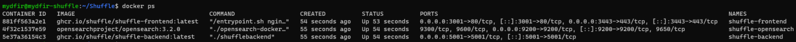

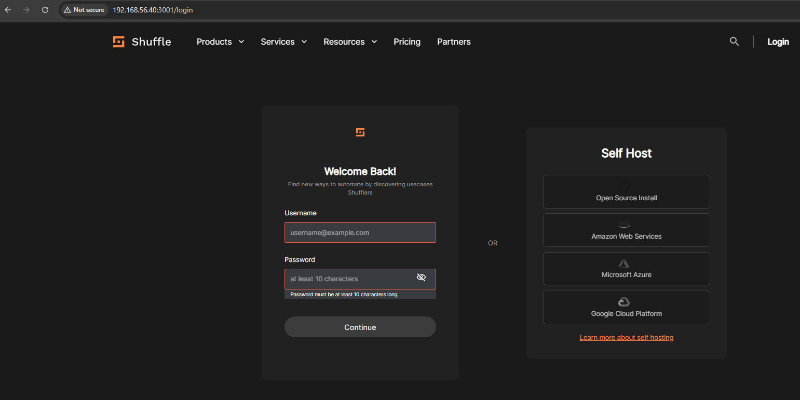

The SOAR console served from a private IP over plain HTTP. No public URL, no tunnel, no ngrok.

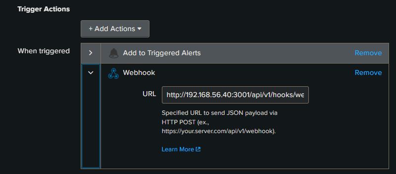

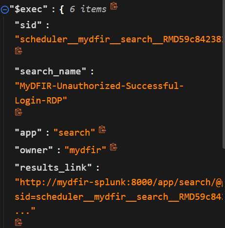

The detection payload arriving intact inside Shuffle, `alert_time` already humanized by `strftime` at the Splunk layer.

### 5 — Workflow A: Detect & Notify

Three nodes. Fires on the Splunk webhook, posts to Slack, sends the analyst email, terminates. No held state.

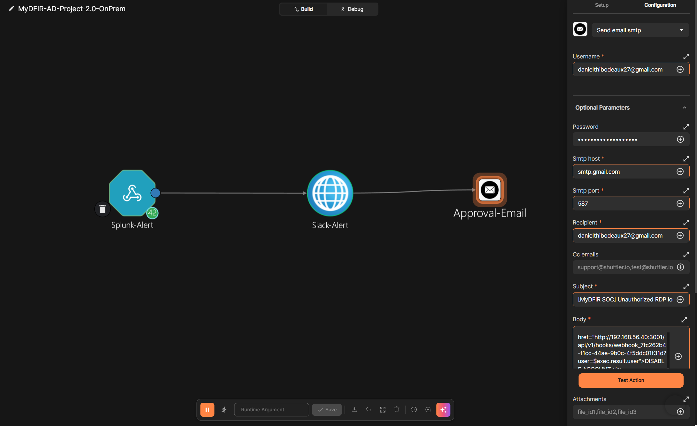

The email body is HTML with both decision links built from the Splunk payload:

```html
<h2>Unauthorized RDP logon detected</h2>
<p>
<b>User:</b> $exec.result.user<br>
<b>Source IP:</b> $exec.result.Source_Network_Address<br>
<b>Host:</b> $exec.result.ComputerName<br>
<b>Logon type:</b> $exec.result.Logon_Type<br>
<b>Time:</b> $exec.result.alert_time
</p>
<p>
<a href="http://192.168.56.40:3001/api/v1/hooks/webhook_<WORKFLOW_B_UUID>?user=$exec.result.user">DISABLE ACCOUNT</a>
</p>
<p>
<a href="http://192.168.56.40:3001/api/v1/hooks/webhook_<WORKFLOW_C_UUID>?user=$exec.result.user">TAKE NO ACTION</a>
</p>
```

### 6 — The analyst decision point

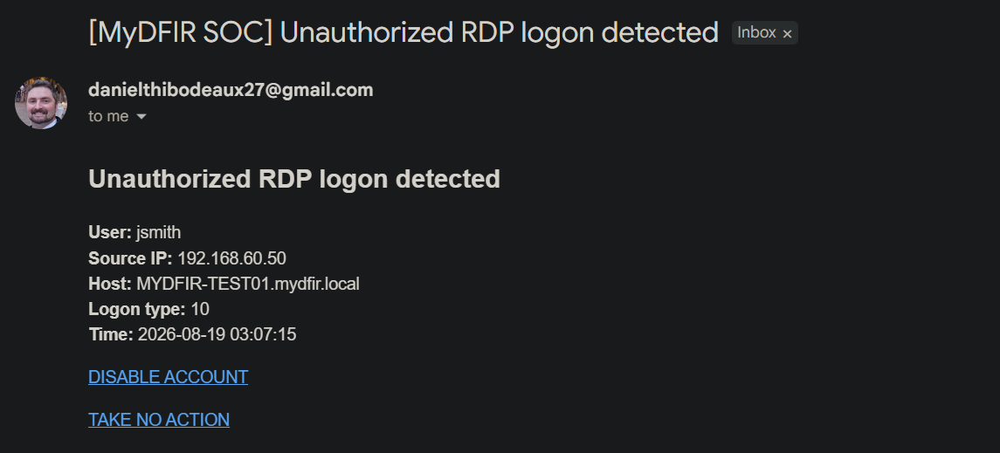

Both links are plain webhook URLs pointing at a private IP. **No address-bar editing, no authorization token, no form to submit.** One click either way, and the analyst never leaves their mail client.

### 7 — Workflow B: Contain & Verify

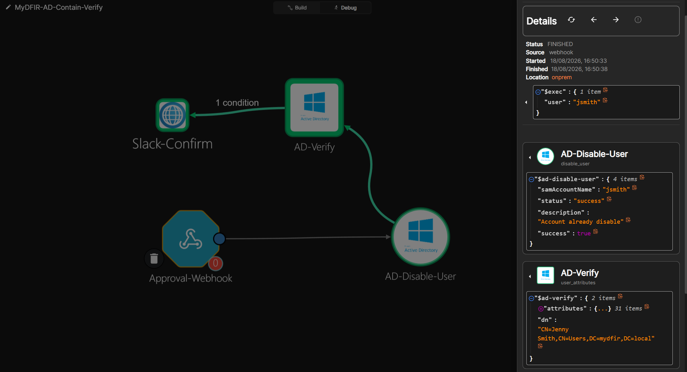

The branch condition on the `AD-Verify → Slack-Confirm` edge:

```
Source: $ad-verify.attributes.userAccountControl
Check:  contains
Value:  ACCOUNTDISABLED
```

**Two details differ from the source tutorial, and both silently break a copied implementation:**

| | Tutorial | Actual (verified) |
|---|---|---|
| Flag string | `ACCOUNTDISABLE` | **`ACCOUNTDISABLED`** |
| Reference path | `userAccountControl` | **`attributes.userAccountControl`** |

Proof, captured from a live `AD-Verify` execution:

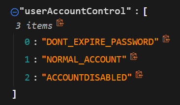

`userAccountControl` is returned by `ldap3`'s Microsoft extension as a **list of flag strings**, not a bitmask integer — so `contains` is the correct operator and no bit arithmetic is needed. A condition built on `ACCOUNTDISABLE` never matches, and the failure mode is a confirmation that simply never posts.

### 8 — Execution evidence

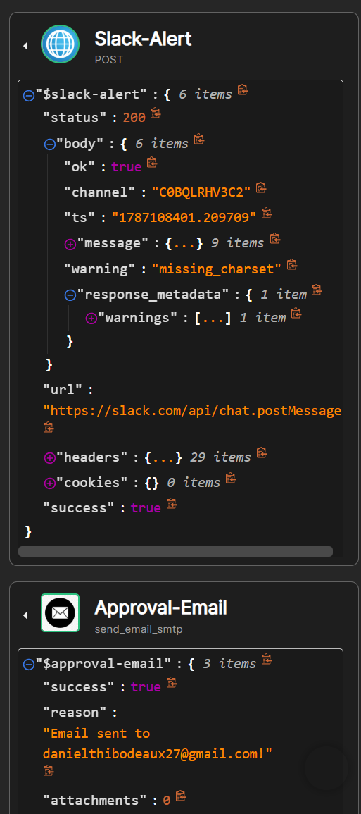

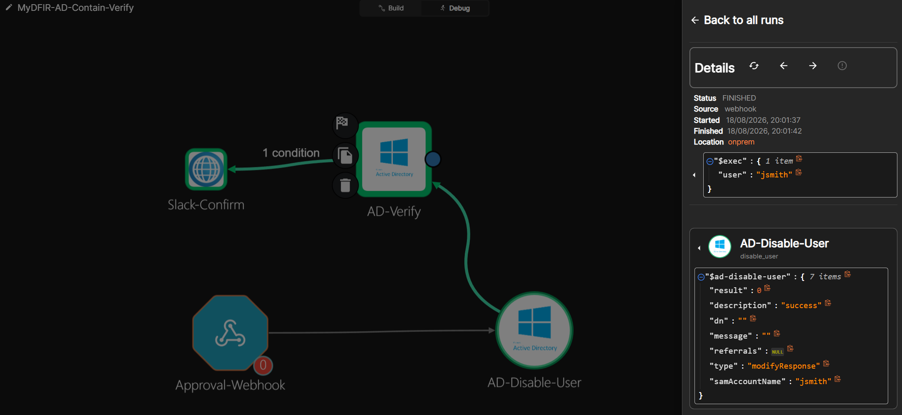

`$exec.user` resolved from the query string in the email link. `type: modifyResponse` is the LDAP write committing against the domain controller.

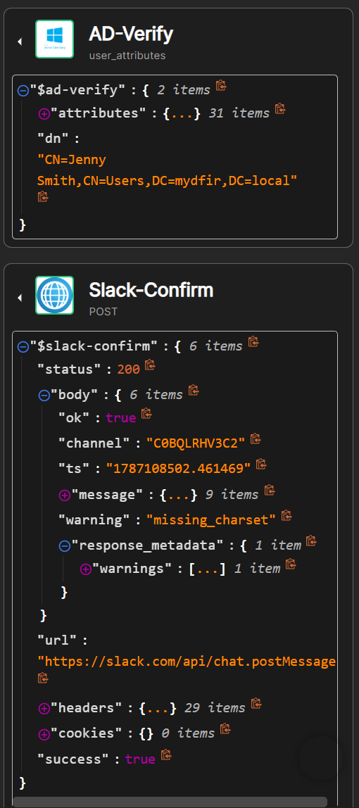

Four seconds, webhook to confirmation.

### 9 — Ground truth in the directory

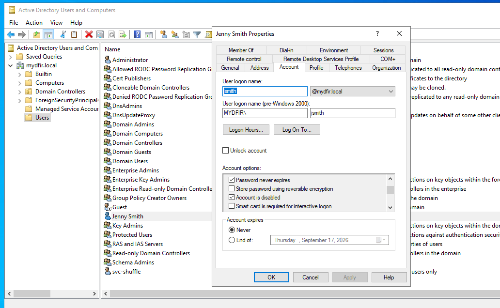

The `AD-Verify` attribute dump corroborates it from the directory's own metadata: `lastLogon` matches the attack timestamp, `whenChanged` matches the containment action.

### 10 — Both analyst paths, audited

**Approve** — initial alert and verified confirmation in the same channel:

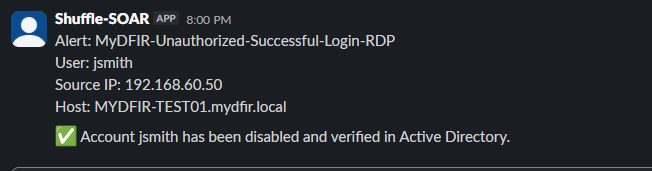

**Decline** — the alert with an explicit recorded non-action:

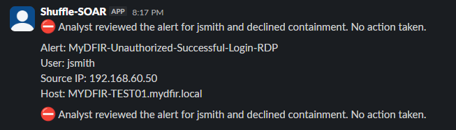


A control tested only in the success direction is a control you have not tested. Declining produces an audit record rather than silence — inaction and a reviewed decision are distinguishable in the channel.

## Technical Implementation

### Repository layout

```
.
├── README.md
├── docs/
│   ├── images/                       # screenshots referenced above
│   └── architecture-diagram.png
├── splunk/
│   ├── detection.spl                 # final detection query
│   ├── savedsearches.conf.excerpt    # alert stanza (schedule, throttle, suppression)
│   └── inputs.conf                   # Universal Forwarder stanza (both Windows hosts)
├── shuffle/
│   ├── workflow-a-detect-notify.json # exported workflow
│   ├── workflow-b-contain-verify.json
│   ├── workflow-c-decline.json
│   ├── approval-email-body.html      # email template with both decision links
│   └── docker-compose.override.md    # ENVIRONMENT_NAME fix and Swarm notes
└── scripts/
    └── generate-attack.sh            # xfreerdp one-liner from Kali
```

### Component interoperation

**`splunk/inputs.conf`** — deployed to `C:\Program Files\SplunkUniversalForwarder\etc\system\local\` on both Windows hosts. Routes the Security event log into the `mydfir-ad` index.

```ini
[WinEventLog://Security]
index = mydfir-ad
disabled = false
```

The forwarder service must run as `LocalSystem`; the default account often cannot read the Security log, producing a silent zero-event failure with no error anywhere.

**`splunk/savedsearches.conf.excerpt`** — the scheduled alert. Key values:

```ini
[MyDFIR-Unauthorized-Successful-Login-RDP]
cron_schedule = */5 * * * *
dispatch.earliest_time = -15m
dispatch.latest_time = now
alert.suppress = 1
alert.suppress.fields = user
alert.suppress.period = 60m
counttype = number of events
relation = greater than
quantity = 0
```

Cron interval and lookback window must be aligned. `* * * * *` against a 60-minute lookback re-fires the same event 60 times — this produced 53 duplicate triggers from a single logon before it was caught. Per-user suppression requires the trigger set to **For each result**; the suppression field does not appear under **Once**.

**Splunk → Shuffle** — a webhook alert action POSTs the search results to Workflow A's trigger URI. The payload arrives wrapped in a Splunk envelope, so fields are referenced as `$exec.result.<field>`.

**Shuffle → Active Directory** — the community `Active Directory` app (`github.com/Shuffle/python-apps`, `active-directory/1.0.0`), hotloaded because self-hosted Shuffle with cloud declined does not ship a fully local app catalog. Relevant actions: `disable_user`, `user_attributes`, `enable_user`.

Authentication is a saved auth set (`AD-Verify-Auth`) shared by every AD node across all workflows — one credential to rotate rather than several:

| Field | Value |
|---|---|
| Server | `192.168.56.10` |
| Port | `389` |
| Domain | `MYDFIR` (NetBIOS short name) |
| Login user | `svc-shuffle` |
| Base DN | `DC=mydfir,DC=local` |
| Use SSL | `False` |

The app binds NTLM-style (`login_dn = domain + "\\" + login_user`), so the `domain` and `login_user` fields are separate and the username must **not** be prefixed.

**Shuffle → Slack** — the generic **HTTP app** with a bot token, not the native Slack app. Native Slack requires an OAuth2 redirect to a **public HTTPS** URL, which does not exist in this architecture. Two headers are mandatory:

```
Authorization: Bearer <bot-token>
Content-Type: application/json
```

**Shuffle → Gmail** — the Email app, `Send email smtp`, `smtp.gmail.com:587`, using a Google **app password**. The regular account password returns `534 5.7.9`.

**Service account scope** — `svc-shuffle` is *not* a domain admin. It holds delegated **read + write on `userAccountControl`** for the Users container and nothing else. That is precisely enough to disable an account and nothing more.

---

## Retrospective & Lessons Learned

### What worked well

**Verify against behavior and config on disk, never against UI indicators.** This was the single highest-leverage habit in the project. Splunk's Edit Alert dialog rendered stale state that contradicted `savedsearches.conf`. Shuffle's webhook Start/Stop panel rendered stale state that `curl` disproved instantly. ADUC cached account status after an external LDAP modify. Ground truth lived in `grep`, `df -h`, `docker logs`, `curl`, and direct OpenSearch queries.

**Testing each workflow in isolation before connecting them.** Workflow B was proven with a single `curl` — no email, no Splunk, no notification layer. When it worked, the failure surface for the integrated test was already reduced to the handoff itself.

**De-risking the rebuild before committing to it.** Before rewriting anything, one `curl` with a query parameter and one OpenSearch document fetch confirmed that Shuffle exposes query params as `execution_argument: {"user":"jsmith"}`. The architectural pivot had zero unknowns in it by the time it started.

**Verify-after-act as a design principle.** The condition on the confirmation branch means the pipeline cannot report a containment it did not observe.

**Scoped service account from the start.** Delegating only `userAccountControl` took five extra minutes and is the kind of decision that survives review.

### Challenges & what didn't work

**The subflow approval pattern — a genuine platform limitation, and the project's defining finding.**

Shuffle's User Input node offers three delivery options: Subflow, Email, SMS. On a self-hosted instance with cloud declined, **Email and SMS are greyed out** — they are cloud-only features. The documented workaround is a subflow that sends the mail via SMTP.

That workaround does not complete. The failure chain, traced across four layers:

1. The parent workflow fires the subflow and **polls it for completion**.
2. The subflow finishes correctly in ~7 seconds and sends the email.
3. The parent's poll never resolves. Worker logs show an infinite backoff loop:
   ```
   Subflow poll backoff attempt 8 for e5f800c9-... (cache hit), sleeping 5s
   Rechecking execution ... (EXECUTING - 2/4 finished)
   ```
4. The backend explains why:
   ```
   [WARNING] Error for workflowexecution_e5f800c9-...: status: 404,
     error: {"_index":"workflowexecution-000001","_id":"e5f800c9-...","found":false}
   ```
   **The subflow's execution record does not exist in OpenSearch.** The parent polls an ID that was never persisted, forever, with no timeout — and no wait/async toggle is exposed on the User Input node, the Email node, or anywhere else in the UI.

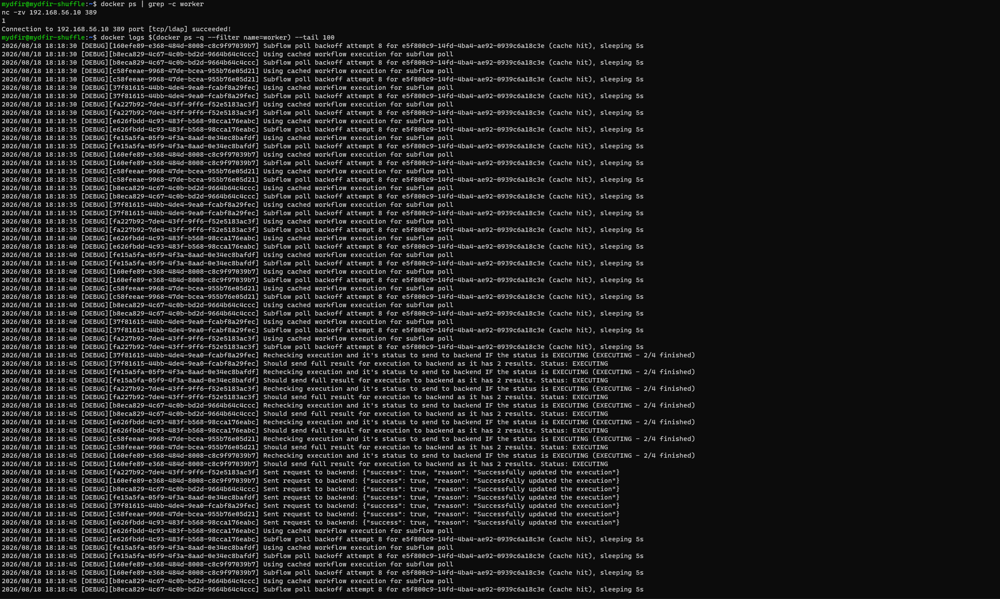

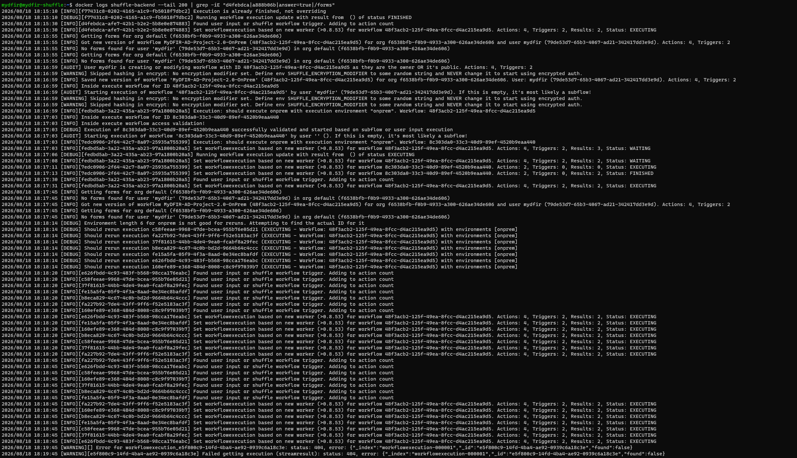

Compounding it, the approval link the User Input node generates contains **two `backend_url` parameters** — the internal Docker hostname `http://shuffle-backend:5001` (unreachable from any browser) followed by the corrected one. The duplicate silently wins. This is the actual reason the cloud tutorial assumes public exposure, and it is not the LDAP hop as commonly assumed.

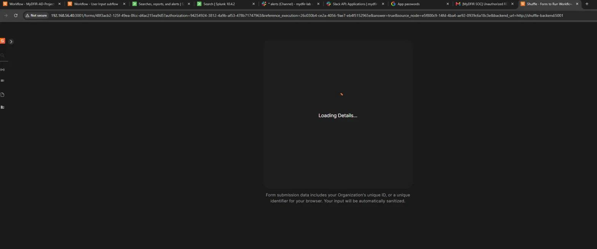

The pivot to three webhook-triggered workflows removed the entire class of problem.

**HTTP 200 is not success.** `Slack-Confirm` returned `status: 200`, `success: true` — and posted nothing:

```json
{ "status": 200, "body": { "ok": false, "error": "missing_post_type" }, "success": true }
```

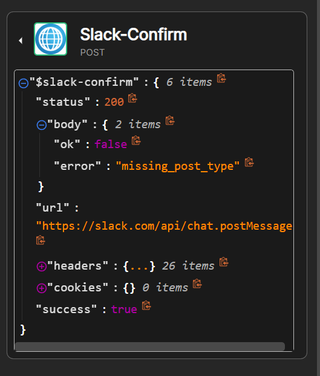

The `Content-Type: application/json` header was missing, so Slack could not parse the body. The node reported transport success while the API rejected the call — precisely the "automation that quietly lies to you" failure the verify-after-act principle exists to catch, one layer higher up.

**The disk-full cascade.** A workflow save failed with *"Failed to save the workflow. Is the network down?"* Three layers of abstraction separated that message from the cause:

| Layer | Symptom |
|---|---|
| Frontend | "Is the network down?" |
| Backend | `503 no_shard_available_action_exception` |
| OpenSearch | `No space left on device` — container not running |
| Disk | `/dev/mapper/ubuntu--vg-ubuntu--lv 19G 19G 0 100%` |

The root cause was novel: **Docker Swarm runs 3/3 replicas of every activated Shuffle app permanently**, and Swarm stores its own image copies separately from Docker (`/var/lib/docker` 14G + `/var/lib/containerd` 11G). Activating an app you try once and abandon leaves three containers running indefinitely. No install guide mentions this.

Fixed by growing the volume rather than deleting data — Ubuntu's installer had left half the volume group unallocated:

```bash
sudo vgs                                    # VFree 19.00g
sudo lvextend -l +100%FREE /dev/mapper/ubuntu--vg-ubuntu--lv
sudo resize2fs /dev/mapper/ubuntu--vg-ubuntu--lv
```

Add `CLEANUP=true` to `.env` to stop worker accumulation. **Never** run `docker system prune --volumes` — it deletes Shuffle's data.

**Other infrastructure friction, condensed:**

| Problem | Root cause | Fix |
|---|---|---|
| Executions queue forever | Orborus requires Docker **Swarm**, not plain Compose | `docker swarm init --advertise-addr 192.168.56.40` |
| Orborus polls the wrong queue | `ENVIRONMENT_NAME` **hardcoded in `docker-compose.yml`**, overriding `.env` | Edit the compose file, not `.env` |
| Worker redeploy blocked | Stale Swarm service holding ingress port `33333` | `docker service rm shuffle-workers` |
| AD app missing from catalog | Self-hosted + cloud-declined ships a partial app catalog | Hotload from `Shuffle/python-apps`; appears after a restart, not immediately |
| Dead Save button | Missing `updated_at` in the `notifications-000001` index mapping → repeated 500s corrupting page JS | Repair the index mapping |
| `WHEA_UNCORRECTABLE_ERROR` during VM builds | BIOS DOCP/XMP at 3600 MHz unstable under sustained load | Set memory profile to **Auto** |
| Domain join refused | Duplicate SID from VM cloning | Full rebuild (sysprep validation failed) |
| UF install "ended prematurely" | GUI wizard unreliable | `msiexec /i ... /l*v` then `splunk.exe add forward-server` |

### Key takeaways

1. **Error messages point at the wrong layer more often than not.** "Is the network down?" meant the disk was full. Trace downward through the stack rather than trusting the topmost message.
2. **A rendered panel is not state.** Every UI in this stack — Splunk, Shuffle, ADUC — rendered stale or misleading information at some point.
3. **Transport success is not application success.** Check the response body, not just the status code.
4. **Held state is the fragile part of any approval workflow.** Replacing a long-lived `WAITING` execution with an authenticated callback removed an entire failure class and produced a design that is idempotent, restart-safe, and leaves no live tokens sitting in a mailbox.
5. **Survey before filtering.** Logon Types 7 and 10 were 2% of 4624 events here. Copying someone else's filter is how you build a detection that never fires.
6. **Verify state after acting.** The difference between automation you can trust and automation that quietly lies to you.
7. **The constraint is the contribution.** Adapting an architecture to a different set of constraints — identifying that the SaaS SOAR was the component forcing public exposure, and moving it inside the perimeter rather than punching a hole through it — is design work, and it is what separates a project you followed from a project you understood.

---

## Setup & Installation

### Prerequisites

| Requirement | Notes |
|---|---|
| Hypervisor host | 8-core CPU, **64 GB RAM** recommended (this build: Ryzen 7 5800X) |
| VMware Workstation | Two host-only networks: VMnet2, VMnet3 |
| Windows Server 2022 ISO | Domain controller + test endpoint |
| Ubuntu 24.04 ISO | Splunk and Shuffle hosts |
| Kali Linux ISO | Attacker VM (ISO install; prebuilt images caused issues) |
| Splunk Enterprise | 60-day trial. Splunk Free supports neither scheduled alerts nor authentication |
| Slack workspace | Bot user with `chat:write` |
| Gmail account | With an **app password** — not the account password |

**Host prerequisites before building any VM:**

```powershell
# Hyper-V's hypervisor layer conflicts with VMware — disable and reboot
bcdedit /set hypervisorlaunchtype off
```

Set the BIOS memory profile (`Ai Overclock Tuner`) to **Auto**. DOCP/XMP at 3600 MHz caused `WHEA_UNCORRECTABLE_ERROR` crashes under sustained VM load; disabling Hyper-V alone was not sufficient.

### 1 — Domain controller

Promote to a DC for `mydfir.local`. Create the test user and the service account:

```powershell
New-ADUser -Name "Jenny Smith" -SamAccountName jsmith `
  -UserPrincipalName jsmith@mydfir.local `
  -AccountPassword (Read-Host -AsSecureString) -Enabled $true

New-ADUser -Name "svc-shuffle" -SamAccountName svc-shuffle `
  -Description "Service account for Shuffle SOAR - scoped to disable users only" `
  -AccountPassword (Read-Host -AsSecureString) -Enabled $true
```

Delegate **read + write on `userAccountControl`** for the Users container to `svc-shuffle` via *Delegate Control → Create a custom task to delegate → User objects → Property-specific*. Do not grant Domain Admin.

### 2 — Splunk

```bash
# Splunk 10.x refuses to run as root
sudo useradd -m splunk
sudo -u splunk /opt/splunk/bin/splunk start --accept-license
sudo -u splunk /opt/splunk/bin/splunk enable boot-start -user splunk

sudo ufw allow 8000/tcp   # web
sudo ufw allow 9997/tcp   # receiver
```

Install **Splunk Add-on for Microsoft Windows** (provides the `user` field extraction — not optional), create the `mydfir-ad` index, and enable receiving on 9997.

### 3 — Universal Forwarders (both Windows hosts)

```powershell
msiexec /i "splunkforwarder-10.x-windows-x64.msi" /l*v C:\uf-install.log

$conf = "C:\Program Files\SplunkUniversalForwarder\etc\system\local\inputs.conf"
@"
[WinEventLog://Security]
index = mydfir-ad
disabled = false
"@ | Out-File -FilePath $conf -Encoding ASCII -Append

# msiexec skips the config wizard, so set the forward-server manually
& "C:\Program Files\SplunkUniversalForwarder\bin\splunk.exe" add forward-server 192.168.56.30:9997

sc.exe config SplunkForwarder obj= "LocalSystem"
Restart-Service SplunkForwarder
```

Verify: `.\splunk.exe list forward-server` → `Active forwards: 192.168.56.30:9997`

### 4 — Shuffle SOAR

**VM sizing: 8 GB RAM minimum.** OpenSearch OOM-kills itself at 4 GB. Provision ≥40 GB disk.

```bash
sudo sysctl -w vm.max_map_count=262144
echo "vm.max_map_count=262144" | sudo tee -a /etc/sysctl.conf

git clone https://github.com/Shuffle/Shuffle
cd Shuffle
mkdir -p shuffle-database
sudo chown -R 1000:1000 shuffle-database

# Docker Swarm is REQUIRED — Orborus cannot dispatch workers without it
docker swarm init --advertise-addr 192.168.56.40
```

Environment variables:

```bash
# .env
BASE_URL=http://192.168.56.40:3001
ENVIRONMENT_NAME=onprem
SHUFFLE_APP_HOTLOAD_FOLDER=./shuffle-apps
SHUFFLE_APP_HOTLOAD_LOCATION=./shuffle-apps
CLEANUP=true
OPENSEARCH_INITIAL_ADMIN_PASSWORD=<your-password>
```

⚠️ **`ENVIRONMENT_NAME` is also hardcoded in `docker-compose.yml` and the compose value wins.** Fix it there too:

```bash
sed -i 's/ENVIRONMENT_NAME=Shuffle/ENVIRONMENT_NAME=onprem/' docker-compose.yml
```

Leave `ORG_ID` alone — it ties to the organization record.

```bash
docker compose up -d
```

### 5 — Hotload the Active Directory app

```bash
git clone https://github.com/Shuffle/python-apps.git /tmp/shuffle-apps
cd ~/Shuffle && mkdir -p shuffle-apps
cp -r /tmp/shuffle-apps/active-directory shuffle-apps/
sudo chown -R 1000:1000 shuffle-apps
docker compose up -d --force-recreate backend
```

The app may not appear immediately. The `run_hotload` API endpoint returns `{"success": false}` and can be ignored — the app registers after time elapses or on a later restart.

### 6 — Import the workflows

Import `shuffle/workflow-*.json`, then in each workflow:

1. Create the AD authentication set once (`AD-Verify-Auth`) and select it on every AD node — saved auth sets are org-scoped and reusable across workflows.
2. Add your Slack bot token and channel ID to the HTTP nodes. **Both headers are required.**
3. Add Gmail credentials to the Email node.
4. **Start each webhook trigger** and copy its URI.
5. Paste Workflow B's and Workflow C's webhook UUIDs into Workflow A's email body.

> A webhook trigger will not persist unless it is connected to a downstream action. `Actions: 1, Triggers: 0` in the backend log is the diagnostic signal.

### 7 — Point Splunk at Workflow A

Add a **Webhook** alert action to the saved search with Workflow A's trigger URI. Verify from the Splunk box:

```bash
curl -X POST http://192.168.56.40:3001/api/v1/hooks/webhook_<WORKFLOW_A_UUID>
# {"success": true, "execution_id": "..."}
```

A returned `execution_id` is ground truth. The Start/Stop panel is not.

### 8 — Run the pipeline

```bash
# From KALI-ATTACKER — generate the detection event
xfreerdp /v:192.168.60.20 /u:MYDFIR\\jsmith /p:'<password>' +clipboard
```

Expected sequence:

1. Slack alert in `#alerts` within the cron interval
2. Approval email with two links
3. Click **DISABLE ACCOUNT** → Workflow B → account disabled → verified → ✅ confirmation in Slack
4. Or click **TAKE NO ACTION** → Workflow C → ⛔ decline recorded, account untouched

**Test both paths.** Re-enable the account between runs:

```powershell
Enable-ADAccount -Identity jsmith
```

### Component-level testing

Each workflow can be exercised independently, which is how they were built:

```bash
# Containment chain, no email, no Splunk
curl -X POST "http://192.168.56.40:3001/api/v1/hooks/webhook_<B_UUID>?user=jsmith"

# Decline path
curl -X POST "http://192.168.56.40:3001/api/v1/hooks/webhook_<C_UUID>?user=jsmith"
```

### Troubleshooting quick reference

| Symptom | Check |
|---|---|
| Execution stuck `EXECUTING` | `docker logs $(docker ps -q --filter name=worker) --tail 50` |
| "Is the network down?" on save | `df -h /` — almost always a full disk, not the network |
| Alert not firing | `sudo grep -A20 "<alert-name>" /opt/splunk/etc/users/<user>/search/local/savedsearches.conf` |
| Slack node returns 200 but posts nothing | Check `body.ok` — likely a missing `Content-Type` header |
| LDAP `list index out of range` | Search base empty or wrong |
| LDAP `invalid credentials` | Try both `MYDFIR` and `mydfir.local` for the domain field |
| Zero events in `mydfir-ad` | Forwarder service not running as `LocalSystem` |

---

## Security Notes

This lab runs on an isolated network with deliberate simplifications. Before adapting anything here:

- **LDAP on port 389 is plaintext.** The bind password crosses the wire in the clear. Acceptable on an isolated lab switch; **LDAPS is the production answer** and requires AD Certificate Services.
- **The callback webhooks are unauthenticated.** Anyone who can reach `192.168.56.40:3001` can trigger containment for an arbitrary username. In production these need an authentication header on the trigger and an allowlist of actionable accounts.
- **The service account is scoped but not audited.** Add logging on `userAccountControl` modifications.
- **Rotate every credential before publishing this repository.** The Slack bot token, the `svc-shuffle` password, and the Gmail app password all appear in working configuration. Scrub or crop any screenshot that shows them.
- **Restore the alert throttle to 60 minutes** if it was lowered for testing.

---

## Credits

Adapted from **MyDFIR's Active Directory Project 2.0** (instructor: Steven) — an excellent cloud-based build worth doing in its original form. This repository documents the on-premises adaptation: what changed, what broke, and why.

The community **Active Directory** app for Shuffle is contributed by `@d4rkw0lv3s` at [Shuffle/python-apps](https://github.com/Shuffle/python-apps).

---

## License

MIT
