# 🔒 Incident Report — RDP Brute Force, Full Domain Compromise & NTDS Exfiltration

**Client:** Kerning City Dental (KCD) — Toronto Branch (Azure-hosted)  
**Severity:** CRITICAL · **Status:** Escalated · **Analyst:** Daniel Thibodeaux, MahCyberDefense SOC  
**Incident Period:** 2026-05-15 → 2026-05-18 (active) · **Report Date:** 2026-05-21

---

## 1. Report Overview

| **Report Title** | RDP Brute Force, Full Domain Compromise & NTDS Database Exfiltration — KCD Toronto |
| --- | --- |
| **Date of Report** | 2026-05-21 |
| **Reported By** | MahCyberDefense SOC — Daniel Thibodeaux |
| **Severity Level** | CRITICAL |
| **Incident Period** | 2026-05-15 07:42 UTC — ONGOING |
| **Affected Organization** | Kerning City Dental (KCD) — Toronto Branch (Azure-hosted) |
| **Report Status** | Escalated |

## 2. Summary of Findings

Between 2026-05-15 and 2026-05-18, an external threat actor (64[.]176[.]206[.]178) conducted sustained brute-force activity against internet-exposed RDP services on two systems: the web server KCD-WEB (172.16.1.7) and the receptionist workstation DESKTOP-Q1HN49 (172.16.1.4). Multiple external IPs achieved successful NTLM authentication against both systems during this window, indicating the threat actor maintained intermittent access for at least three days prior to active exploitation. 

On 2026-05-18, the attacker became highly active. After establishing an interactive RDP session, they performed host and domain reconnaissance using built-in Windows utilities, SoftPerfect Network Scanner (netscan.exe), and NetExec (nxc.exe). They laterally moved to the domain controller KCD-DC02 and deployed Mimikatz for credential harvesting. The attacker then performed a VSS shadow copy theft of the Active Directory database file (ntds.dit), effectively obtaining all domain credential hashes.

To ensure persistent access, the attacker installed a MeshCentral remote management agent (Mesh Agent) as an auto-starting system service. They also modified domain password policy, reset the ryan.adams user password multiple times, and used explicit credentials to authenticate against KCD-WEB and DESKTOP-RHD61K over SMB. The administrator account was added to local Administrators groups on multiple workstations.

The scope of compromise is domain-wide. All Active Directory accounts — including those of Ryan Adams (CEO), the receptionist workstations, and the web server — must be treated as fully compromised.

## 3. Investigation Timeline

| **Time (UTC)** | **Host** | **Activity** |
| --- | --- | --- |
| 2026-05-15 — 05-18 | KCD-WEB DESKTOP-Q1HN49 | PERSISTENT LOGINS — Multiple admin authentication successes from varying external IPs observed sporadically across three days. |
| 2026-05-18 09:06:33 | KCD-WEB | Successful logon Type 3 & Type 7 from external IP of 64.176.206.178. This IP was was seen in the previous step, PERSISTENT LOGINS |
| 2026-05-18 09:07:42 | KCD-WEB | MeshAgent was launched via explorer from Pictures folder |
| 2026-05-18 09:07:47 | KCD-WEB | MeshAgent was installed, allowing for persistence |
| 2026-05-18 09:09:58 | KCD-WEB | Remotely.txt service successfully installed. |
| 2026-05-18 09:24:34 | KCD-DC02 | RDP SESSION ESTABLISHED — Attacker establishes interactive (Logon Type 10) RDP session directly on KCD-DC02 as 'administrator' via KCD-WEB. |
| 2026-05-18 09:31:11 | KCD-DC02 | POST-EXPLOITATION BEGINS — cmd.exe launched; attacker opens a command shell on KCD-DC02. NetExec (nxc.exe) invocations commence. |
| 2026-05-18 09:31:53–09:32:06 | KCD-DC02 | NTDS.DIT EXFILTRATION VIA VSS — Four randomised services installed and executed in sequence: (1) 'inicWxwm' / 'pbrGPpFE': vssadmin list shadows; (2) 'zEoQbjwI': vssadmin create shadow /For=C:; (3) 'CyZlBNAp': copies ntds.dit from HarddiskVolumeShadowCopy1 to %SYSTEMROOT%\Temp\zEZjzVwu.tmp; (4) 'zKUdKOYg': vssadmin delete shadows to cover tracks. |
| 2026-05-18 09:35:26–09:35:35 | KCD-DC02 | PERSISTENCE — MESH AGENT INSTALLED — meshagent64-kerningcitydental.ca.exe executed three times; 'Mesh Agent' service installed as auto-start under LocalSystem (EventCode 7045/4697). MeshCentral provides the attacker persistent remote GUI access. |
| 2026-05-18 09:36 | KCD-DC02 | EDGE BROWSER INSTALLED — Microsoft Edge installed on KCD-DC02 (msedge.exe / Installer/setup.exe), likely to facilitate browsing the MeshCentral management portal or downloading additional tools. |
| 2026-05-18 09:42:13 | DESKTOP-Q1HN49 | LATERAL MOVEMENT — ADMIN ADDED TO LOCAL GROUPS — EventCode 4732: administrator (SID -1113) added to local Administrators group on DESKTOP-Q1HN49. |
| 2026-05-18 10:35:02 | KCD-DC02 | DOMAIN PASSWORD POLICY MODIFIED — EventCode 4739: administrator resets domain password history length to 0, weakening password reuse controls. Logged against KCD domain, Logon ID 0x6DEC6CC. |
| 2026-05-18 10:39:46 & 10:45:57 | KCD-DC02 | MIMIKATZ EXECUTED TWICE — C:\Users\administrator\Pictures\x64\mimikatz.exe launched from KCD-DC02 (EventCode 4688). Combined with prior ntds.dit theft, attacker dumps all domain credential hashes. |
| 2026-05-18 10:40–10:46 | KCD-DC02 | RYAN.ADAMS PASSWORD RESET — EventCode 4724/4738: administrator resets ryan.adams (SID -1103) account password three times (10:40, 10:41, 10:46 UTC), indicating takeover of the CEO account. |
| 2026-05-18 10:50:55 | KCD-DC02 | NETWORK SCANNING — SoftPerfectNetworkScannerPortable.exe and netscan.exe launched to enumerate the Toronto subnet. |
| 2026-05-18 10:55:34 | KCD-DC02 KCD-WEB DESKTOP-Q1HN49 DESKTOP-RHD61K | LATERAL MOVEMENT — SMB EXPLICIT CREDENTIAL LOGINS — EventCode 4648 (explicit credential logon) fired against KCD-WEB (172.16.1.7:445), DESKTOP-Q1HN49 (172.16.1.4:445), and DESKTOP-RHD61K (172.16.1.5:445) with Logon ID 0x6DEC81F — all systems in the Toronto subnet accessed. |
| 2026-05-18 11:10:18 | KCD-DC02 | POWERSHELL SESSION — ACTIVE DISCOVERY — PowerShell session active; attacker runs systeminfo, ipconfig, arp, nbtstat, findstr, reg, WMIC via cmd on KCD-DC02. |
| 2026-05-18 11:17:46 & 11:19:05 | KCD-DC02 | REMOTE DESKTOP CLIENT (MSTSC) LAUNCHED — mstsc.exe launched on KCD-DC02 twice, suggesting the attacker RDP'd laterally to another host within the Toronto subnet. |
| 2026-05-18 11:32:06 | KCD-DC02 | NETEXEC AGAINST INTERNAL HOSTS — nxc.exe run from C:\Users\administrator\Pictures\nxc v1.5.0\ multiple times, targeting subnet hosts for credential spraying / execution. |

## 4. Who, What, When, Where, Why, How

### Who

Unknown external threat actor(s). Ultimate goal not determined. Actions were performed under the compromised KCD\administrator account.

Source IPs observed in NTLM logons across the investigation window:

- 64[.]176[.]206[.]178 — Confirmed active exploitation of KCD-WEB on 2026-05-18 09:06:33 UTC; also present in the May 15–18 brute-force window; assessed as threat actor operational IP for KCD-WEB compromise

- 91[.]238[.]181[.]92 — Observed during the persistent login phase and post-DC02 activity; assessed as primary threat actor infrastructure

- 141[.]98[.]80[.]88 (observed logging in successfully with no additional actions)

- 155[.]117[.]189[.]111 (observed logging in successfully with no additional actions) 

- 94[.]26[.]68[.]54 (observed logging in successfully with no additional actions)

Multiple additional source IPs were involved in the brute-force phase (May 15–18). Full IP enumeration requires expanded Splunk query scope. Whether 91[.]238[.]181[.]92 and 64[.]176[.]206[.]178 represent the same actor using different infrastructure or distinct actors requires further correlation. 

### What

A full domain compromise of the kerningcitydental.ca Active Directory domain, consisting of:

- Brute-force compromise of internet-exposed RDP services on both KCD-WEB (172.16.1.7) and DESKTOP-Q1HN49 (172.16.1.4)

- Active exploitation of KCD-WEB as the initial staging host on 2026-05-18

- Installation of dual persistence mechanisms on KCD-WEB: MeshAgent (MeshCentral) service and a "Remotely.txt" service

- Lateral movement from KCD-WEB to domain controller KCD-DC02 via RDP

- Theft of the Active Directory database (ntds.dit) via VSS shadow copy on KCD-DC02

- Credential dumping via Mimikatz on KCD-DC02

- Installation of a second MeshCentral Mesh Agent on KCD-DC02 for persistent backdoor access

- Domain password policy weakening (password history length set to 0)

- Forced password reset of the ryan.adams (CEO) AD account three times

- SMB explicit-credential lateral movement to KCD-WEB, DESKTOP-Q1HN49, and DESKTOP-RHD61K

- Enabling of WinRM on KCD-DC02 for persistent PowerShell remoting

### When

Initial access: 2026-05-15 07:42 UTC (earliest confirmed external NTLM logon)

Escalation / active exploitation: 2026-05-18 09:24 UTC onward

Last observed activity: 2026-05-18 11:32 UTC

### Where

Primary initial exploitation host: KCD-WEB (172.16.1.7) — internet-exposed RDP; confirmed internal pivot host to KCD-DC02; dual persistence installed

Additional brute-force target: DESKTOP-Q1HN49 (172.16.1.4) — internet-exposed RDP; accessed during lateral movement phase (09:42 UTC)

Domain controller: KCD-DC02 (172.16.1.6) — pivoted to via KCD-WEB; NTDS exfiltration and full post-exploitation conducted here; second MeshAgent persistence installed

Additional lateral movement targets: DESKTOP-RHD61K (172.16.1.5)

Domain: kerningcitydental.ca / KCD

### Why

Likely threat actor intent (based on observed TTPs): financial crime, ransomware pre-positioning, or data theft targeting patient records and billing data. The theft of ntds.dit and domain credential hashes, combined with the installation of a persistent remote management agent, is consistent with a pre-ransomware engagement where the attacker establishes long-term access before deploying ransomware or exfiltrating sensitive data.

### How

Attack chain summary:

- Initial Access: RDP brute force over internet-exposed port 3389 targeting both KCD-WEB and DESKTOP-Q1HN49 across May 15–18

- Initial Active Exploitation: External IP 64[.]176[.]206[.]178 authenticates to KCD-WEB (Logon Types 3 & 7) at 09:06:33 UTC

- Persistence on KCD-WEB: meshagent64-RDP.exe launched from Pictures folder via explorer at 09:07:42; Mesh Agent service installed at 09:07:47; "Remotely.txt" service installed at 09:09:58

- Lateral Movement — Web to DC: Interactive RDP session (Logon Type 10) from KCD-WEB to KCD-DC02 at 09:24:34 under administrator account

- Execution on KCD-DC02: cmd.exe and PowerShell used as execution vehicles; NetExec (nxc.exe) run from Pictures folder

- Privilege Escalation: Domain Administrator rights were already held; no additional escalation required

- Credential Access: ntds.dit exfiltration via VSS shadow copy + Mimikatz live LSASS dump on KCD-DC02

- Stealth / Anti-Forensics: Randomized service names used for VSS operations; shadow copy deleted post-exfiltration

- Discovery: systeminfo, ipconfig, arp, nbtstat, nslookup, WMIC, SoftPerfect Network Scanner, nxc.exe, reg.exe

- Lateral Movement (subnet-wide): NetExec (nxc.exe), mstsc.exe, SMB explicit credential authentication (EventCode 4648) to DESKTOP-Q1HN49 and DESKTOP-RHD61K

- Persistence on KCD-DC02: Mesh Agent (MeshCentral) service installed as SYSTEM auto-start; WinRM enabled via Configure-SMRemoting.exe

- Impact: Domain-wide credential compromise; CEO account takeover; domain password policy weakened; active persistent backdoors on KCD-WEB (dual) and KCD-DC02

## 5. MITRE ATT****&****CK Techniques

| **Technique ID** | **Technique Name** | **Observed Activity** |
| --- | --- | --- |
| **T1110.001** | Brute Force: Password Guessing | RDP port 3389 exposed; NTLM logons from multiple external IPs over 3+ days before success |
| **T1078.002** | Valid Accounts: Domain Accounts | Compromised KCD\administrator account used throughout the attack chain |
| **T1021.001** | Remote Services: RDP | Attacker established interactive RDP session to DESKTOP-Q1HN49 and KCD-DC02 |
| **T1059.003** | Command/Scripting: Windows Command Shell | cmd.exe used as primary execution vehicle post-compromise |
| **T1003.003** | OS Credential Dumping: NTDS | VSS shadow copy of ntds.dit extracted to %SYSTEMROOT%\Temp\zEZjzVwu.tmp via service-based execution |
| **T1003.001** | OS Credential Dumping: LSASS Memory | Mimikatz (x64\mimikatz.exe) executed twice on KCD-DC02 |
| **T1543.003** | Create/Modify System Process: Windows Service | Mesh Agent, and VSS-execution services (zEoQbjwI, CyZlBNAp, pbrGPpFE, zKUdKOYg, inicWxwm) created |
| **T1197** | BITS Jobs / Shadow Copies | vssadmin create shadow / vssadmin delete shadows used for ntds.dit theft and anti-forensics |
| **T1490** | Inhibit System Recovery | VSS shadow copies deleted post-exfiltration (vssadmin delete shadows) |
| **T1018** | Remote System Discovery | SoftPerfect Network Scanner, nxc.exe, ARP, nbtstat, nslookup used to map the 172.16.1.0/28 subnet |
| **T1082** | System Information Discovery | systeminfo.exe, ipconfig, WMIC executed |
| **T1046** | Network Service Discovery | netscan.exe (SoftPerfect), nxc.exe SMB scanning |
| **T1021.002** | Remote Services: SMB/Windows Admin Shares | nxc.exe and explicit credential (4648) logins over SMB to KCD-WEB and DESKTOP-RHD61K |
| **T1012** | Query Registry | reg.exe executed multiple times for registry enumeration |
| **T1098.001** | Account Manipulation: Additional Cloud Credentials | Administrator added to local Administrators on DESKTOP-Q1HN49 and DESKTOP-RHD61K |
| **T1098** | Account Manipulation | ryan.adams password reset 3x; domain password history zeroed |
| **T1562.001** | Impair Defenses: Disable/Modify Tools | Domain password policy modified (history length = 0) |
| **T1071.001** | Application Layer Protocol: Web Protocols | MeshCentral agent beaconing over HTTP/HTTPS to external C2 |
| **T1087.002** | Account Discovery: Domain Account | nxc.exe and PowerShell Get-Service used for domain and service enumeration |

## 6. Impact Assessment

### Confirmed Impact

- **FULL DOMAIN CREDENTIAL COMPROMISE:** ntds.dit exfiltrated from KCD-DC02. All Active Directory account password hashes — including krbtgt, all Domain Admins, and all user accounts — are in attacker possession. The attacker can generate Golden Tickets and maintain persistent, undetectable domain access indefinitely. This impact persists even after all visible tooling is removed unless the krbtgt account is rotated twice.

- **CEO ACCOUNT TAKEOVER:** The ryan.adams account password was forcibly reset by the attacker three times (10:40, 10:41, and 10:46 UTC), indicating direct takeover of the CEO's domain account.

- **KCD-WEB CONFIRMED AS STAGING HOST WITH DUAL PERSISTENT BACKDOORS:** KCD-WEB is confirmed as the initial active exploitation point and the internal pivot host used to reach KCD-DC02. Two independent persistence mechanisms were installed on KCD-WEB: the MeshCentral Mesh Agent service (meshagent64-RDP.exe deployed to C:\Program Files\Mesh Agent\MeshAgent.exe) and the "Remotely.txt" service. The attacker retains remote access to the internal network via KCD-WEB independently of any DC02 remediation unless both services are fully eradicated and the corresponding management portals are revoked.

- **PERSISTENT BACKDOOR ON KCD-DC02:** A second Mesh Agent instance was installed on KCD-DC02 as a SYSTEM-level auto-start service. Attacker retains remote desktop access to the domain controller via MeshCentral even after domain password resets, unless the service is removed and the portal account is revoked.

- **WINRM ENABLED ON KCD-DC02:** Configure-SMRemoting.exe was executed repeatedly between 09:46 and 11:46 UTC, enabling persistent PowerShell Remoting on KCD-DC02 — an additional attacker-controlled command channel that survives password resets.

- **LATERAL MOVEMENT TO ALL SUBNET HOSTS:** All systems in the Toronto subnet — KCD-WEB (172.16.1.7), DESKTOP-Q1HN49 (172.16.1.4), and DESKTOP-RHD61K (172.16.1.5) — were accessed via SMB explicit-credential authentication (EventCode 4648). All systems must be treated as fully compromised.

- **DOMAIN POLICY WEAKENED:** Password history length set to 0, eliminating credential reuse controls and reducing the effectiveness of password-based recovery measures.

### Potential / Unconfirmed Impact

- Patient Health Information (PHI): KCD-DC02 doubles as the file server hosting patient records, X-rays, and billing data. The attacker had full file system access as SYSTEM; data exfiltration cannot be ruled out without file access auditing review.

- Ransomware Pre-positioning: Tool set (Mimikatz, NetExec, network scanner, persistent agent) is characteristic of pre-ransomware reconnaissance. A ransomware deployment cannot be excluded.

## 7. Recommendations / Next Steps

### Immediate Actions (0–24 hours)

- ISOLATE all VMs (KCD-DC02, DESKTOP-Q1HN49, DESKTOP-RHD61K, KCD-WEB) 

- CLOSE RDP port 3389 on DESKTOP-Q1HN49's public IP. RDP to Azure VMs should never be directly exposed; require Azure Bastion or VPN.

- REMOVE “Mesh Agent” service from KCD-DC02: CC:\Users\administrator\Pictures\meshagent64-kerningcitydental[.]ca[.]exe.

- REMOVE "NetExec" toolkit and directory located at: C:\Users\administrator\Pictures\nxc v1.5.0\nxc[.]exe

- BLOCK external IPs: 64[.]176[.]206[.]178, 141[.]98[.]80[.]88, 91[.]238[.]181[.]92, 94[.]26[.]68[.]54, 155[.]117[.]189[.]111, and any others identified in expanded log review.

- RESET ALL domain account passwords — priority: administrator, ryan.adams, all privileged/service accounts.

- CHECK network activity over the past few days to confirm whether or not any additional (patient) files were exfiltrated as KCD-DC02 doubles as the file server

### Short-Term Actions (24–72 hours)

- FORENSIC IMAGING of KCD-DC02, DESKTOP-Q1HN49, KCD-WEB before rebuild. Preserve memory dump if machine is still live.

- FULL ANTIVIRUS/EDR SCAN of all systems in the Toronto subnet

- REBUILD all compromised systems from clean images. Do not re-use potentially contaminated VM snapshots.

- AUDIT KCD-WEB for web shells and modified IIS application files. Check IIS logs for any malicious HTTP requests post-compromise.

- AUDIT file server shares on KCD-DC02 for any patient data that may have been staged for exfiltration.

- REVIEW all domain accounts for unexpected group memberships and unauthorised accounts.

- RESTORE domain password policy: re-enable password history.

### Long Term Strategic Recommendations

- ENFORCE Multi-Factor Authentication (MFA) on all privileged accounts and remote access methods.

- REVIEW NTDS backup and recovery procedures; ensure ntds.dit backups are encrypted and access-controlled.

- CONDUCT mandatory security awareness training; establish procedures for reporting anomalous account access.

## 8. Attachments / Evidence

**Figure-01 — Windows Event ID 4732: Administrator added to local Administrators group**

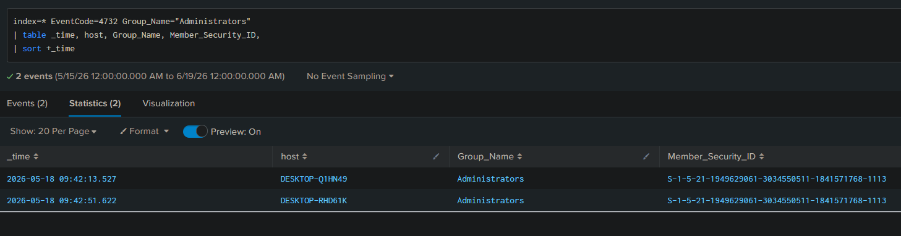

```spl
index=* EventCode=4732 Group_Name="Administrators"
| table _time, host, Group_Name, Member_Security_ID,
| sort +_time
```

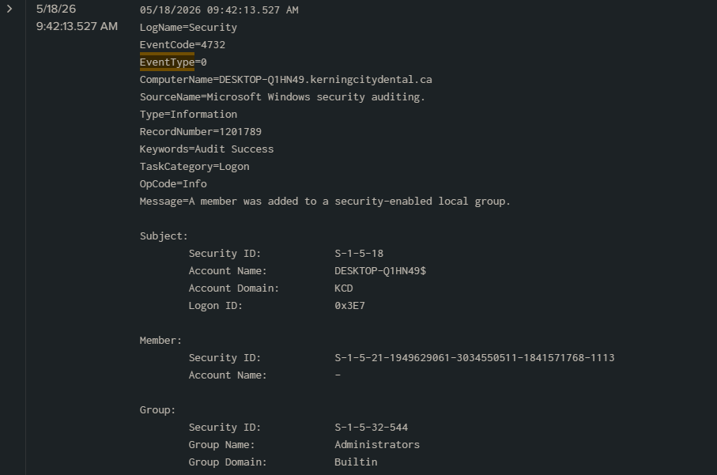

**Figure-02**

70 successful administrator login attempts

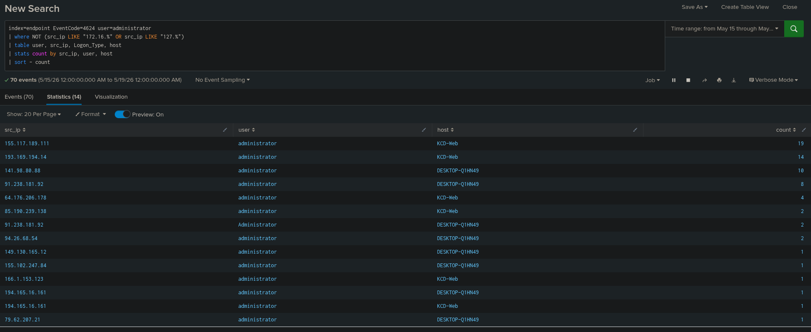

```spl
index=endpoint EventCode=4624 user=administrator
| where NOT (src_ip LIKE "172.16.%" OR src_ip LIKE "127.%")
| table user, src_ip, Logon_Type, host
| stats count by src_ip, user, host
| sort - count
```

**Figure-03**

Attacker establishes interactive (Logon Type 10) RDP session directly on KCD-DC02 as 'administrator' from KCD-WEB (172.16.1.7)


```spl
index=endpoint EventCode=4624 Logon_Type=10
| table _time, user, Account_Name, Logon_Type, Logon_Process, src_ip
| sort _time
```

**Figure-04**

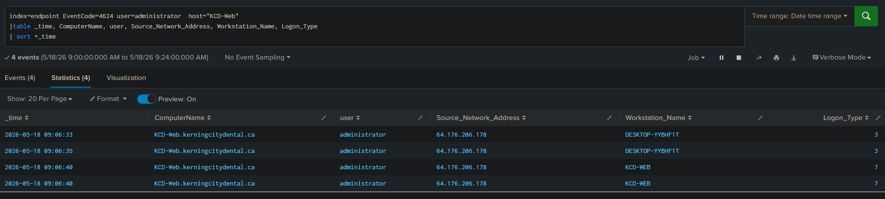

```spl
index=endpoint EventCode=4624 src_ip="64.176.206.178"
| table _time, user, host src_ip, Logon_Type
| sort +_time
```

**Figure-05**

Searching for EventCode 1 immediately after successful login to admin.

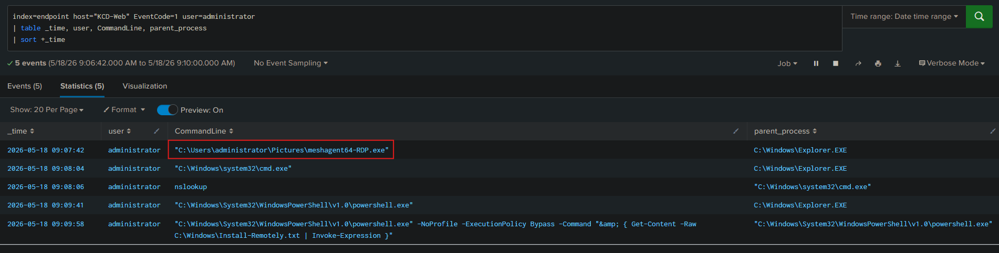

```spl
index=endpoint host="KCD-Web" EventCode=1 user=administrator
| table _time, user, CommandLine, parent_process
| sort +_time
```

**Figure-06**

Moving to EventID 11 to search for FileCreate

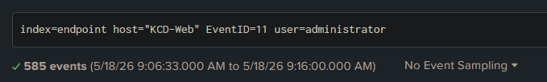

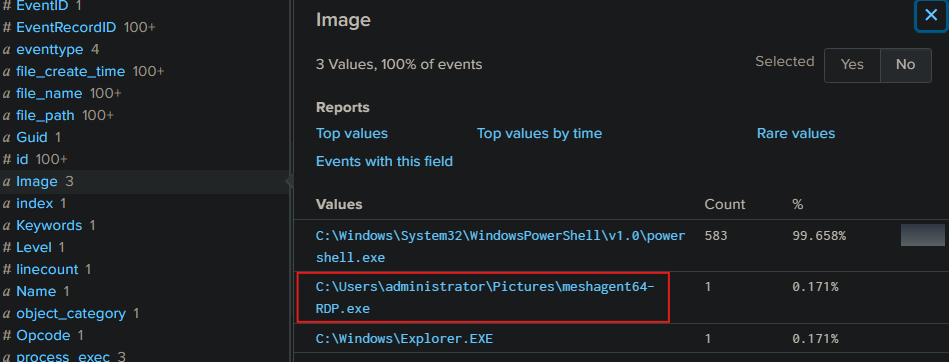

Administrator wrote C:\Users\administrator\Pictures\meshagent64-RDP.exe to C:\Program Files\Mesh Agent\MeshAgent.exe

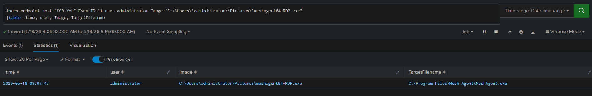

**Figure-07**

Searching for EventCode 1 after successful login showed the following

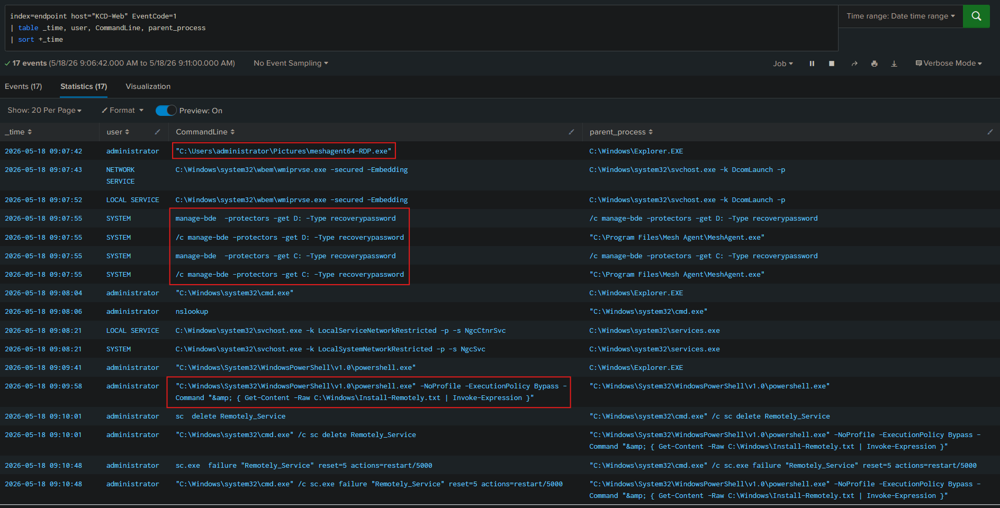

```spl
index=endpoint host="KCD-Web" EventCode=1
| table _time, user, CommandLine, parent_process
| sort +_time
```

**Figure-08 (Same as Figure-03) shows Lateral movement from WEB to DC.**

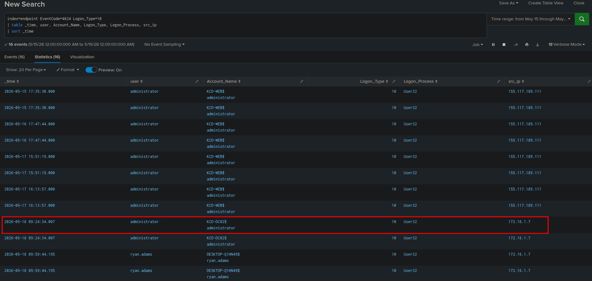

```spl
index=endpoint EventCode=4624 Logon_Type=10
| table _time, user, Account_Name, Logon_Type, Logon_Process, src_ip
| sort _time
```

**Figure-09**

Searching for Event ID 4688 to look for process creations, we see nxc.exe coming from the Pictures folder.

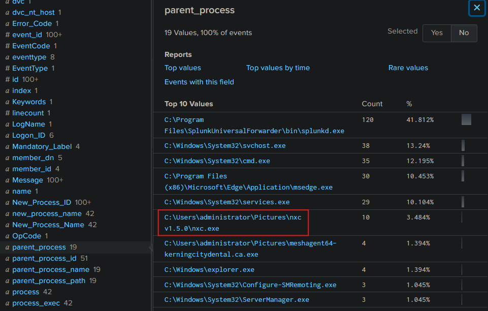

Searching for Event ID 4688 and nxc.exe, we see cmd.exe running nxc.exe which is an exploitation tool.

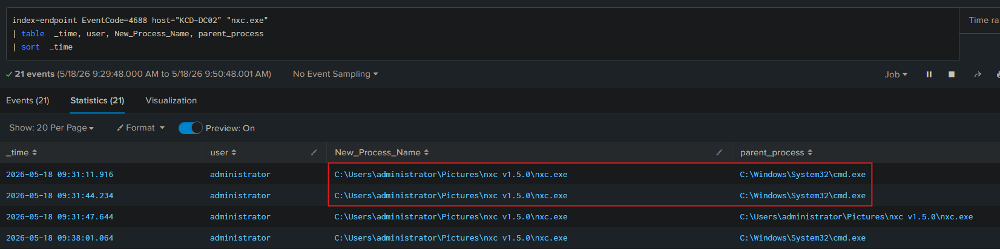

```spl
index=endpoint EventCode=4688 host="KCD-DC02" "nxc.exe"
| table  _time, user, New_Process_Name, parent_process
| sort  _time
```

**Figure-10**

Now switching over to Event ID 7045, which is a native Windows system event that logs whenever a new service or driver is installed on the machine, we see vssadmin listing, creating, and deleting shadows

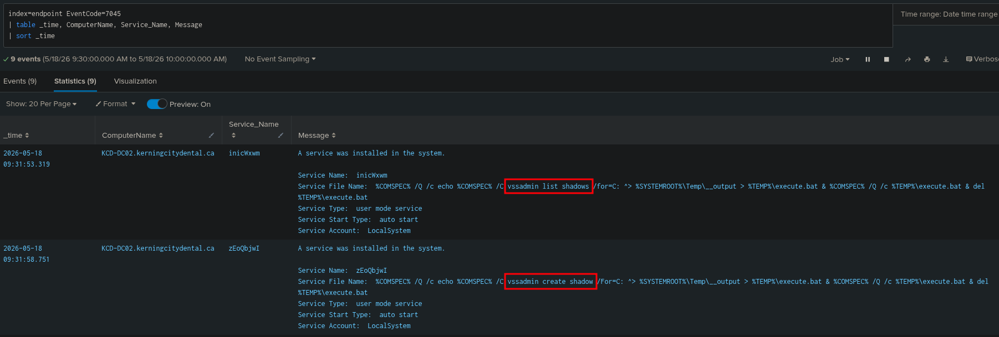

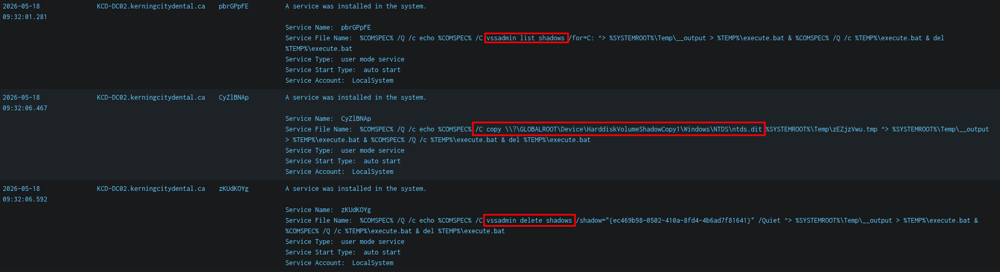

```spl
index=endpoint EventCode=7045
| table _time, ComputerName, Service_Name, Message
| sort _time
```

**Figure-11**

Windows Event ID 4697 triggers whenever a new service is installed on a system. Mesh Agent - a legitimate remote monitoring and management (RMM) tool. It is designed to run in the background allowing users to remotely manage computers via a central MeshCentral server.

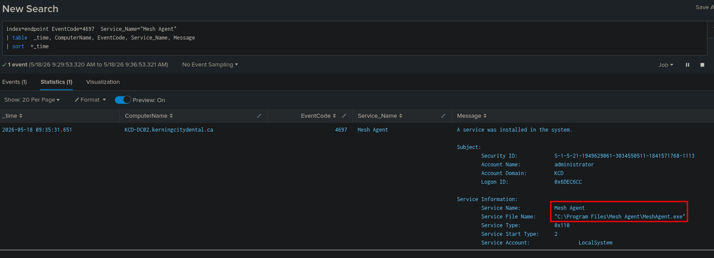

```spl
index=endpoint EventCode=4697  Service_Name="Mesh Agent"
| table  _time, ComputerName, EventCode, Service_Name, Message
| sort  +_time
```

**Figure-12**

Event ID 4688, "A new process has been created”

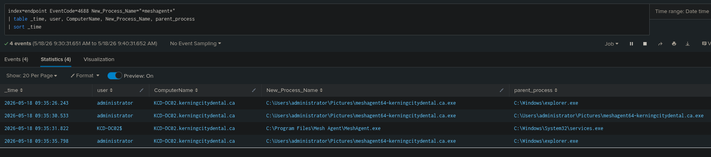

```spl
index=endpoint EventCode=4688 New_Process_Name="*meshagent*"
| table _time, user, ComputerName, New_Process_Name, parent_process
| sort _time
```

**Figure-13**

Windows Event ID 4732 "A member was added to a security-enabled local group.”

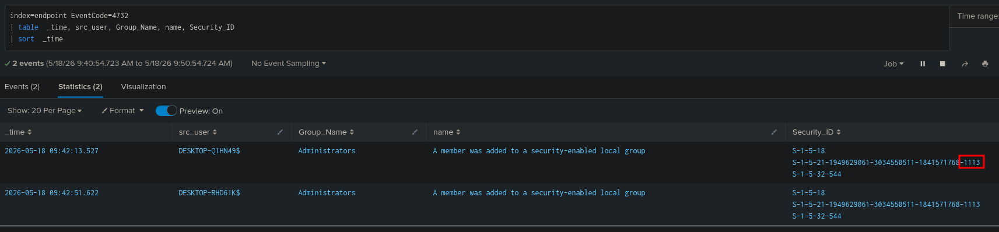

```spl
index=endpoint EventCode=4732
| table  _time, src_user, Group_Name, name, Security_ID
| sort  _time
```

**Figure-14**

Windows Event ID 4739 "Domain Policy was changed”

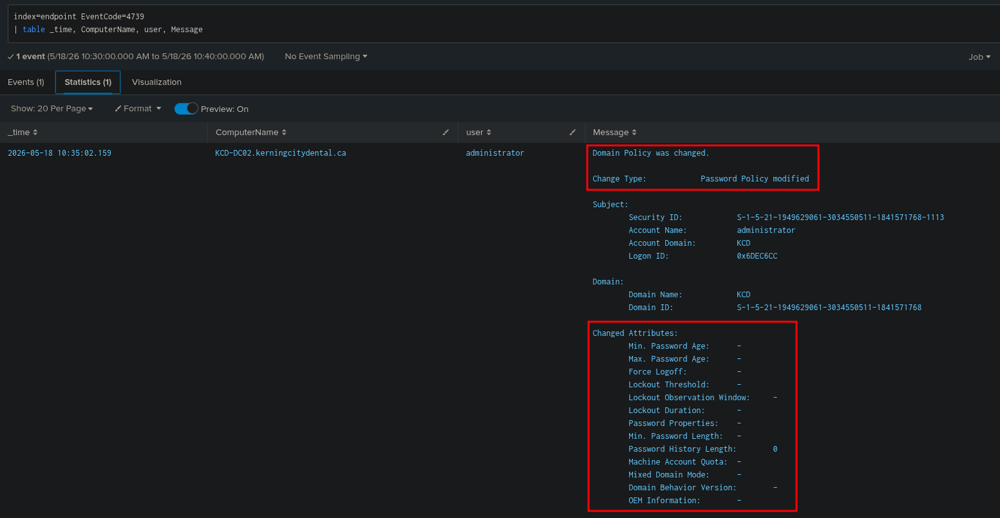

```spl
index=endpoint EventCode=4739
| table _time, ComputerName, user, Message
```

**Figure-15**

Now checking for mimikatz execution

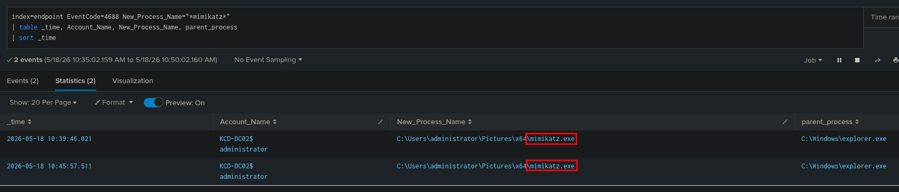

```spl
index=endpoint EventCode=4688 New_Process_Name="*mimikatz*"
| table _time, Account_Name, New_Process_Name, parent_process
| sort _time
```

**Figure-16**

Windows Event ID 4724 is logged when an administrator or privileged user attempts to reset an account's password. Windows Event ID 4738 is logged whenever a user account (local SAM or Active Directory) is successfully modified

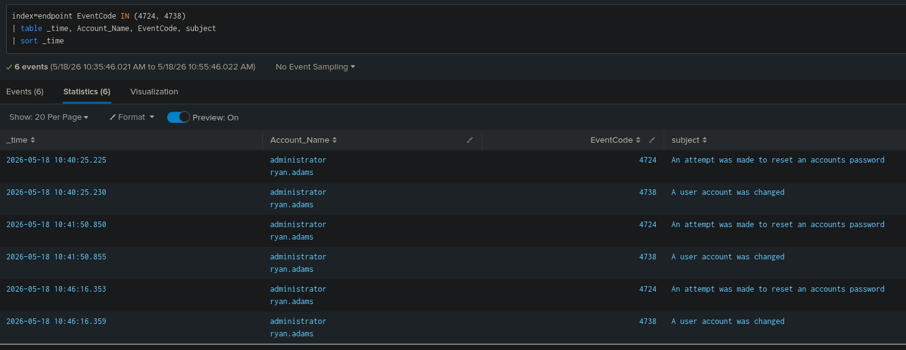

```spl
index=endpoint EventCode IN (4724, 4738)
| table _time, Account_Name, EventCode, subject
| sort _time
```

**Figure-17**

Continuous Scanning to enumerate the subnet

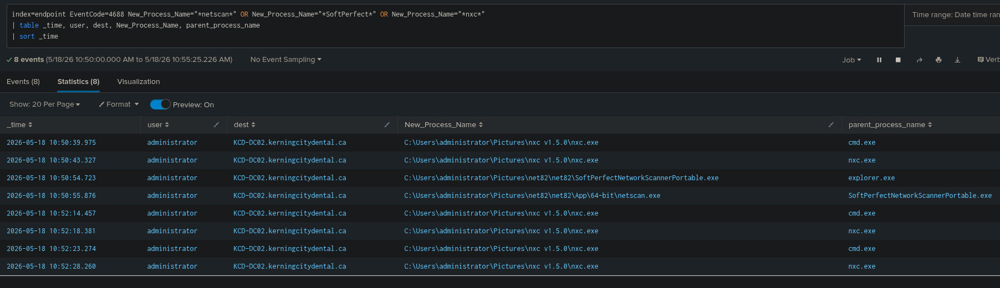

```spl
index=endpoint EventCode=4688 New_Process_Name="*netscan*" OR New_Process_Name="*SoftPerfect*" OR New_Process_Name="*nxc*"
| table _time, user, dest, New_Process_Name, parent_process_name
| sort _time
```

**Figure-18**

Successful SMB logins from DC for all devices on the subnet :(

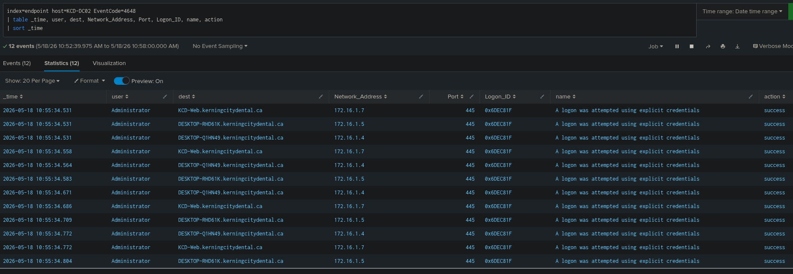

```spl
index=endpoint host=KCD-DC02 EventCode=4648
| table _time, user, dest, Network_Address, Port, Logon_ID, name
| sort _time
```

**Figure-19**

Discovery: Checking for powershell, cmd, and nxc.exe

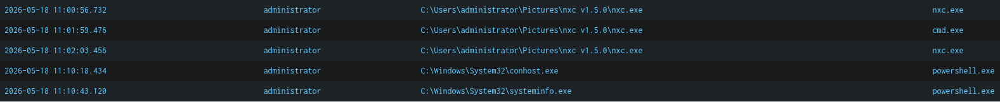

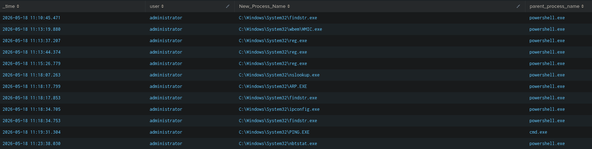

```spl
index=endpoint EventCode=4688 user=administrator
| search parent_process_name IN ("*powershell.exe*","*cmd.exe*","*nxc.exe*")
| table _time, user, New_Process_Name, parent_process_name
| sort _time
```

**Figure-20**

Mstsc.exe is then run on DC to Establish an RDP connection

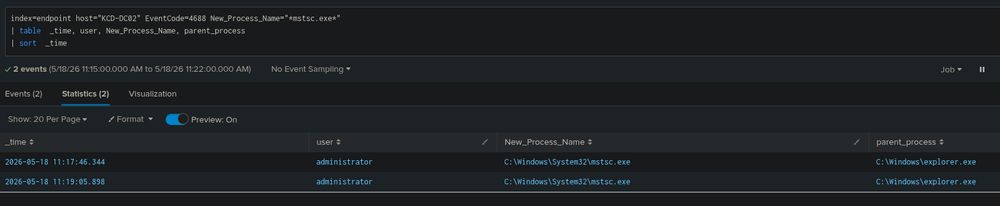

```spl
index=endpoint host="KCD-DC02" EventCode=4688 New_Process_Name="*mstsc.exe*"
| table  _time, user, New_Process_Name, parent_process
| sort  _time
```

**Figure-21**

We then see Configure-SMRemoting.exe running every 2 minutes from 9:46:32.680  to 11:46:33. Attackers use the -Enable switch to configure compromised servers to allow remote management, enabling them to move across the network.

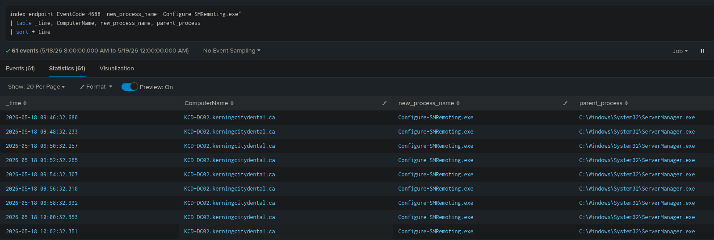

```spl
index=endpoint EventCode=4688  new_process_name="Configure-SMRemoting.exe"
| table _time, ComputerName, new_process_name, parent_process
| sort +_time
```

**Figure-22**

Screenshots of abuseipdb showing the IP of initial login from 64[.]176[.]206[.]178

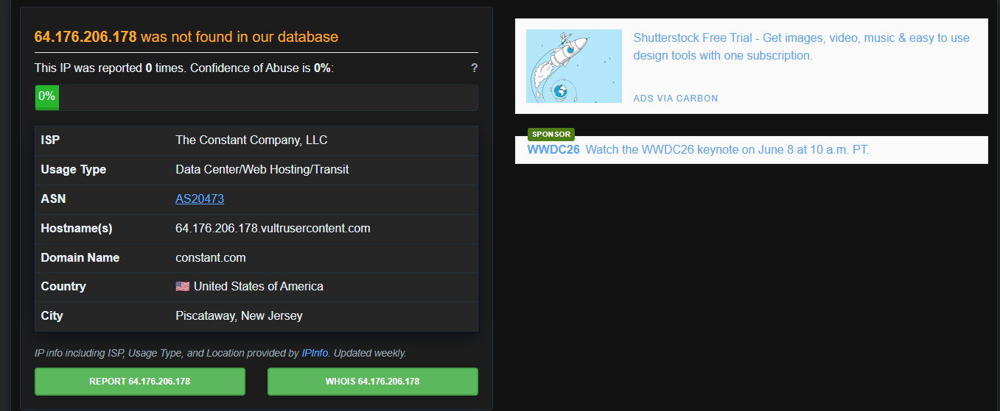

Presumed threat actor’s infrastructure 91[.]238[.]181[.]92

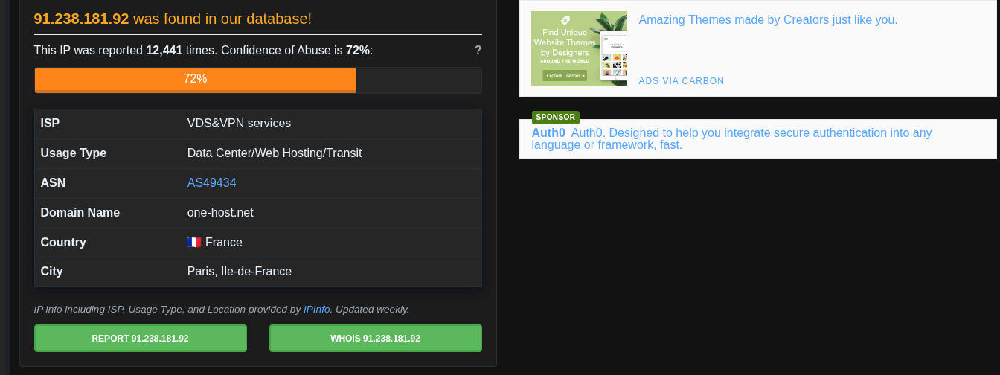

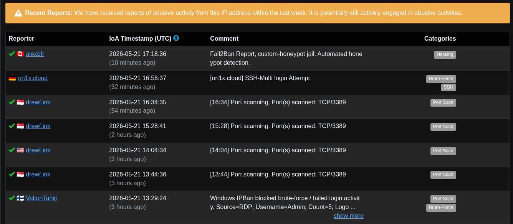

9. Report Status & Review

Report Status

OPEN — Escalated to Incident Response

Reviewed By

SOC Lead / MahCyberDefense — Pending Sign-off

Client Notified

Pending — Kerning City Dental management to be briefed immediately

Regulatory Notification

PENDING — Assess PHI exposure; PIPEDA breach reporting may be required within 72 hours of confirmation

— END OF REPORT —

