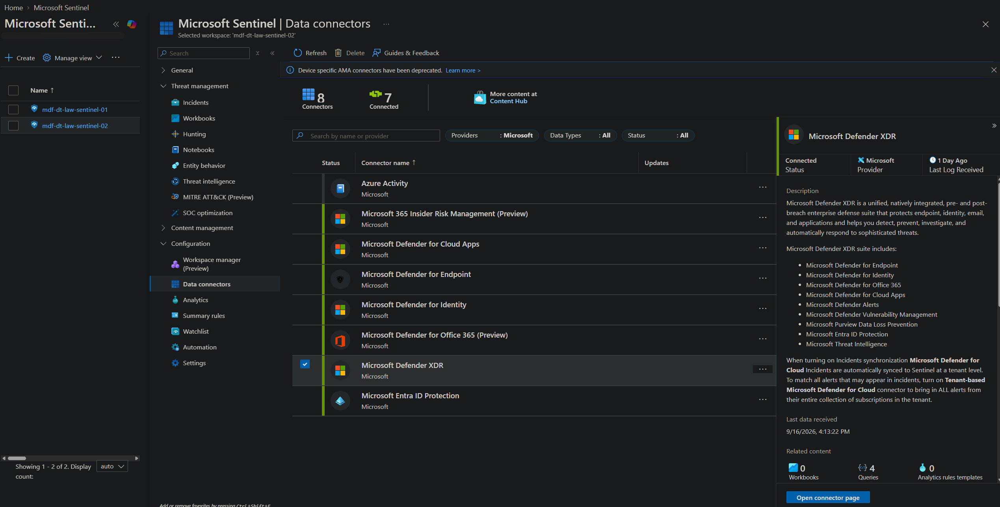
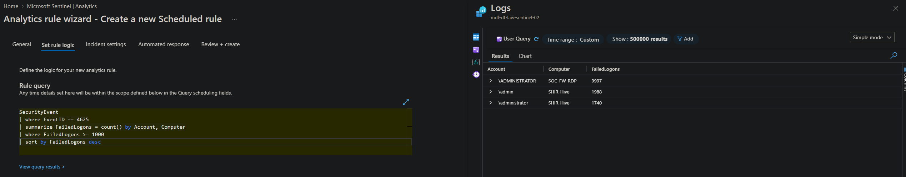
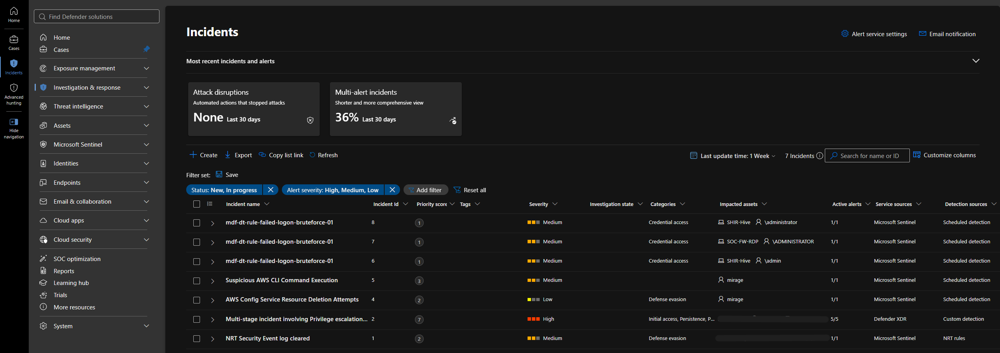

# Microsoft SOC Challenge

A 30-day project building a Microsoft-native SOC lab from scratch and working it like an analyst — Microsoft Sentinel, Defender XDR, Defender for Office 365, and Entra ID.

Part of the [MyDFIR](https://www.mydfir.com/) 30-Day Microsoft SOC Analyst Challenge.

**Timeline:** September 14 – October 13, 2026 · **Status:** In progress

---

## Contents

- [Overview](#overview)
- [Lab setup](#lab-setup)
- [What's running](#whats-running)
- [Data sources](#data-sources)
- [KQL](#kql)
- [Detection built](#detection-built)
- [Investigation reports](#investigation-reports)
- [Dashboard](#dashboard)
- [Day-by-day log](#day-by-day-log)
- [Reflection](#reflection)
- [Skills demonstrated](#skills-demonstrated)

---

## Overview

**What this is.** A full cloud SOC lab built end to end: identity, email, endpoint, and SIEM, with detections written and investigations reported against the telemetry it produces.

**Why I built it.** My portfolio was already strong on Elastic, Splunk, and on-prem Active Directory. This closes the Microsoft/Azure gap that most SOC job descriptions ask for by name.

**Tools used**

- Microsoft Sentinel — analytics rules, workbooks, incidents, KQL hunting
- Microsoft Defender XDR — unified incident queue, data connector into Sentinel
- Defender for Endpoint — endpoint telemetry and advanced hunting
- Defender for Office 365 — phishing investigation, Threat Explorer
- Microsoft Entra ID — identity, sign-in logs, Conditional Access
- Azure Log Analytics, Azure Cost Management
- KQL, MITRE ATT&CK

**Skills practiced**

- Writing and explaining KQL against Microsoft security tables
- Building scheduled analytics rules with entity mapping and ATT&CK alignment
- Triaging alerts to a verdict and writing the investigation up
- Building dashboards that match what the data can actually support
- Standing up and troubleshooting cloud infrastructure

---

## Lab setup

Hybrid — Azure for the SIEM, local hardware for the endpoint.

| Layer | Where it runs |
|---|---|
| SIEM / analytics | Azure — Microsoft Sentinel on Log Analytics |
| Identity | Microsoft 365 E5 trial tenant (Entra ID) |
| Email security | Defender for Office 365 |
| Endpoint | Windows 11 VM in VMware Workstation, local hardware |

The endpoint runs locally because free Azure credits won't provision a VM without converting the subscription to pay-as-you-go.

**Naming convention:** `mdf-dt-<type>-<purpose>-<##>` — `mdf` groups all challenge resources for easy filtering and cleanup, `dt` is my initials.

VM names stay at 15 characters or fewer. Windows still enforces the NetBIOS computer-name limit, and a longer Azure resource name silently desyncs from the OS hostname — which breaks host correlation between Defender for Endpoint and Sentinel.

**Cost controls**

- Azure Cost Management budget `MyDFIR-Challenge` at $10/month with alerting
- Every resource tagged `Project=MyDFIR-M365` · `Owner=Daniel` · `Environment=Lab` · `DeleteAfter=2026-10-13`
- Both E5 trials set to cancel on expiration rather than convert to paid

---

## What's running

| Resource | Name | Region |
|---|---|---|
| Resource group | `mdf-dt-rg-lab-02` | West US |
| Log Analytics workspace | `mdf-dt-law-sentinel-02` | West US |
| Microsoft Sentinel | on `mdf-dt-law-sentinel-02` | West US |
| Sentinel Training Lab | 11+ tables, 18/22 detection rules live | West US |
| Sentinel workbook | `mdf-dt-wb-soc-overview-01` | West US |
| Custom analytics rule | `mdf-dt-rule-failed-logon-bruteforce-01` | West US |
| Windows 11 endpoint | `MDF-DT-W11` | On-prem (VMware) |

An earlier resource group and workspace (`mdf-dt-rg-lab-01` / `mdf-dt-law-sentinel-01`, West US 2) were superseded during the Training Lab deployment — see Day 4 below.

The endpoint is Entra-joined as a dedicated **non-admin** user licensed with E5, not as my admin account. Identity and privilege-escalation scenarios later in the challenge only produce realistic telemetry if they start from an ordinary user's endpoint.

---

## Data sources

**Connectors.** 8 data connectors available, 7 connected. The Microsoft Defender XDR connector is wired into `mdf-dt-law-sentinel-02`, with Defender Alerts fully connected (`AlertInfo`, `AlertEvidence`) so Defender detections land in the Sentinel incident queue alongside Sentinel's own.



**Tables confirmed populated:**

```kql
union withsource=TableName *
| summarize Events = count() by TableName
| sort by Events desc
```

| Table | Events | What it gives me |
|---|---|---|
| `ExposureGraphNodes` | 1,103,105 | Attack surface and asset relationships |
| `GraphAPIAuditEvents` | 2,280 | Graph API activity |
| `EntraIdSignInEvents` | 112 | Identity sign-in telemetry |
| `SecurityEvent` | 18,163 failed logons | Windows security event log |
| `Watchlist` | 16 | Training Lab watchlists |
| `SecurityIncident` / `SecurityAlert` | 2 / 2 | Sentinel incidents and alerts |
| `AlertEvidence` / `AlertInfo` / `IdentityInfo` | 2 / 1 / 1 | Defender XDR enrichment |

---

## KQL

All queries are in [`kql/`](kql/), each with a header comment explaining what it looks for and why.

**Failed logon summary**

```kql
SecurityEvent
| where EventID == 4625
| summarize FailedAttempts = count() by Account, Computer
| sort by FailedAttempts desc
```

Event ID 4625 is Windows logging *an account failed to log on*. This filters to those events, counts them per account-and-host pair, and sorts the highest to the top.

**Why it matters:** a burst of failed logons is the classic signature of brute force or password spraying. Summarizing by account *and* host is what lets you tell them apart — many failures against one account is brute force, few failures across many accounts is spraying, and spraying is the one that slips past lockout policy.

**Result:** `\ADMINISTRATOR` on host `SOC-FW-RDP` with nearly 10,000 failed attempts — an admin account being hammered on an RDP-exposed host.

---

## Detection built

**`mdf-dt-rule-failed-logon-bruteforce-01`** — a scheduled analytics rule written from scratch, not imported from a template.

| Setting | Value |
|---|---|
| Severity | Medium |
| MITRE ATT&CK | Credential Access — T1110 (Brute Force) |
| Frequency | Every 1 hour |
| Lookback | Last 14 days |
| Threshold | Alert if query returns more than 0 results |
| Event grouping | Trigger an alert for each event |
| Entity mapping | Account → `FullName` = `Account` · Host → `HostName` = `Computer` |

```kql
SecurityEvent
| where EventID == 4625
| summarize FailedLogons = count() by Account, Computer
| where FailedLogons >= 1000
| sort by FailedLogons desc
```



**Why the threshold is 1,000.** A handful of failed logons is a user mistyping a password. The interesting signal here is volume, so the rule only fires on accounts crossing four figures within the lookback window. That's deliberately tuned to this dataset — in production the number would come from baselining normal failure rates per host, not from picking a round number.

**Why entity mapping matters.** Without it, Sentinel treats an alert as a row of text. Mapping `Account` and `Computer` to the Account and Host entities lets the platform pivot — click the account and see everything else it touched, build an investigation graph, correlate across rules. An unmapped rule fires but can't be investigated from inside the product.

The rule went live and generated three incidents against the accounts crossing the threshold.



---

## Investigation reports

| Day | Investigation | Verdict | Report |
|---|---|---|---|
| 7 | Multiple failed logons — 18,163 events across 3 hosts | True positive, unsuccessful | [`reports/day07-failed-logon-alert-report.md`](reports/day07-failed-logon-alert-report.md) |

Reports follow the structure I use for casework: **Findings → Summary → 5W1H → Recommendations → Supporting evidence**, with estimative language (*likely / probable / almost certain*) wherever the evidence supports an assessment but not a conclusion. If it can't be backed with evidence, it doesn't go in the report.

---

## Dashboard

**Workbook:** `mdf-dt-wb-soc-overview-01`

| Panel | Query basis | Visualization |
|---|---|---|
| Top 5 Failed Logins | `SecurityEvent` · `EventID == 4625` · by `Account` | Pie |

<!-- TODO: add the rest of the Day 5 panels here -->

**One thing worth noting about the data.** The Training Lab telemetry is bulk-ingested, not streamed, so `TimeGenerated` and `TimeCollected` both reflect ingestion time. All 18,163 failed logons carry a single timestamp, which means a "failed logons over time" chart renders one giant spike and says nothing. I built categorical panels instead.

`LogonTypeName` is also unpopulated in this dataset, so the network / RDP / interactive breakdown isn't available here. Both would be standard panels in a production workspace.

---

## Day-by-day log

| Day | What I did |
|---|---|
| 1 | Azure account, $10 budget with alerting, naming convention, lab plan and schedule |
| 2 | Built the Windows 11 endpoint on-prem in VMware; created a non-admin Entra user licensed E5 and Entra-joined the VM as that user |
| 3 | Walked the Sentinel tabs; created the Log Analytics workspace |
| 4 | Deployed the Sentinel Training Lab; ran three KQL queries |
| 5 | Built the SOC Overview workbook; inventoried the available tables |
| 6 | Connected the Defender XDR data connector; built and enabled my first custom analytics rule, which fired and created three incidents |
| 7 | Investigated the failed-logon alert end to end and wrote the full report |
| 8 | Hunted `OfficeActivity_CL` with no alert to follow; found a file access from an off-baseline IP, bookmarked it and promoted it to an incident |
| 9 | Portfolio setup — this writeup |

**Problems worth recording**

- **Day 2 —** Windows 11 setup died at ~54% three times. I chased two wrong theories before reading `vmware.log`, which showed the virtual disk was set to NVMe while the host drive is SATA. Fixed the controller and the install completed. Two hours lost to not reading the log first.
- **Day 4 —** The Training Lab deployment failed in West US 2. On trial subscriptions, Azure Automation accounts can only be created in a handful of regions, and the Training Lab depends on one. Rebuilt in West US. Azure soft-delete also means deleting and retrying fails identically, so the Conflict error has to be read rather than worked around.
- **Day 4 —** The Training Lab now ingests into the native `SecurityEvent` table with typed fields rather than a custom `_CL` table with string fields. Queries written against the old schema run fine and return nothing, which looks like an absence of findings instead of a broken query.
- **Day 6 —** Sentinel rejects a 5-minute rule frequency against a 14-day lookback: any lookback of 2 days or more requires a frequency of at least 1 hour. The constraint makes sense once you see it — a 14-day query running every 5 minutes would re-scan the same two weeks 288 times a day.

---

## Reflection

**What I can do now that I couldn't before.** Stand up Sentinel on Log Analytics, connect data sources into it, query it in KQL, write a scheduled detection with proper entity mapping, and investigate the resulting incident to a documented verdict — without following click-by-click instructions.

**What was most useful.** Writing a rule and then investigating what it produced, in that order. Building the detection made me decide what "suspicious" meant numerically; investigating the alert showed me what the rule could and couldn't tell me once it fired. Those are two different skills and most tutorials only teach the first.

**What I'd do differently in a real SOC.**

- Check timestamp semantics on any new data source before building time-based dashboards or detections on it. Ingestion time is not event time, and the failure is silent.
- Fix data quality before tuning detections. The 4625 events in this workspace have no source IP, so the brute force couldn't be attributed or blocked — no amount of rule tuning fixes a missing field.
- Clean up or clearly label failed-state resources right away. Leaving `-01` next to `-02` is fine when I'm the only one looking; in a shared environment it's someone querying the wrong workspace and concluding there's no data.
- Treat a zero-row query as unproven, not negative, until I've confirmed the query matches the actual schema.

**What I want to keep improving.** Detection tuning. I can write a rule that fires; deciding a threshold from a baseline rather than from a round number, and measuring the false-positive rate afterward, is the part I want the rest of this challenge to push on.

---

## Skills demonstrated

`Microsoft Sentinel` · `Log Analytics` · `KQL` · `Detection engineering` · `Defender XDR` · `Defender for Office 365` · `Microsoft Entra ID` · `Azure resource management` · `Windows Event Log analysis` · `MITRE ATT&CK` · `Incident documentation`

---

*Lab environment only. All telemetry is synthetic or self-generated. No tenant identifiers, subscription IDs, workspace IDs, or device identifiers are published here; screenshots are redacted accordingly.*
