# Microsoft SOC Challenge

A 30-day project building a Microsoft-native SOC lab from scratch and working it like an analyst — Microsoft Sentinel, Defender XDR, Defender for Office 365, and Entra ID.

Part of the [MyDFIR](https://www.mydfir.com/) 30-Day Microsoft SOC Analyst Challenge.

**Timeline:** September 14 – October 13, 2026 · **Status:** In progress (Day 20 of 30 complete)

---

## Contents

- [Overview](#overview)
- [Lab setup](#lab-setup)
- [What's running](#whats-running)
- [Data sources](#data-sources)
- [KQL](#kql)
- [Detection built](#detection-built)
- [Investigation reports](#investigation-reports)
- [Email security configuration and validation](#email-security-configuration-and-validation)
- [Endpoint hardening and validation](#endpoint-hardening-and-validation)
- [Dashboard](#dashboard)
- [Day-by-day log](#day-by-day-log)
- [Reflection](#reflection)
- [Skills demonstrated](#skills-demonstrated)

---

## Overview

**What this is.** A full cloud SOC lab built end to end: identity, email, endpoint, and SIEM, with detections written and investigations reported against the telemetry it produces.

**Why I built it.** My portfolio was already strong on Elastic, Splunk, and on-prem Active Directory. This closes the Microsoft/Azure gap that most SOC job descriptions ask for by name.

**Tools used**

- Microsoft Sentinel — analytics rules, workbooks, incidents, KQL hunting
- Microsoft Defender XDR — unified incident queue, data connector into Sentinel
- Defender for Endpoint — endpoint telemetry and advanced hunting
- Defender for Office 365 — phishing investigation, Threat Explorer, Safe Links, anti-phishing policy, attack simulation training
- Microsoft Entra ID — identity, sign-in logs, Conditional Access
- Microsoft Intune — endpoint security policy (attack surface reduction)
- Atomic Red Team — adversary simulation for detection validation
- Azure Log Analytics, Azure Cost Management
- KQL, MITRE ATT&CK

**Skills practiced**

- Writing and explaining KQL against Microsoft security tables
- Building scheduled analytics rules with entity mapping and ATT&CK alignment
- Triaging alerts to a verdict and writing the investigation up
- Building dashboards that match what the data can actually support
- Standing up and troubleshooting cloud infrastructure
- Configuring email threat policies and proving them with test messages and hunting queries
- Working a user-reported phish from report to verdict, and reading a credential-harvest simulation
- Enforcing an endpoint control and verifying it on the endpoint, not only in the portal
- Validating detections with adversary simulation and tracing alerts back to raw telemetry

---

## Lab setup

Hybrid — Azure for the SIEM, local hardware for the endpoint.

| Layer | Where it runs |
|---|---|
| SIEM / analytics | Azure — Microsoft Sentinel on Log Analytics |
| Identity | Microsoft 365 E5 trial tenant (Entra ID) |
| Email security | Defender for Office 365 |
| Endpoint | Windows 11 VM in VMware Workstation, local hardware |
| Endpoint management | Microsoft Intune (Microsoft 365 E5 trial tenant) |

The endpoint runs locally because free Azure credits won't provision a VM without converting the subscription to pay-as-you-go.

**Naming convention:** `mdf-dt-<type>-<purpose>-<##>` — `mdf` groups all challenge resources for easy filtering and cleanup, `dt` is my initials.

VM names stay at 15 characters or fewer. Windows still enforces the NetBIOS computer-name limit, and a longer Azure resource name silently desyncs from the OS hostname — which breaks host correlation between Defender for Endpoint and Sentinel.

**Cost controls**

- Azure Cost Management budget `MyDFIR-Challenge` at $10/month with alerting
- Every resource tagged `Project=MyDFIR-M365` · `Owner=Daniel` · `Environment=Lab` · `DeleteAfter=2026-10-13`
- Both E5 trials set to cancel on expiration rather than convert to paid

---

## What's running

| Resource | Name | Region |
|---|---|---|
| Resource group | `mdf-dt-rg-lab-02` | West US |
| Log Analytics workspace | `mdf-dt-law-sentinel-02` | West US |
| Microsoft Sentinel | on `mdf-dt-law-sentinel-02` | West US |
| Sentinel Training Lab | 11+ tables, 18/22 detection rules live | West US |
| Sentinel workbook | `mdf-dt-wb-soc-overview-01` | West US |
| Custom analytics rule | `mdf-dt-rule-failed-logon-bruteforce-01` | West US |
| Windows 11 endpoint | `MDF-DT-W11` | On-prem (VMware) |
| Lab users | `richard.hale` (CFO, Finance) and `robert.smith` | Tenant |
| Safe Links policy | `mdf-dt-safelinks-allusers-01` | Tenant |
| Anti-phishing policy | `mdf-dt-antiphish-allusers-01` | Tenant |
| Attack simulation | `mdf-dt-sim-credential-harvest-01` | Tenant |
| Defender for Endpoint onboarding | `MDF-DT-W11` | Tenant |
| Intune ASR policy | `mdf-dt-asr-policy-01` | Tenant |
| Entra device group | `mdf-dt-grp-asr-test-01` | Tenant |

An earlier resource group and workspace (`mdf-dt-rg-lab-01` / `mdf-dt-law-sentinel-01`, West US 2) were superseded during the Training Lab deployment — see Day 4 below.

The endpoint is Entra-joined as a dedicated **non-admin** user licensed with E5, not as my admin account. Identity and privilege-escalation scenarios later in the challenge only produce realistic telemetry if they start from an ordinary user's endpoint.

---

## Data sources

**Connectors.** 8 data connectors available, 7 connected. The Microsoft Defender XDR connector is wired into `mdf-dt-law-sentinel-02`, with Defender Alerts fully connected (`AlertInfo`, `AlertEvidence`) so Defender detections land in the Sentinel incident queue alongside Sentinel's own.

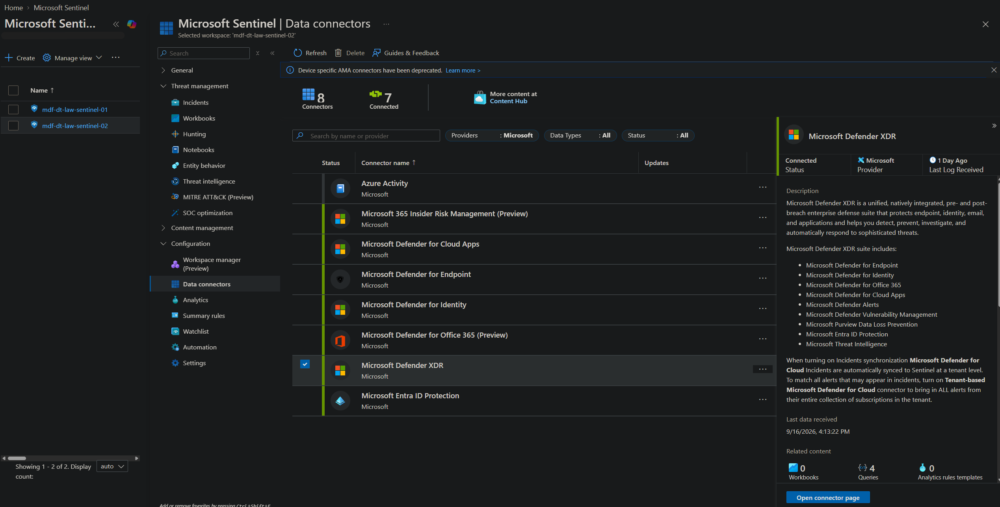

**Tables confirmed populated:**

```kql
union withsource=TableName *
| summarize Events = count() by TableName
| sort by Events desc
```

| Table | Events | What it gives me |
|---|---|---|
| `ExposureGraphNodes` | 1,103,105 | Attack surface and asset relationships |
| `GraphAPIAuditEvents` | 2,280 | Graph API activity |
| `EntraIdSignInEvents` | 112 | Identity sign-in telemetry |
| `SecurityEvent` | 18,163 failed logons | Windows security event log |
| `Watchlist` | 16 | Training Lab watchlists |
| `SecurityIncident` / `SecurityAlert` | 2 / 2 | Sentinel incidents and alerts |
| `AlertEvidence` / `AlertInfo` / `IdentityInfo` | 2 / 1 / 1 | Defender XDR enrichment |

---

## KQL

All queries are in [`kql/`](kql/), each with a header comment explaining what it looks for and why.

**Failed logon summary**

```kql
SecurityEvent
| where EventID == 4625
| summarize FailedAttempts = count() by Account, Computer
| sort by FailedAttempts desc
```

Event ID 4625 is Windows logging *an account failed to log on*. This filters to those events, counts them per account-and-host pair, and sorts the highest to the top.

**Why it matters:** a burst of failed logons is the classic signature of brute force or password spraying. Summarizing by account *and* host is what lets you tell them apart — many failures against one account is brute force, few failures across many accounts is spraying, and spraying is the one that slips past lockout policy.

**Result:** `\ADMINISTRATOR` on host `SOC-FW-RDP` with nearly 10,000 failed attempts — an admin account being hammered on an RDP-exposed host.

**Safe Links click tracing**

```kql
EmailEvents
| where RecipientEmailAddress contains "richard"
| where SenderFromAddress =~ "phishingmydfir@gmail.com"
| project Timestamp, UrlCount, Subject, SenderFromAddress, RecipientEmailAddress, DeliveryAction, DeliveryLocation, NetworkMessageId
| sort by Timestamp asc

UrlClickEvents
| where AccountUpn startswith "richard.hale@"
| project Timestamp, AccountUpn, Url, ActionType, Workload, IsClickedThrough
```

Safe Links rewrites a link at delivery and logs the click in `UrlClickEvents`. The first query lists the messages from one sender to one recipient; the second lists that recipient's clicks. Matching `NetworkMessageId` across the two ties a click to the exact email that carried the link. Full version with notes: [`safelinks-click-tracing.kql`](kql/safelinks-click-tracing.kql).

**Why it matters:** the same ID is how a click, an Explorer entry, and a user report all point at one message. `IsClickedThrough` means the user clicked past a warning page, not that they clicked the link.

**Result:** the 11:50 AM message had `UrlCount` 1, and `UrlClickEvents` showed one `ClickAllowed` row for `https://google.com/` with `IsClickedThrough` 0. `UrlClickEvents` was empty right after the click and filled in later because of ingestion delay.

**Run key persistence (Atomic Red Team)**

```kql
DeviceRegistryEvents
| where DeviceName =~ "mdf-dt-w11"
| where RegistryKey contains "CurrentVersion\\Run"
| project Timestamp, RegistryKey, RegistryValueName, RegistryValueData, InitiatingProcessCommandLine
```

Run and RunOnce keys are where Windows looks for programs to start at logon, so a write to them is a classic persistence signal. This returns every write with the command that made it.

**Why it matters:** the value data shows what will run and the command line shows who wrote it, which is enough to separate a software installer from a script planting a payload.

**Result:** two rows from the Atomic Red Team tests: a HKCU `Run` value pointing at `C:\Path\AtomicRedTeam.exe`, and a HKLM `RunOnce` value holding a PowerShell command that downloads and runs a script. The RunOnceEx write (most likely test 2) left no row here. Its `reg.exe` command line was only visible in `DeviceProcessEvents` ([`reg-exe-runonce-process.kql`](kql/reg-exe-runonce-process.kql)), and the scheduled task test was only in `DeviceEvents` ([`scheduled-task-created.kql`](kql/scheduled-task-created.kql)). Telemetry coverage differs by table, so one query is not enough.

---

## Detection built

**`mdf-dt-rule-failed-logon-bruteforce-01`** — a scheduled analytics rule written from scratch, not imported from a template.

| Setting | Value |
|---|---|
| Severity | Medium |
| MITRE ATT&CK | Credential Access — T1110 (Brute Force) |
| Frequency | Every 1 hour |
| Lookback | Last 14 days |
| Threshold | Alert if query returns more than 0 results |
| Event grouping | Trigger an alert for each event |
| Entity mapping | Account → `FullName` = `Account` · Host → `HostName` = `Computer` |

```kql
SecurityEvent
| where EventID == 4625
| summarize FailedLogons = count() by Account, Computer
| where FailedLogons >= 1000
| sort by FailedLogons desc
```

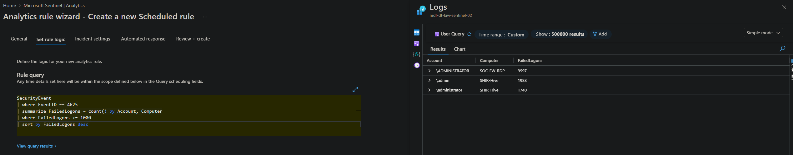

**Why the threshold is 1,000.** A handful of failed logons is a user mistyping a password. The interesting signal here is volume, so the rule only fires on accounts crossing four figures within the lookback window. That's deliberately tuned to this dataset — in production the number would come from baselining normal failure rates per host, not from picking a round number.

**Why entity mapping matters.** Without it, Sentinel treats an alert as a row of text. Mapping `Account` and `Computer` to the Account and Host entities lets the platform pivot — click the account and see everything else it touched, build an investigation graph, correlate across rules. An unmapped rule fires but can't be investigated from inside the product.

The rule went live and generated three incidents against the accounts crossing the threshold.

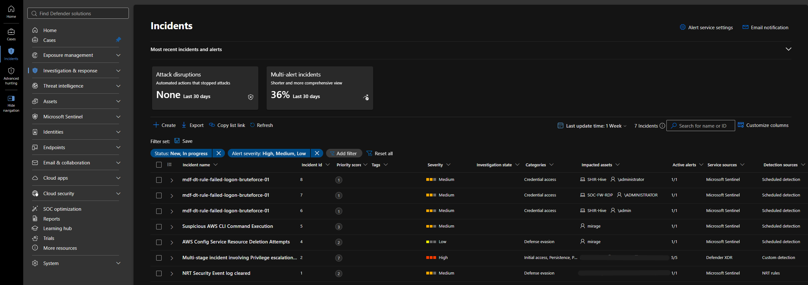

---

## Investigation reports

| Day | Investigation | Verdict | Report |
|---|---|---|---|
| 7 | Multiple failed logons — 18,163 events across 3 hosts | True positive, unsuccessful | [`reports/day07-failed-logon-alert-report.md`](reports/day07-failed-logon-alert-report.md) |
| 16 | Suspicious email — simulated "Microsoft Support Team" password-expiry phish to the CFO test user | Phish, quarantined by Exchange Online Protection (High Confidence), not in the mailbox | [`reports/day16-suspicious-email-report.md`](reports/day16-suspicious-email-report.md) |

Reports follow the structure I use for casework: **Findings → Summary → 5W1H → Recommendations → Supporting evidence**, with estimative language (*likely / probable / almost certain*) wherever the evidence supports an assessment but not a conclusion. If it can't be backed with evidence, it doesn't go in the report.

---

## Email security configuration and validation

Day 10 sets up the two lab users, and Days 11-15 cover Defender for Office 365: reviewing the default policies, building two of my own, and testing them with messages from an external Gmail account to the CFO test user. Day 14 had no assignment, so I used it to explore the user-reported phish workflow. The Day 16 mini project is the suspicious email report in the table above.

| Day | Work | Result |
|---|---|---|
| 10 | Created the lab users: a CFO in Finance and a second user, each licensed Microsoft 365 E5 (no Teams) | Both users show as licensed in Active users, and the CFO user has the default role with no admin center access. A test email sent between the two users was delivered, which confirmed the mailboxes worked before any policies were built. |
| 11 | Reviewed the threat policies and recorded the tenant baseline | Only the default anti-phishing policy existed and Built-in protection was the only active preset. Configuration analyzer listed 18 findings, 12 of them anti-phishing. In the default anti-spam policy, the high-confidence spam and phishing email detection actions are Move to Junk Email folder, and the default anti-phishing impersonation action is "No action". |
| 12 | Built Safe Links policy `mdf-dt-safelinks-allusers-01` (URL rewriting, real-time scanning, click tracking on, click-through off) | A test link was rewritten to a safelinks URL, and `UrlClickEvents` logged a ClickAllowed row whose `NetworkMessageId` matched the email in `EmailEvents`. |
| 13 | Built anti-phishing policy `mdf-dt-antiphish-allusers-01` (threshold 3, CFO user protected, impersonation and spoof actions set to Quarantine) | Configuration analyzer moved from 12 to 14 anti-phishing findings. The 12 default-policy findings remain because the default policy sits unchanged underneath. |
| 14 | No assignment. Worked a user-reported phish through Submissions and Explorer | Marked it Phishing, and the reporter received the follow-up email. The report's subject carries the original `NetworkMessageId`, so it pivots straight into hunting. A report covers only the one message, so scoping needs a sender search. |
| 15 | Sent a BEC-style lure and ran credential-harvest simulation `mdf-dt-sim-credential-harvest-01` against both lab users | The BEC-style lure reached the Inbox with Threat type None. Safe Links rewrote its link and a first-contact tip appeared, but nothing blocked it. In the simulation, 1 of 2 users was compromised as of the report capture (the simulation was still in progress): the CFO test user clicked, supplied credentials, and was assigned two training courses. The simulation email itself never appeared in `EmailEvents` or Explorer, only the training notifications did. |

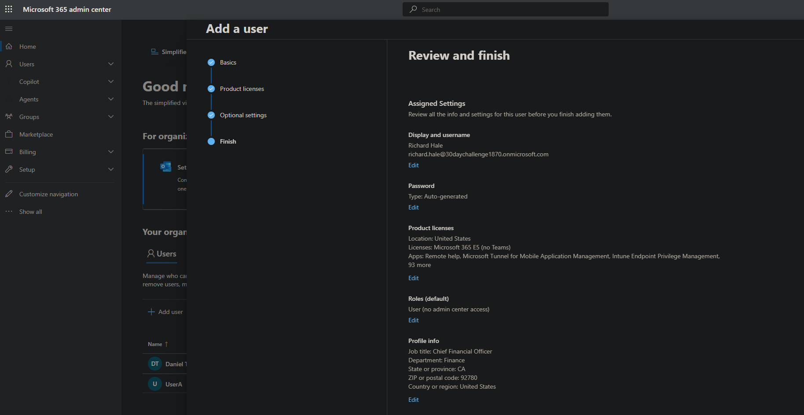

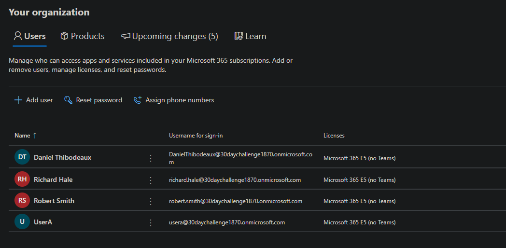

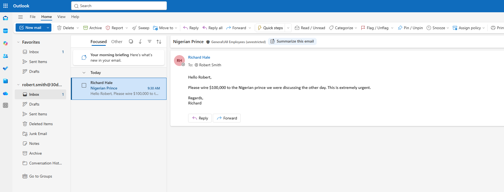

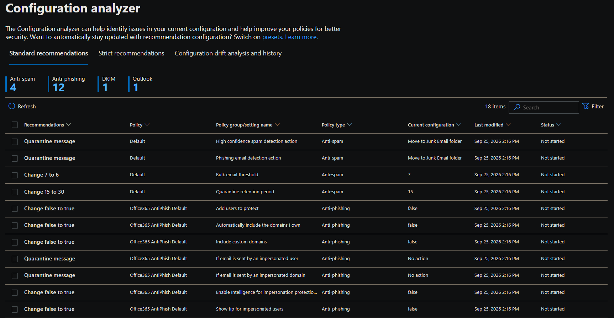

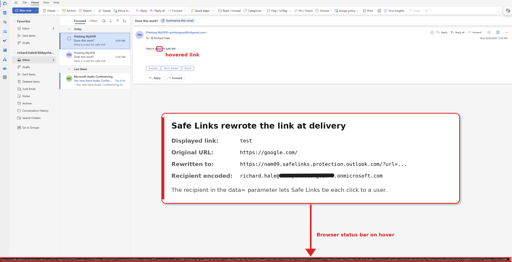

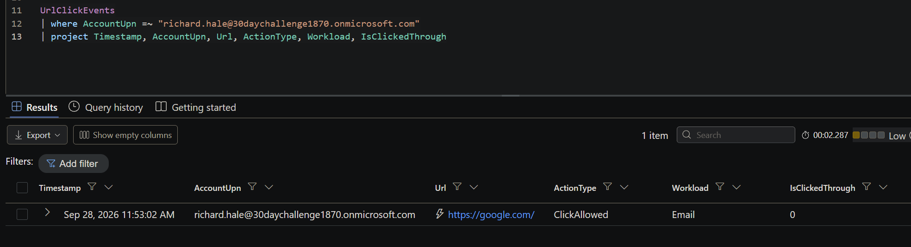

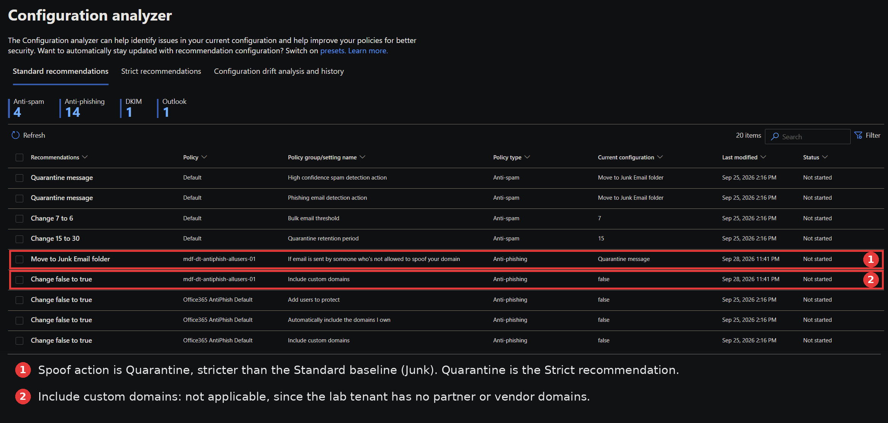

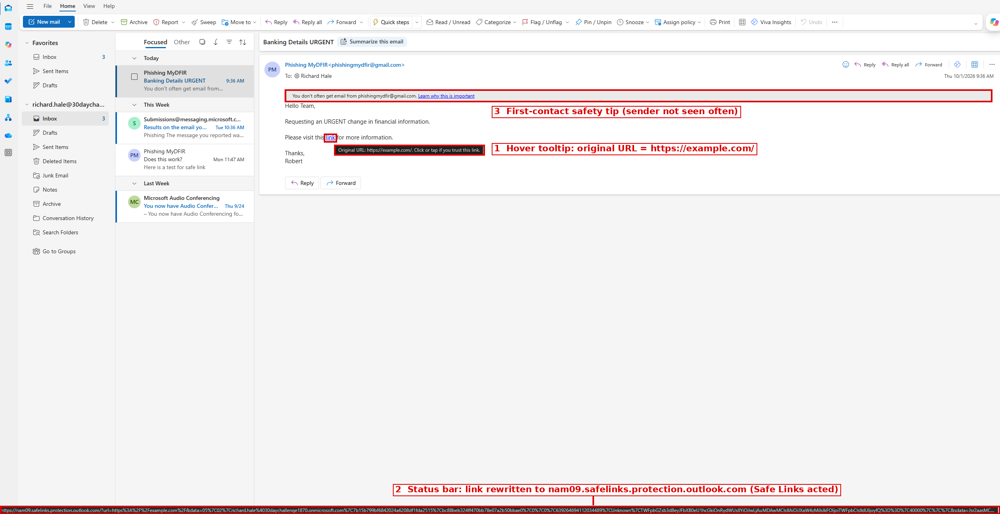

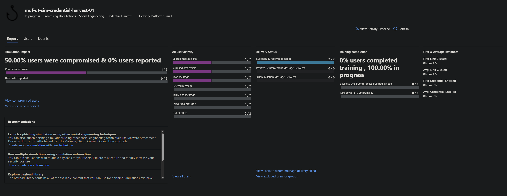

---

## Endpoint hardening and validation

Beyond investigating alerts, the challenge also covers onboarding the endpoint, hardening it, and proving the detections work. Day 19 and Day 20 are hands-on exercises rather than investigations, so their writeups live in [`writeups/`](writeups/) instead of the reports folder.

| Day | Work | Result | Writeup |
|---|---|---|---|
| 17 | Onboarded the Windows 11 endpoint to Defender for Endpoint with the local script and ran the detection test | The device shows Onboarded and Active in Device Inventory. | None |
| 18 | Investigated two events on the device timeline: an EICAR test file and a PowerShell detection test | EICAR was prevented by antivirus before `explorer.exe` could open it. The PowerShell test was caught by EDR on a signed Microsoft binary, tagged T1059.001. Both were expected test activity, and the two alerts landed as separate incidents (808 and 809). | None |
| 19 | Intune attack surface reduction policy, four rules in Block, scoped to a one-device group | Intune reported Succeeded 1, and all four rules were enforcing on the endpoint | [`writeups/day19-asr-policy-writeup.md`](writeups/day19-asr-policy-writeup.md) |
| 20 | Atomic Red Team: registry run keys and a scheduled task | Defender XDR raised persistence alerts and a High alert, then contained the account through attack disruption | [`writeups/day20-atomic-red-team-writeup.md`](writeups/day20-atomic-red-team-writeup.md) |

Enforcement on Day 19 is verified by configuration on the endpoint, not by a live block.

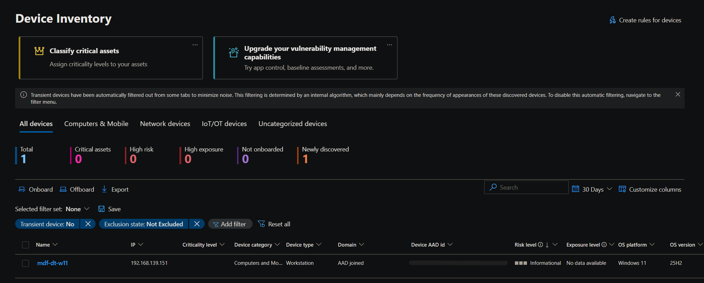

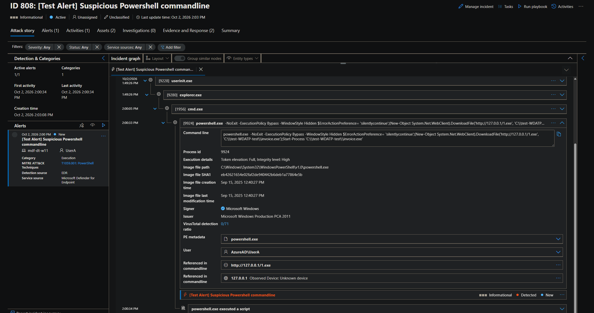

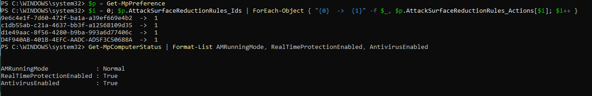

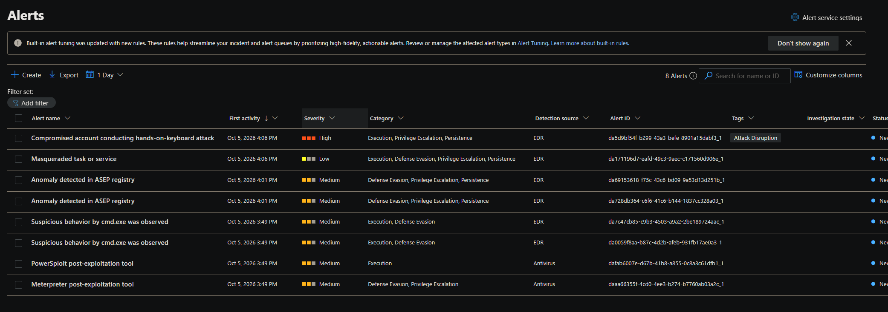

---

## Dashboard

**Workbook:** `mdf-dt-wb-soc-overview-01`

Baseline monitoring for the lab. Default time range 30 days.

| Panel | Query basis | Visualization |
|---|---|---|
| Top 5 Failed Logins | `SecurityEvent` · `EventID == 4625` · by `Account` | Donut |
| Failed Logons by Target Host | `SecurityEvent` · `EventID == 4625` · by `Computer` | Bar + tiles |
| Event Volume by Event ID | `SecurityEvent` · by `EventID` | Tiles |

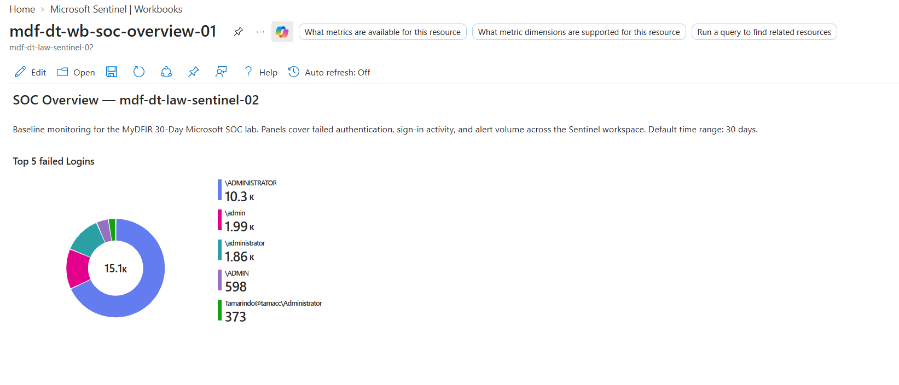

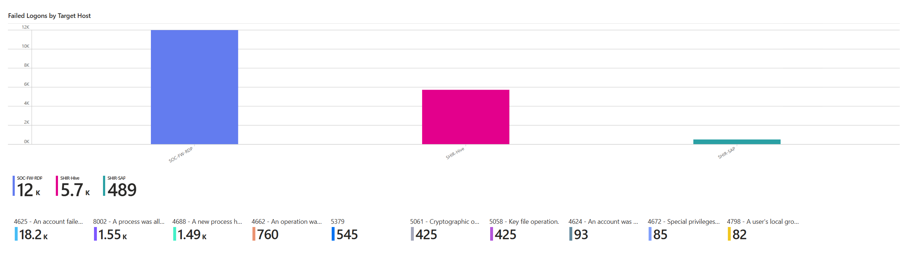

**One thing worth noting about the data.** The Training Lab telemetry is bulk-ingested, not streamed, so `TimeGenerated` and `TimeCollected` both reflect ingestion time. All 18,163 failed logons carry a single timestamp, which means a "failed logons over time" chart renders one giant spike and says nothing. I built categorical panels instead.

`LogonTypeName` is also unpopulated in this dataset, so the network / RDP / interactive breakdown isn't available here. Both would be standard panels in a production workspace.

---

## Day-by-day log

| Day | What I did |
|---|---|
| 1 | Azure account, $10 budget with alerting, naming convention, lab plan and schedule |
| 2 | Built the Windows 11 endpoint on-prem in VMware; created a non-admin Entra user licensed E5 and Entra-joined the VM as that user |
| 3 | Walked the Sentinel tabs; created the Log Analytics workspace |
| 4 | Deployed the Sentinel Training Lab; ran three KQL queries |
| 5 | Built the SOC Overview workbook; inventoried the available tables |
| 6 | Connected the Defender XDR data connector; built and enabled my first custom analytics rule, which fired and created three incidents |
| 7 | Investigated the failed-logon alert end to end and wrote the full report |
| 8 | Hunted `OfficeActivity_CL` with no alert to follow; found a file access from an off-baseline IP, bookmarked it and promoted it to an incident |
| 9 | Portfolio setup — this writeup |
| 10 | Created the lab users (a CFO in Finance and a second user) with E5 (no Teams) licenses and confirmed mail flow with a test email between them |
| 11 | Reviewed the Defender for Office 365 threat policies and recorded the tenant baseline (default anti-phishing policy only, 18 Configuration analyzer findings) |
| 12 | Built a Safe Links policy and confirmed a test link was rewritten and the click was logged in `UrlClickEvents` |
| 13 | Built an anti-phishing policy protecting the CFO test user, with impersonation and spoof actions set to Quarantine |
| 14 | No assignment. Worked a user-reported phish through Submissions and Explorer and marked it Phishing |
| 15 | Sent a BEC-style lure that reached the Inbox, and ran a credential-harvest simulation (1 of 2 users compromised) |
| 16 | Mini project: investigated a simulated password-expiry phish, quarantined as High Confidence Phish, and wrote the report |
| 17 | Onboarded the Windows 11 endpoint to Defender for Endpoint |
| 18 | Investigated two events on the device timeline: an EICAR test file prevented by antivirus and a PowerShell test alert caught by EDR. Both were expected test activity |
| 19 | Built an Intune attack surface reduction policy (four rules in Block), scoped it to a one-device group, and verified it on the endpoint |
| 20 | Ran Atomic Red Team persistence tests, traced the alerts to raw telemetry, and hunted across three tables |

---

## Reflection

**What I can do now that I couldn't before.** Stand up Sentinel on Log Analytics, connect data sources into it, query it in KQL, write a scheduled detection with proper entity mapping, and investigate the resulting incident to a documented verdict — without following click-by-click instructions.

**What was most useful.** Writing a rule and then investigating what it produced, in that order. Building the detection made me decide what "suspicious" meant numerically; investigating the alert showed me what the rule could and couldn't tell me once it fired. Those are two different skills and most tutorials only teach the first.

**What I'd do differently in a real SOC.**

- Check timestamp semantics on any new data source before building time-based dashboards or detections on it. Ingestion time is not event time, and the failure is silent.
- Fix data quality before tuning detections. The 4625 events in this workspace have no source IP, so the brute force couldn't be attributed or blocked — no amount of rule tuning fixes a missing field.
- Clean up or clearly label failed-state resources right away. Leaving `-01` next to `-02` is fine when I'm the only one looking; in a shared environment it's someone querying the wrong workspace and concluding there's no data.
- Treat a zero-row query as unproven, not negative, until I've confirmed the query matches the actual schema.
- Don't rely on filtering alone. A BEC-style lure reached the Inbox with Threat type None on Day 15, and a click-through simulation compromised one of two users, so user reporting and training are the backstop.
- Scope after a user report. A report covers only the message reported, so search for the sender to find every copy.
- Record what I could not determine. The Day 16 report says why there is no URL IOC instead of guessing.
- Verify a control on the endpoint, not only in the portal. Intune said the ASR policy succeeded; `Get-MpPreference` is what showed the four rules enforcing.
- Check more than one telemetry table before concluding something didn't happen. One persistence test showed up only as a process command line.
- Know what automated response can do to my own accounts before running simulations, and where to find and undo it.

**What I want to keep improving.** Detection tuning. I can write a rule that fires; deciding a threshold from a baseline rather than from a round number, and measuring the false-positive rate afterward, is the part I want the rest of this challenge to push on.

---

## Skills demonstrated

`Microsoft Sentinel` · `Log Analytics` · `KQL` · `Detection engineering` · `Defender XDR` · `Defender for Office 365` · `Microsoft Entra ID` · `Azure resource management` · `Windows Event Log analysis` · `MITRE ATT&CK` · `Incident documentation` · `Microsoft Intune` · `Defender for Endpoint` · `Attack surface reduction` · `Adversary simulation (Atomic Red Team)` · `Advanced hunting` · `Safe Links` · `Anti-phishing policy` · `Attack simulation training` · `Device timeline investigation`

---

*Lab environment only. All telemetry is synthetic or self-generated. No tenant identifiers, subscription IDs, workspace IDs, or device identifiers are published here; screenshots are redacted accordingly.*
