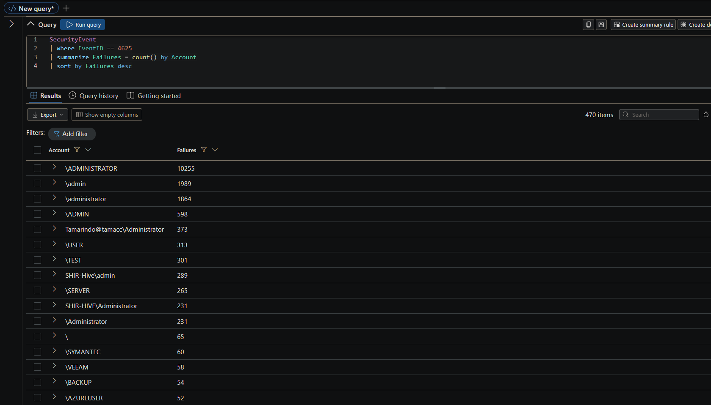
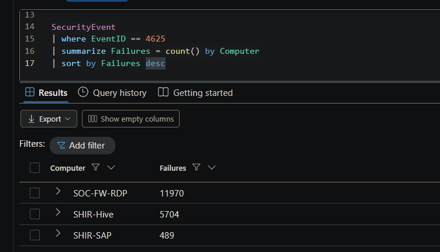
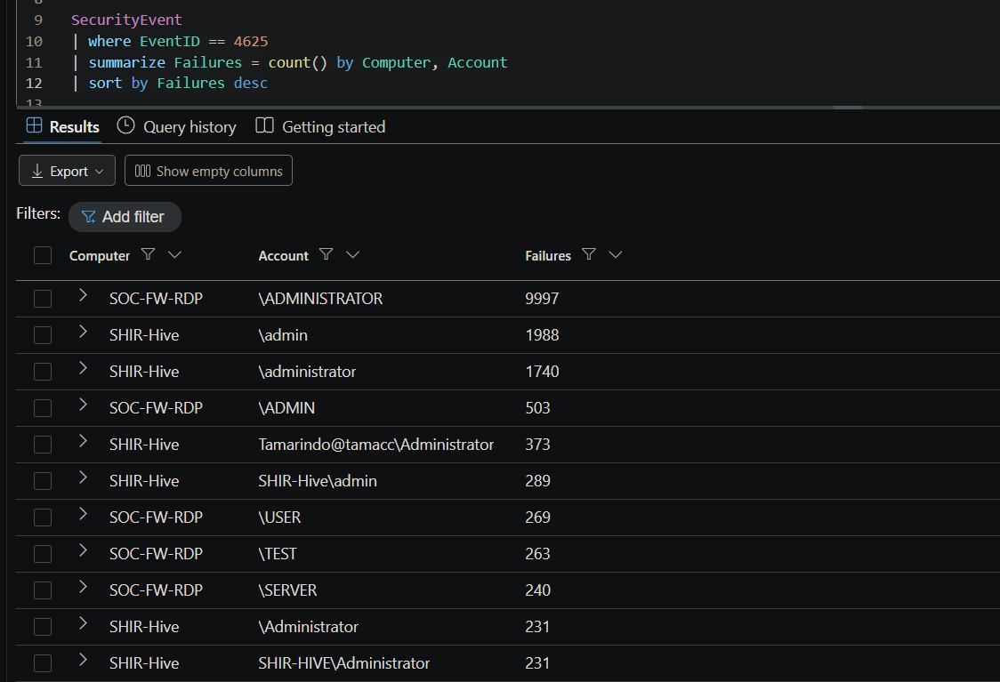
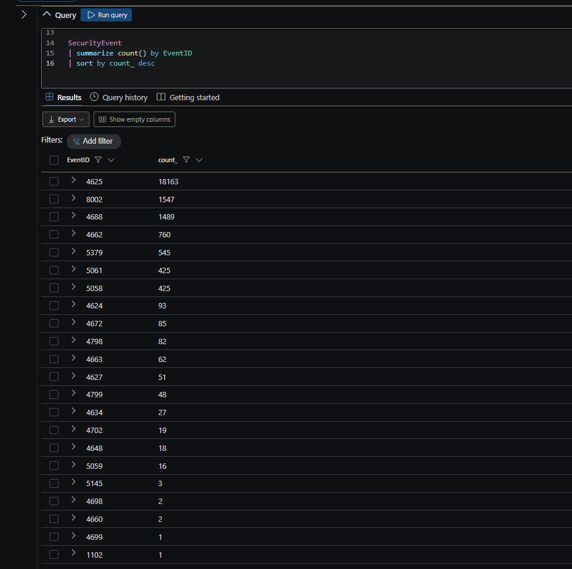
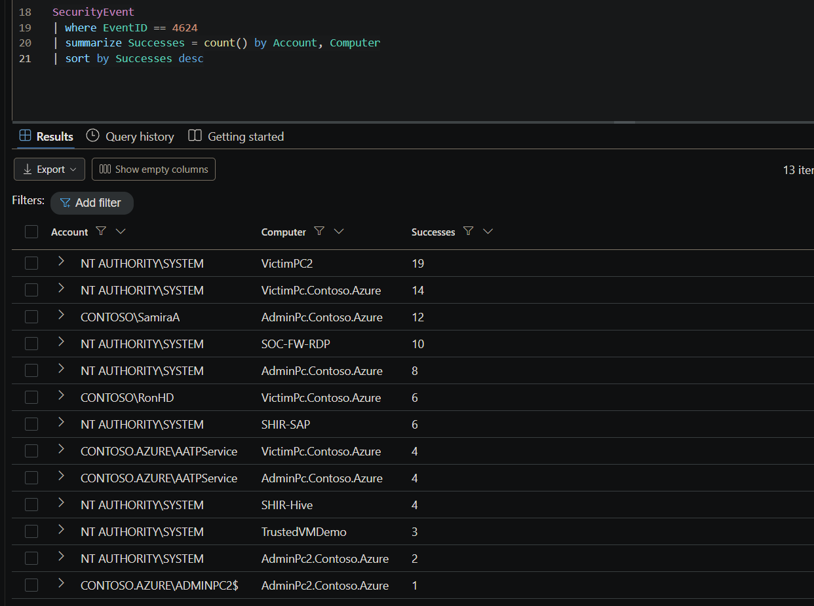
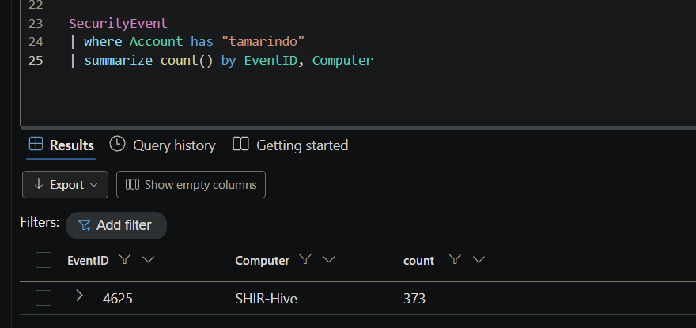

# Alert Report — Multiple Failed Logons

**Analyst:** Daniel Thibodeaux
**Date of report:** 2026-09-22
**Alert:** Multiple Failed Logon Attempts
**Severity:** Medium
**Data source:** `SecurityEvent` table, Log Analytics workspace `mdf-dt-law-sentinel-02`
**MITRE ATT&CK:** T1110 — Brute Force (Credential Access)

**Verdict:** True positive — attempted credential brute force. No evidence of successful authentication.

---

## Findings

- Total failed logon events (4625): **18,163**
- Distinct account names targeted: **470**
- Affected hosts: `SOC-FW-RDP` (11,970 failures) · `SHIR-Hive` (5,704) · `SHIR-SAP` (489)
- Authentication package: NTLM
- Successful logons (4624) for any targeted account: **none**
- Total successful logons in dataset: 93, all attributable to normal system and user activity
- Source IP: not available — field not populated in this dataset

**Top targeted accounts**, with case variants combined (Windows account names are not case-sensitive):

| Account | Failures |
|---|---|
| administrator | 12,581 |
| admin | 2,876 |
| Tamarindo@tamacc | 373 |
| USER | 313 |
| TEST | 301 |

The `administrator` total combines `\ADMINISTRATOR` (10,255), `\administrator` (1,864), `\Administrator` (231), and `SHIR-HIVE\Administrator` (231) — approximately **69% of all failed logons**.

The `admin` total combines `\admin` (1,989), `\ADMIN` (598), and `SHIR-Hive\admin` (289).

---

## Investigation summary

A high volume of failed logon events was observed against three hosts, with the majority directed at `SOC-FW-RDP`, a system whose naming convention indicates it is RDP-facing. Authentication attempts used NTLM.

The distribution of targeted account names indicates automated username guessing rather than legitimate user error. Across 470 distinct account names, the list includes localized variants of the built-in administrator account (ADMINISTRADOR, ADMINISTRATEUR), default service accounts for common backup and security software (SYMANTEC, VEEAM, BACKUP, BACKUPEXEC), cloud and virtualization defaults (AZUREUSER, AZUREADMIN, VMADMIN), and generic test accounts (TEST, DEMOUSER, DEMOADMIN). This composition is consistent with a published brute-force wordlist.

One account does not fit the wordlist pattern. `Tamarindo@tamacc\Administrator` accounts for 373 failures, all against `SHIR-Hive`. The email-format name suggests a real person rather than a wordlist entry. This is likely a legitimate user account, either targeted deliberately or generating failures from a stale cached credential, and should be verified with the account owner.

All 93 successful logons in the dataset were reviewed. All are attributable to `NT AUTHORITY\SYSTEM`, two legitimate domain users on their own workstations (`CONTOSO\SamiraA`, `CONTOSO\RonHD`), a Defender for Identity service account (`CONTOSO.AZURE\AATPService`), and a computer account (`CONTOSO.AZURE\ADMINPC2$`). No targeted account appears in the success list. On the three affected hosts, the only successful logons were SYSTEM.

Based on the evidence available, the brute-force attempt is assessed as **unsuccessful with high confidence**. This assessment is limited to the `SecurityEvent` data in this workspace; it does not rule out successful authentication recorded elsewhere.

---

## Who, What, When, Where, Why, How

**Who** — The source of the activity cannot be identified. The `IpAddress` and `WorkstationName` fields are not populated on the 4625 events in this dataset. The accounts targeted are predominantly built-in and default administrative names, plus one apparently legitimate user account (`Tamarindo@tamacc`).

**What** — 18,163 failed logon attempts (Event ID 4625) against 470 distinct account names, using NTLM authentication.

**When** — Events carry a timestamp of 2026-09-15. This reflects bulk ingestion into the Training Lab workspace rather than the true time of the activity, so the duration and rate of the attack cannot be determined from this data. Whether the activity is ongoing cannot be established.

**Where** — Three hosts: `SOC-FW-RDP`, `SHIR-Hive`, and `SHIR-SAP`. `SOC-FW-RDP` received approximately 66% of the attempts.

**Why** — Not determinable from the available evidence. The targeting pattern is consistent with an attempt to obtain administrative credentials for initial access or lateral movement, but intent is inferred from the account list rather than directly observed.

**How** — Automated password guessing, most likely tool-driven, cycling a wordlist of common administrative and default account names against the affected hosts over NTLM.

---

## Recommendations

1. **Restrict remote access to `SOC-FW-RDP`.** Determine why the host accepts authentication from untrusted sources and place RDP behind a VPN, or restrict source addresses at the firewall. Reducing exposure eliminates the attack surface rather than filtering the traffic.

2. **Disable or rename the built-in Administrator account.** The built-in account is the target of roughly 69% of the failures. Disabling or renaming it lowers the chance of a successful guess.

3. **Verify the `Tamarindo@tamacc` account.** Confirm with the account owner whether the failures correspond to a known issue such as a stale saved password. If not, treat the account as specifically targeted, reset the credential, and review its activity on `SHIR-Hive`.

4. **Remediate data ingestion before tuning the alert.** The `IpAddress`, `WorkstationName`, `LogonType`, and `SubStatus` fields are empty on 4625 events in this workspace. Without a source IP, the attacker cannot be blocked or scoped across the environment. Restoring these fields is a prerequisite for meaningful detection on this alert in the future.

5. **Scope additional suspicious activity separately.** The workspace also contains Event ID 1102 (audit log cleared), 4698/4702/4699 (scheduled task creation, modification, and deletion), and 4798/4799 (local user and group enumeration). These fall outside this alert but warrant their own review.

---

## Supporting evidence

### Which accounts are failing the most?

```kql
SecurityEvent
| where EventID == 4625
| summarize Failures = count() by Account
| sort by Failures desc
```



`\ADMINISTRATOR` and `\administrator` are the same account — Windows account names are not case-sensitive. Combining the case variants, the built-in Administrator account absorbs roughly 69% of all failures.

470 distinct account names across 18,163 failures, many of them defaults for common software and systems, is a wordlist rather than a user mistyping a password. An automated tool is cycling common names looking for one that exists.

### Which machines are being targeted?

```kql
SecurityEvent
| where EventID == 4625
| summarize Failures = count() by Computer
| sort by Failures desc
```



Three hosts, with `SOC-FW-RDP` taking about two thirds of the traffic.

### One account doesn't fit the pattern

```kql
SecurityEvent
| where EventID == 4625
| summarize Failures = count() by Computer, Account
| sort by Failures desc
```



`Tamarindo@tamacc\Administrator` is in email format and looks like a real person, not a wordlist entry. Either a real user being targeted specifically, or a real user with a stale saved password.

### Are there any successful logons at all?

```kql
SecurityEvent
| summarize count() by EventID
| sort by count_ desc
```



93 successful logons (4624) in the dataset.

### Every successful logon, by account and host

```kql
SecurityEvent
| where EventID == 4624
| summarize Successes = count() by Account, Computer
| sort by Successes desc
```



### Tamarindo on its own

```kql
SecurityEvent
| where Account has "tamarindo"
| summarize count() by EventID, Computer
```



**What's absent matters more than what's present.** No `\ADMINISTRATOR`, no `\admin`, no Tamarindo, and no wordlist name anywhere in the success list. On the three targeted hosts the only successes are SYSTEM — `SOC-FW-RDP` 10, `SHIR-SAP` 6, `SHIR-Hive` 4. Tamarindo confirms it: 373 events, all 4625, all on `SHIR-Hive`, zero successes.

---

*End of report*
