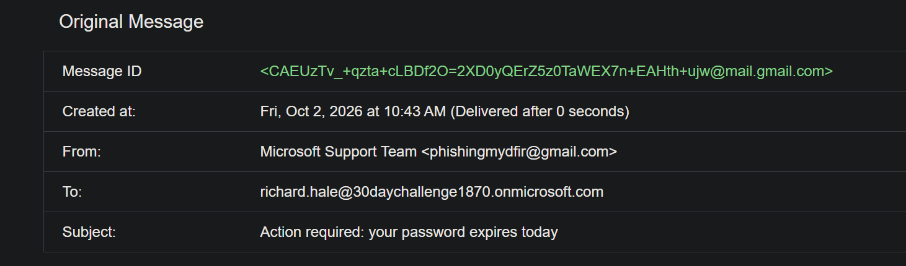
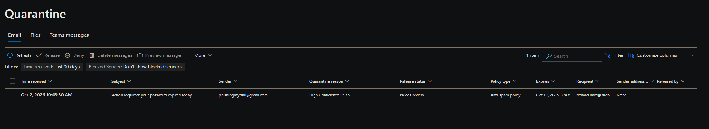
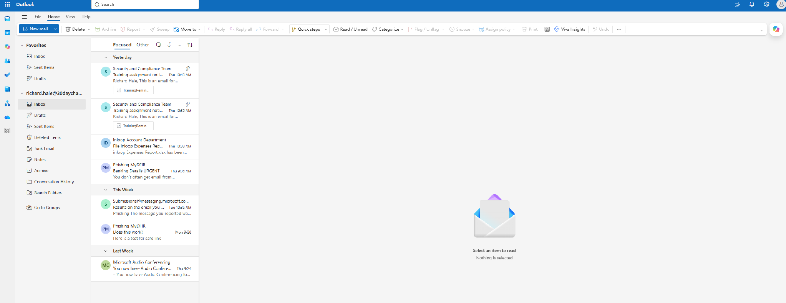

# Day 16 Mini Project: Suspicious Email Investigation (Phishing Lure)

**Date:** October 2, 2026 · **Analyst:** Daniel Thibodeaux · **Type:** Simulated phish in a lab tenant, not a real incident

Times: the Gmail and Defender portals show local time (Pacific, UTC-7 on this date). Findings are given in UTC.

## Findings

A simulated credential-phishing lure impersonating "Microsoft Support Team" was sent from a Gmail account and quarantined by Exchange Online Protection (EOP) as High Confidence Phish. It never reached the recipient's mailbox.

- **Time sent:** 2026-10-02 17:43:21 UTC
- **Time received by EOP / quarantined:** 2026-10-02 17:43:30 UTC
- **Recipient:** richard.hale@30daychallenge1870.onmicrosoft.com
- **Sender display name:** Microsoft Support Team
- **Sender address (IOC):** phishingmydfir[@]gmail[.]com
- **Subject:** Action required: your password expires today
- **Message ID:** `<CAEUzTv_+qzta+cLBDf2O=2XD0yQErZ5z0TaWEX7n+EAHth+ujw@mail.gmail.com>`
- **Authentication:** SPF pass, DKIM pass, DMARC pass (all for gmail.com)
- **Verdict:** Quarantine reason High Confidence Phish, policy type Anti-spam policy
- **Quarantine status:** Needs review, expires 2026-10-17
- **URL, attachment, and hash IOCs:** none recoverable. The Gmail draft contained a "here" hyperlink (Figure 1), but the quarantined copy shows no link (Figure 4) and the original link target was not captured. No attachment.
- **Malware family:** not applicable (social-engineering lure, no payload)

## Summary

This was a controlled lab simulation. On 2026-10-02 at 10:43:21 PDT (17:43:21 UTC), an external Gmail account with the display name "Microsoft Support Team" emailed richard.hale@30daychallenge1870.onmicrosoft.com. The message used urgency ("password expires today"), a 48-hour deadline, a threat of account loss, and a sign-in request. EOP received it at 17:43:30 UTC and quarantined it as High Confidence Phish under the Anti-spam policy.

The header analysis shows the sender was not spoofing a domain. SPF, DKIM, and DMARC all passed for gmail.com, so this was a real Gmail account abusing a Microsoft brand name in the display name. Passing authentication does not make a message legitimate. The quarantined copy contains no recoverable URL and no attachment, so there are no URL, domain, or file-hash IOCs to scope on. Why the link in the draft is missing from the quarantined copy was not determined.

Because the message was held in quarantine, it did not appear in Richard's Inbox (Focused view), and the Quarantine entry shows it was never released. Based on the evidence provided, the activity is contained. Searches for other recipients and for Richard's sign-in activity are listed under Recommendations as follow-up checks.

## Who, What, When, Where, Why, How

- **Who:** The sender was the external account phishingmydfir[@]gmail[.]com, displayed as "Microsoft Support Team". The target was richard.hale@30daychallenge1870.onmicrosoft.com, who did not receive or interact with the message.
- **What:** A credential-phishing style lure titled "Action required: your password expires today" was sent and quarantined as High Confidence Phish. No URL or attachment was present in the quarantined copy.
- **When:** Sent 2026-10-02 at 17:43:21 UTC and quarantined at 17:43:30 UTC. Based on the evidence provided, the activity is not ongoing, and the message expires from quarantine on 2026-10-17.
- **Where:** The message was stopped at Exchange Online Protection in the 30daychallenge1870 tenant. It was not in Richard's Inbox (Focused view, Figure 5), and the Quarantine entry (Figure 3) shows it held for review.
- **Why:** The intent was to simulate a phishing lure for a lab exercise. A real attacker would use this pattern to push a user toward a fake sign-in page to harvest credentials.
- **How:** The sender used a free Gmail account with a brand-impersonating display name, urgency, and a threat of account loss. Gmail passed SPF, DKIM, and DMARC, so the message was caught by content-based detection rather than failing authentication.

## Recommendations

1. **Do not release the quarantined message.** Keep it as evidence until it expires or the case is closed, then delete it.
2. **Scope the sender across the tenant.** In Explorer or Advanced Hunting, search `EmailEvents` on `SenderFromAddress = phishingmydfir@gmail.com` and on the Message ID, and review `RecipientEmailAddress`, `LatestDeliveryLocation`, and `DeliveryAction`. Isolate any other recipients and remove delivered copies.
3. **Check for post-event identity activity.** Review `SigninLogs` for richard.hale around 17:43 UTC for unfamiliar IPs, locations, or failed and successful sign-ins. Reset credentials only if anything unusual appears.
4. **Block the sender address.** Add phishingmydfir@gmail.com to the Tenant Allow/Block List. Do not block the connecting IP, because it belongs to Google's shared mail infrastructure.
5. **Raise awareness of the lure pattern.** A "Microsoft Support" display name on a freemail address with urgency and an account-loss threat is a reportable pattern. Remind users to use the Report button in Outlook.
6. **Improve visibility for next time.** Consider an anti-phishing policy that flags display-name impersonation of Microsoft from external senders.

## Limits

- I did not determine why the hyperlink in the Gmail draft is absent from the quarantined copy, and I did not capture the original link target.
- I checked Richard's Inbox in the Focused view only. The Quarantine entry is the stronger evidence that the message was held.
- The scoping and sign-in checks in Recommendations 2 and 3 were not run.

## Supporting evidence

| File | Shows |
|---|---|
| `day16-01-gmail-lure-compose.png` | Lure composed in Gmail, addressed to Richard Hale, with the "here" hyperlink in the draft |
| `day16-02-gmail-original-message.png` | Gmail Original Message view: send time, sender, recipient, subject, and Message ID |
| `day16-03-quarantine-entry.png` | Quarantine entry: High Confidence Phish, Anti-spam policy, Needs review, expires Oct 17, 2026 |
| `day16-04-quarantine-message-source.png` | Message source from quarantine: plain body, no link on "Sign in here" |
| `day16-05-richard-outlook-mailbox.png` | Richard's Outlook mailbox: the lure is not in the Focused view |

