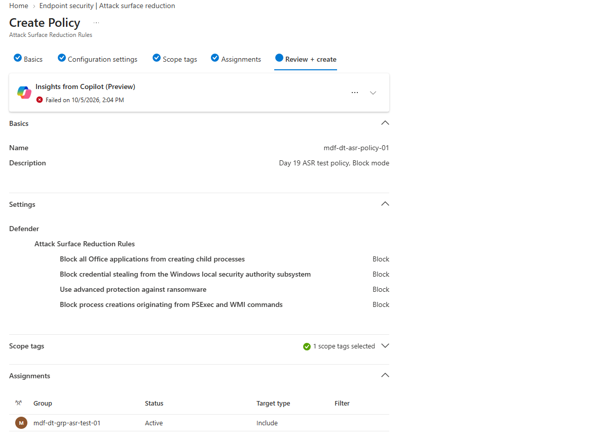

# Day 19: Intune Attack Surface Reduction Policy

**Date:** October 5, 2026 · **Endpoint:** MDF-DT-W11 · **Type:** Endpoint hardening (configuration), not an incident

## Findings

- Policy `mdf-dt-asr-policy-01` (Attack Surface Reduction Rules, Windows) created in Intune and assigned to `mdf-dt-grp-asr-test-01`, a security group with one device member (MDF-DT-W11).
- Four rules enforced in **Block** mode: Office child processes, LSASS credential stealing, advanced ransomware protection, PSExec/WMI process creation. Every other rule is Not configured.
- Intune reported **Succeeded: 1** (Error 0, Conflict 0) after a forced sync.
- On the endpoint, `Get-MpPreference` returned all four rule IDs with action `1` (Block). Defender Antivirus was in Normal mode with real-time protection on.
- No rule was triggered live, so no block event was captured.

## Summary

ASR rules block specific behaviors that malware commonly relies on, instead of matching known-bad files. I built a policy that enforces four high-signal rules and scoped it to a one-device group so a mistake could only affect the test endpoint. Intune reported the policy as applied, and I confirmed enforcement directly on the endpoint instead of relying on the portal status. Enforcement is verified by configuration, not by observed behavior.

## Policy detail

| Rule | Behavior it stops | ATT&CK | Rule ID |
|---|---|---|---|
| Block all Office applications from creating child processes | A malicious macro or document launching cmd, PowerShell, or other executables | T1204.002, T1059 | `d4f940ab-401b-4efc-aadc-ad5f3c50688a` |
| Block credential stealing from the Windows local security authority subsystem | Tools such as Mimikatz reading LSASS memory | T1003.001 | `9e6c4e1f-7d60-472f-ba1a-a39ef669e4b2` |
| Use advanced protection against ransomware | Unknown executables that behave like ransomware, scored with cloud reputation | T1486 | `c1db55ab-c21a-4637-bb3f-a12568109d35` |
| Block process creations originating from PSExec and WMI commands | Remote execution used for lateral movement | T1021.002, T1047 | `d1e49aac-8f56-4280-b9ba-993a6d77406c` |

**Why these four.** Together they cover initial execution, credential access, lateral movement, and impact, and they are high-signal rules with relatively low false-positive rates.

**Prerequisites that had to be true.**

- MDM user scope set to All, and "Disable MDM enrollment when adding work or school account on Windows" set to No.
- Defender for Endpoint connection Available, "Allow Microsoft Defender for Endpoint to enforce Endpoint Security Configurations" On, and the Windows devices connector On.
- The device Intune-managed. Entra showed both MDM and Security settings management as Microsoft Intune.

**Verification on the endpoint** (elevated PowerShell):

```
9e6c4e1f-7d60-472f-ba1a-a39ef669e4b2  ->  1
c1db55ab-c21a-4637-bb3f-a12568109d35  ->  1
d1e49aac-8f56-4280-b9ba-993a6d77406c  ->  1
D4F940AB-401B-4EFC-AADC-AD5F3C50688A  ->  1

AMRunningMode             : Normal
RealTimeProtectionEnabled : True
AntivirusEnabled          : True
```

The Intune per-setting report rolls every ASR rule into one row (success 1, error 0, conflict 0), so it cannot confirm each rule's mode. That is why the endpoint check matters.

## Issues

- Intune's All devices list was empty while Entra already showed the device as Intune-managed. The Windows devices view listed it with OS version 0.0.0.0, and All devices caught up after a refresh and a wait. I did not determine the cause.
- `Get-MpPreference` returned blank ASR fields in a non-elevated window. Elevated, it returned all four rules.

## Recommendations

1. In production, start the noisier rules (Office child processes, PSExec/WMI) in **Audit** mode and review the results before enforcing. Audit and block events appear as Event IDs 1122 and 1121, and as `Asr...` action types in Advanced Hunting.
2. Roll out in rings, starting with a small group like this one, then widen.
3. Add per-rule exclusions only with evidence of a false positive.
4. Confirm cloud-delivered protection is on, because the ransomware rule depends on it. The PSExec/WMI rule is documented as incompatible with Configuration Manager-managed environments, so check that before enforcing it.
5. Trigger one rule safely in a lab and capture the block event, so the control is proven by behavior and not only by configuration.

## Supporting evidence

| File | Shows |
|---|---|
| `day19-03-mde-connection-enforce-on.png` | MDE connection Available, enforce Endpoint Security Configurations On |
| `day19-06-group-members-vm.png` | Group membership: one device |
| `day19-13-review-create.png` | Policy name, four rules in Block, and the assignment |
| `day19-16-policy-overview-succeeded.png` | Intune overview: Succeeded 1 |
| `day19-17-per-setting-status.png` | Per-setting status: success 1, error 0, conflict 0 |
| `day19-18-get-mppreference-asr.png` | Four rule IDs enforcing in Block on the endpoint |




