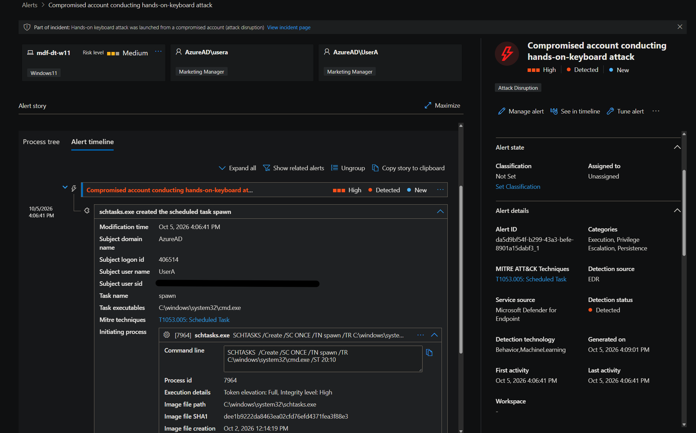
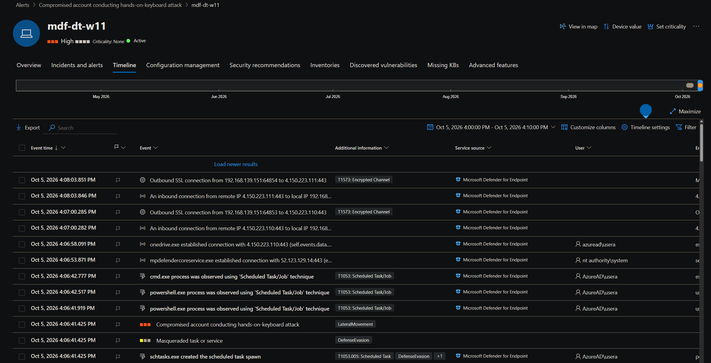

# Day 20: Atomic Red Team Detection Validation

**Date:** October 5, 2026 · **Endpoint:** MDF-DT-W11 · **Type:** Simulated activity in an isolated lab, not an incident

Times: Defender XDR shows local time (Pacific). PowerShell timestamps are UTC (Pacific is UTC-7 on this date).

## Findings

- **Tests run:** Atomic Red Team T1547.001 tests 1, 2, 3 (registry Run keys), started 11:00:52 PM UTC (4:00 PM local), and T1053.005 test 2 (a local scheduled task named `spawn`), started shortly after 11:03:52 PM UTC.
- **Alerts raised by the tests:** Anomaly detected in ASEP registry (x2, Medium, 4:01 PM), Masqueraded task or service (Low, 4:06 PM), and Compromised account conducting hands-on-keyboard attack (High, Attack Disruption tag, 4:06 PM).
- **Alerts raised by the install, before the tests (3:49 PM):** PowerSploit post-exploitation tool, Meterpreter post-exploitation tool, and two Suspicious behavior by cmd.exe alerts.
- **Automated response:** about three minutes after the High alert, attack disruption ran **Contain user** on the account that ran the tests. The account stayed enabled.
- **Telemetry:** the registry writes and the scheduled task each appeared in a different Advanced Hunting table. One of the three Run key tests had no registry row and was visible only as a `reg.exe` command line.

## Summary

I ran two persistence techniques against the lab endpoint to see what Defender XDR would raise. Both produced behavior-based EDR alerts, and the command lines and timestamps matched across the alert story, the device timeline, and Advanced Hunting. The scheduled task test escalated to a High alert and an automatic containment of the lab account. The most useful finding was about the data: coverage differed by table, so no single query told the whole story.

## 5W1H

- **Who:** the lab's non-admin user account (UserA), running from an elevated PowerShell session.
- **What:** Atomic Red Team persistence tests: Run/RunOnce registry keys and a scheduled task that runs `cmd.exe`.
- **When:** October 5, 2026, about 4:00 to 4:10 PM Pacific (11:00 to 11:10 PM UTC). Not ongoing: every test was cleaned up with `-Cleanup`.
- **Where:** MDF-DT-W11, the lab Windows 11 endpoint, with a lab-only Defender exclusion for `C:\` (removed afterward).
- **Why:** to validate detections and practice tracing alerts back to raw telemetry.
- **How:** `Invoke-AtomicTest` from an elevated session after installing Invoke-AtomicRedTeam.

## Details

### Alerts

| First activity | Alert | Severity | Source | Relates to |
|---|---|---|---|---|
| 3:49 PM | PowerSploit post-exploitation tool | Medium | Antivirus | Install |
| 3:49 PM | Meterpreter post-exploitation tool | Medium | Antivirus | Install |
| 3:49 PM | Suspicious behavior by cmd.exe was observed (x2) | Medium | EDR | Before the first test |
| 4:01 PM | Anomaly detected in ASEP registry (x2) | Medium | EDR | T1547.001 tests |
| 4:06 PM | Masqueraded task or service | Low | EDR | T1053.005 test |
| 4:06 PM | Compromised account conducting hands-on-keyboard attack | High | EDR | T1053.005 test |

**ASEP registry alert.** `powershell.exe` changed the HKLM `RunOnce` value `NextRun` at 4:01:59 PM. The value is a PowerShell command that downloads `Discovery.bat` from the Atomic Red Team repository and runs it with `IEX`. ATT&CK T1547.001 and T1112.

**High alert.** It is built on one event: `schtasks.exe` created the task `spawn` at 4:06:41 PM with `SCHTASKS /Create /SC ONCE /TN spawn /TR C:\windows\system32\cmd.exe /ST 20:10`. ATT&CK T1053.005. The Masqueraded task alert shares the same event timestamp in the device timeline.

**Attack disruption.** Action Center > History showed Contain user on the account, submitted by Attack disruption, status Completed, with a CONTAINED badge on the user page. The restriction blocks the account's remote activity over lateral movement protocols and lifts automatically after five days. I undid it after collecting evidence.

### Device timeline

At 4:06:41.425 PM the timeline shows `schtasks.exe created the scheduled task spawn`, tagged T1053.005 and Defense Evasion, at the same timestamp as both alerts. At 4:06:41.919 to 4:06:42.777 PM, `powershell.exe` and `cmd.exe` events are tagged T1053 Scheduled Task/Job.

### Hunting

| Table | Query file | What it found |
|---|---|---|
| `DeviceRegistryEvents` | [registry-run-key-persistence.kql](../kql/registry-run-key-persistence.kql) | Two rows: the HKCU `Run` value (4:01:55 PM, test 1) and the HKLM `RunOnce` `NextRun` value (4:01:59 PM, test 3) |
| `DeviceProcessEvents` | [reg-exe-runonce-process.kql](../kql/reg-exe-runonce-process.kql) | One row: a `reg.exe` write to `RunOnceEx\0001\Depend` at 4:01:56 PM, most likely test 2 by its timestamp and key |
| `DeviceEvents` | [scheduled-task-created.kql](../kql/scheduled-task-created.kql) | One `ScheduledTaskCreated` row at 4:06:41 PM with the task name, trigger, and action in `AdditionalFields` |

## Recommendations

1. Treat Run, RunOnce, and RunOnceEx writes, and scheduled task creation by non-admin accounts, as detection targets, and consider custom detections for them.
2. Hunt across `DeviceRegistryEvents`, `DeviceProcessEvents`, and `DeviceEvents` together. Coverage differs by technique, and an empty result in one table does not mean nothing happened.
3. Know where automated response actions appear (Action Center > History) and have an owner and an undo procedure. In a real environment, investigate a contained account before restoring it.
4. Run adversary simulation only on isolated hosts, record UTC start times for every test, run cleanup, and remove any exclusions afterward.

## Limits

I did not determine why my baseline alerts after the install differed from the course video's. I ran fewer tests than the video, so my alert set is smaller by design.

## Supporting evidence

| File | Shows |
|---|---|
| `day20-03-alerts-after-install.png` | Baseline alerts after the install |
| `day20-04-t1547-001-run.png` | T1547.001 tests 1 to 3 with the UTC start time |
| `day20-05-t1053-005-run.png` | T1053.005 test 2 creating `spawn` |
| `day20-06-alerts-list-after-tests.png` | Alerts after the tests, with first-activity times |
| `day20-06a-action-center-contain-user.png` | Contain user submitted by Attack disruption |
| `day20-07-alert-detail.png` | High alert story: `schtasks.exe` creating `spawn` |
| `day20-07a-alert-detail-asep-registry.png` | ASEP alert story: RunOnce `NextRun` payload |
| `day20-08-device-timeline.png` | Timeline with ATT&CK tags, 4:00 to 4:10 PM |
| `day20-09-advhunting-registry-events.png` | Run key writes in `DeviceRegistryEvents` |
| `day20-09b-advhunting-reg-process-events.png` | The RunOnceEx write found in `DeviceProcessEvents` |

