# 🤖 SOC Automation Lab — Wazuh + TheHive + Shuffle

> An end-to-end **SOC automation** build that takes a single endpoint detection all the way through enrichment, case management, and analyst notification — with zero manual steps once the alert fires. Sysmon telemetry from a Windows 11 host is ingested by **Wazuh** (SIEM/XDR), a custom rule detects **Mimikatz**, and a **Shuffle** SOAR workflow enriches the file hash against **VirusTotal**, opens a case in **TheHive**, and emails the analyst automatically.

---

## 📋 Table of Contents

1. [Lab Overview](#-lab-overview)
2. [Architecture](#-architecture)
3. [Prerequisites](#-prerequisites)
4. [1 — Building the Environment](#1--building-the-environment)
5. [2 — Configuring the Servers](#2--configuring-the-servers)
6. [3 — Onboarding the Windows Endpoint](#3--onboarding-the-windows-endpoint)
7. [4 — Custom Detection: Mimikatz](#4--custom-detection-mimikatz)
8. [5 — SOAR Integration with Shuffle](#5--soar-integration-with-shuffle)
9. [6 — Automated Enrichment (VirusTotal)](#6--automated-enrichment-virustotal)
10. [7 — Case Management with TheHive](#7--case-management-with-thehive)
11. [8 — Analyst Notification](#8--analyst-notification)
12. [Detection Rule Reference](#-detection-rule-reference)
13. [Lessons Learned](#-lessons-learned)

---

## 🔭 Lab Overview

The goal of this project was to build a working SOC pipeline from nothing — provisioning the infrastructure, generating malicious telemetry on an endpoint, detecting it, and then **automating the entire response**: enrichment, case creation, and notification. The end state is a fully integrated Wazuh + SOAR + case-management stack where a single Mimikatz execution triggers a hands-off workflow.

**Skills demonstrated:**
- Designing a logical architecture and mapping data flow across VMs
- Standing up and configuring Wazuh, TheHive, and Shuffle from scratch
- Onboarding a Windows endpoint and ingesting Sysmon telemetry
- Writing a custom Wazuh detection rule (MITRE **T1003 — Credential Dumping**)
- Building a SOAR workflow: webhook → hash extraction → VirusTotal → TheHive → email
- Real-world troubleshooting (VirusTotal parsing, ngrok tunneling, JSON severity)

**Tools used:**

| Tool | Role |
|------|------|
| VMware | Virtualization for all lab VMs |
| Wazuh | SIEM & XDR |
| TheHive | Case management |
| Shuffle | SOAR / automation |
| Sysmon | Endpoint telemetry |
| Mimikatz | Telemetry generation (attack simulation) |
| VirusTotal | Threat-intelligence enrichment |

---

## 🏛 Architecture

The lab runs entirely on-premise across three servers and one Windows endpoint. Sysmon telemetry flows from the endpoint into Wazuh; a rule match is pushed to Shuffle via webhook, which enriches, creates a case in TheHive, and notifies the analyst.

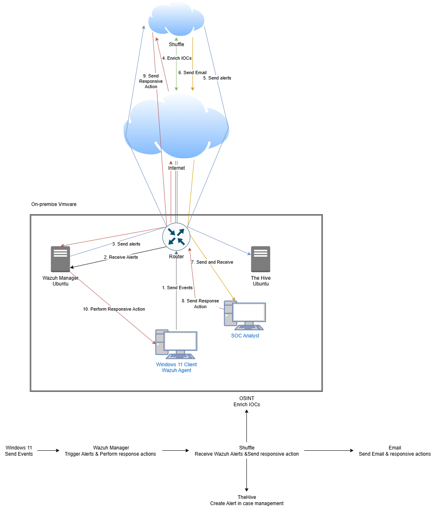

&nbsp;

| Instance | OS | Role | Resources |
|----------|-----|------|-----------|
| Wazuh Server | Ubuntu Server | SIEM / XDR (Indexer, Server, Dashboard) | 60 GB · 6 GB RAM · 4 CPU |
| TheHive Server | Ubuntu Server | Case management (Cassandra + Elasticsearch) | 60 GB · 16 GB RAM · 6 CPU |
| Windows 11 | Windows 11 Pro | Monitored endpoint (Sysmon agent) | 80 GB · 4 GB RAM · 2 CPU |
| Shuffle | Cloud (shuffler.io) | SOAR orchestration | — |

---

## ✅ Prerequisites

- A virtualization platform (VMware used here)
- Ubuntu Server and Windows 11 ISOs
- Basic Linux CLI comfort (editing configs, managing services)
- Free accounts: Shuffle, VirusTotal, ngrok

---

## 1 — Building the Environment

Two Ubuntu servers were provisioned — one for **Wazuh**, one for **TheHive** — plus a Windows 11 endpoint with Sysmon (v15.15) installed using Olaf Hartong's configuration.

Wazuh was installed via the Quickstart script, which prints the generated admin credentials on completion:

```bash
curl -sO https://packages.wazuh.com/4.x/wazuh-install.sh && sudo bash ./wazuh-install.sh -a
```

Browsing to the Wazuh server IP over HTTPS confirms the stack is up:

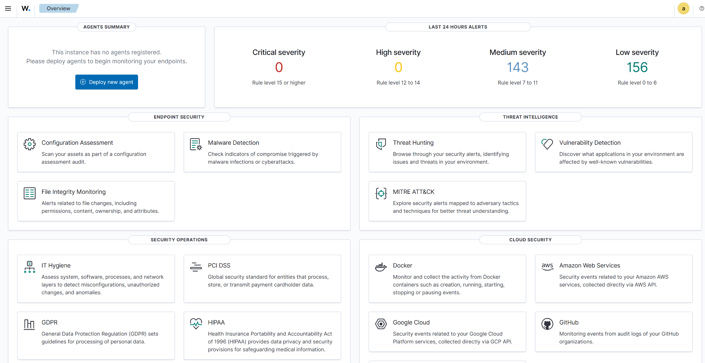

TheHive relies on **Cassandra** (NoSQL store) and **Elasticsearch**, so it was allocated significantly more RAM. After installing the Java VM, Cassandra, Elasticsearch, and TheHive package, the login screen confirms a healthy install:


---

## 2 — Configuring the Servers

**TheHive** required edits across three config files:

- `cassandra.yaml` — set `cluster_name`, `listen_address`, `rpc_address`, and the `seed_provider` to TheHive's IP.
- `elasticsearch.yml` — set `cluster.name` to `mydfir`, uncomment `network.host` / `http.port`, and set `cluster.initial_master_nodes`.
- `application.conf` — point both hostname entries and `application.baseURL` at TheHive's IP.

After resetting the Cassandra data directory and starting the services in order, all three were verified:

```bash
systemctl status cassandra
systemctl status elasticsearch
systemctl status thehive
```

Ownership of `/opt/thp` was reassigned from `root` to the `thehive` user so the service could write to it.

---

## 3 — Onboarding the Windows Endpoint

The Wazuh agent was deployed to the Windows 11 host (**Deploy new agent → Windows → server address → name**), then confirmed as active in the manager:

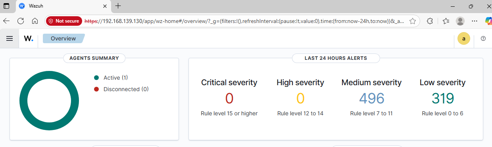

To forward Sysmon data, the agent's `ossec.conf` was edited to replace the default Application/Security channels with the Sysmon operational channel:

```xml
<localfile>
  <location>Microsoft-Windows-Sysmon/Operational</location>
  <log_format>eventchannel</log_format>
</localfile>
```

After restarting the agent, Sysmon telemetry appears in Wazuh's Discover view:

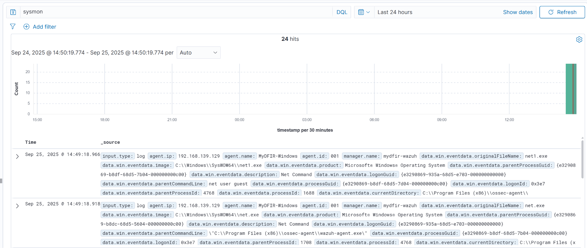

---

## 4 — Custom Detection: Mimikatz

To capture *everything* for rule development, `logall` and `logall_json` were enabled in the manager's `ossec.conf`, Filebeat's module was enabled, and a **`wazuh-archives`** index pattern was created so raw archived events became searchable.

With Defender disabled and the C: drive excluded from scanning (so the binary would persist), **Mimikatz** was executed from PowerShell to generate telemetry. A custom rule was then added to `local_rules.xml`, built from the base Sysmon Event ID 1 (Process Create) rule:

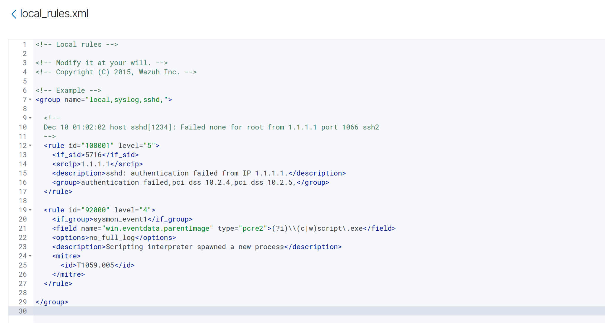

The rule keys on the process's `originalFileName` (case-insensitive regex) rather than the on-disk filename — so renaming `mimikatz.exe` to something innocuous won't evade it. After restarting the manager and re-running Mimikatz, the rule fires:

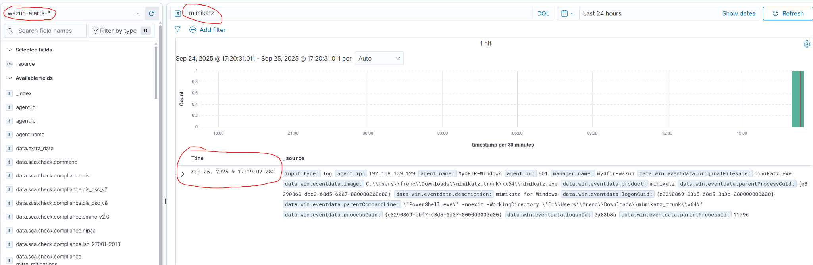

Opening the event confirms everything specified in the rule — `rule.id 100002`, level 15, description, and **MITRE T1003 (Credential Access / OS Credential Dumping)**:

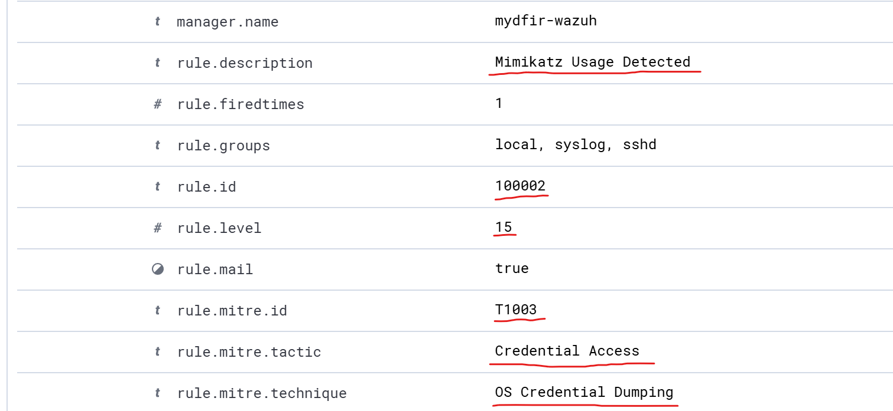

---

## 5 — SOAR Integration with Shuffle

A Shuffle workflow was created and a **Webhook** node dragged in to receive alerts. The webhook URI was wired into Wazuh's `ossec.conf` as an integration, scoped to only the custom rule:

```xml
<integration>
  <name>shuffle</name>
  <hook_url>https://shuffler.io/api/v1/hooks/webhook_XXXXXXXX</hook_url>
  <rule_id>100002</rule_id>
  <alert_format>json</alert_format>
</integration>
```

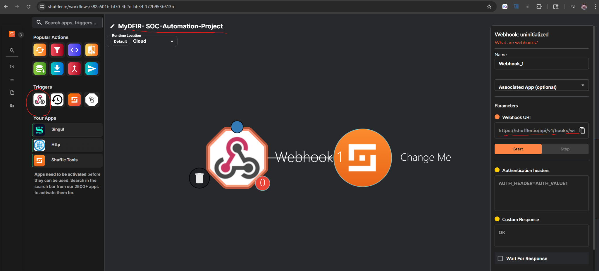

After restarting Wazuh and starting the webhook, re-running Mimikatz sends the alert straight into Shuffle. **Explore runs** shows it arriving with the full event payload:

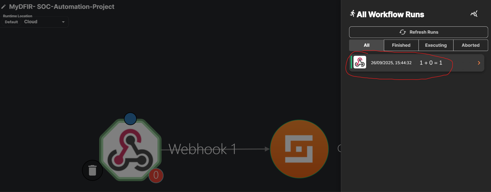

---

## 6 — Automated Enrichment (VirusTotal)

A **regex capture** (Shuffle Tools) extracts the SHA256 hash from `$exec.all_fields.full_log.win.eventdata.hashes`, which is passed to a **VirusTotal** "Get a hash report" node (authenticated with a free API key).

The first run returned a **404** — VirusTotal was being handed the whole hash object instead of just the value. Fixing the `Id` field to reference `.list.group_0` (the hash alone) produced a **200**, and VirusTotal returned the full verdict — Mimikatz classified as malicious across multiple sandboxes:

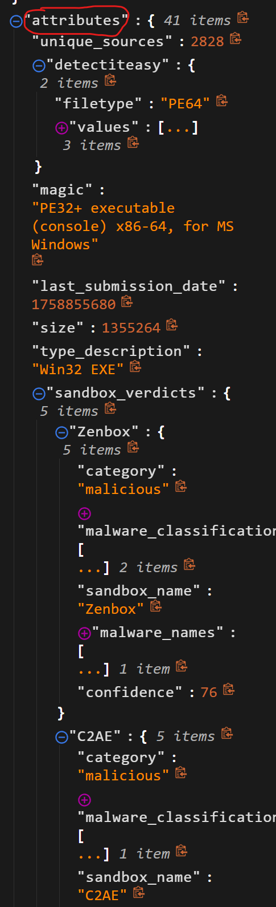

---

## 7 — Case Management with TheHive

In TheHive, a new **organization** was created along with an analyst user and a **SOAR service account**, whose API key was integrated into Shuffle. A **TheHive → Create alert (Advanced)** node was configured, mapping Wazuh fields into the alert body: description, source (`Wazuh Alert`), `sourceRef` (`rule_id`), summary, tags (`T1003`), TLP, PAP, and severity.

Two real-world issues surfaced and were resolved:

- **Connection timeout** — cloud-hosted Shuffle couldn't reach TheHive's private `192.168.139.131`. Fixed by exposing the API through an **ngrok** tunnel (`ngrok http 9000`) and pointing the node at the public URL.
- **Bad request (invalid JSON)** — the severity value was unexpected; changing it to `3` (matching the alert) resolved it.

The workflow then returned a **201 Created**:

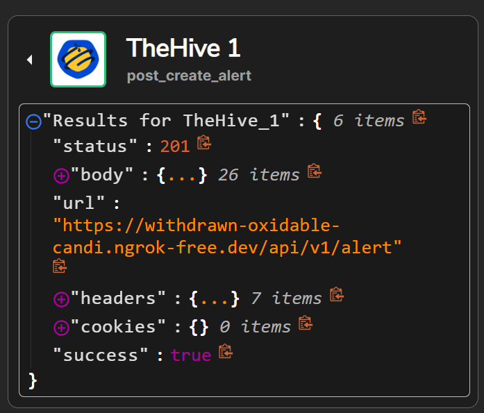

Logging in as the analyst, the automatically-created alert is waiting in the queue — Mimikatz, T1003, severity high, host `MDFIR-PC`:

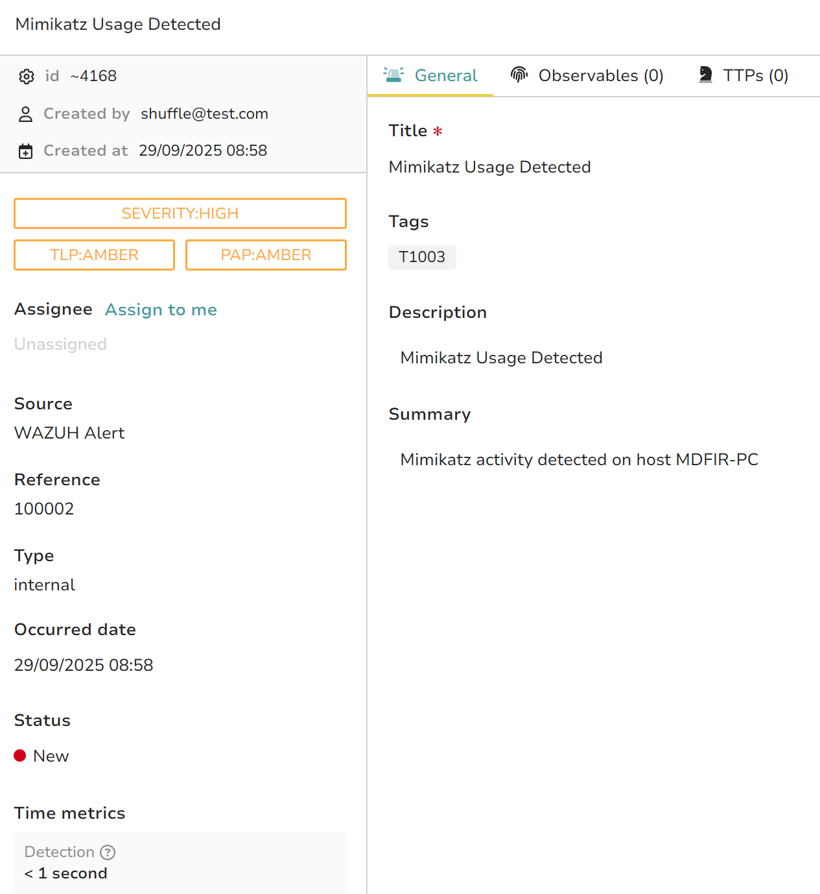

---

## 8 — Analyst Notification

Finally, an **email** node was attached to the workflow so the analyst is notified the moment a case is created. End-to-end proof of concept — the alert lands in the inbox automatically:

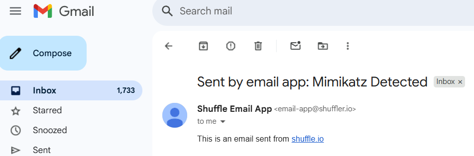

At this point the pipeline is fully automated: **Mimikatz executes → Wazuh detects → Shuffle enriches via VirusTotal → TheHive opens a case → analyst is emailed**, with no manual intervention.

---

## 🔎 Detection Rule Reference

Custom Wazuh rule (`/var/ossec/etc/rules/local_rules.xml`), adapted from the base Sysmon Process-Create rule:

```xml
<group name="sysmon,">
  <rule id="100002" level="15">
    <if_sid>92004</if_sid> <!-- Sysmon Event ID 1: Process Create -->
    <field name="originalFileName" type="pcre2">(?i)mimikatz</field>
    <description>Mimikatz Usage Detected</description>
    <mitre>
      <id>T1003</id>
    </mitre>
  </rule>
</group>
```

- **id `100002`** — custom rules start at 100000
- **level `15`** — highest severity
- **`originalFileName` + `(?i)`** — matches the PE's original name regardless of a rename, case-insensitive
- **T1003** — MITRE technique for OS Credential Dumping

---

## 🎓 Lessons Learned

- **Detections should survive evasion.** Keying on `originalFileName` instead of the filename on disk defeats a trivial rename — a small choice with a big detection payoff.
- **`logall` is a development tool, not a production setting.** Archiving everything made rule-building possible, but it's noisy and storage-heavy; it belongs on temporarily, for tuning.
- **Local labs and cloud SOAR don't mix without a bridge.** The ngrok tunnel was the difference between a workflow that timed out and one that worked — a reminder that network reachability is as important as the automation logic.
- **Read the API's error, don't guess.** Both blockers (VirusTotal 404, TheHive 400) were solved by opening the actual response and fixing one field — the 404 was a parsing issue, the 400 a type mismatch.
- **Automation compounds.** Each node added little on its own, but chained together they collapse a multi-step manual triage into a single, instant, auditable response.

---

### 🧰 Tools Used

`Wazuh` · `TheHive` · `Shuffle (SOAR)` · `Sysmon` · `VirusTotal` · `Mimikatz` · `ngrok` · `VMware` · `Ubuntu Server` · `Windows 11`
